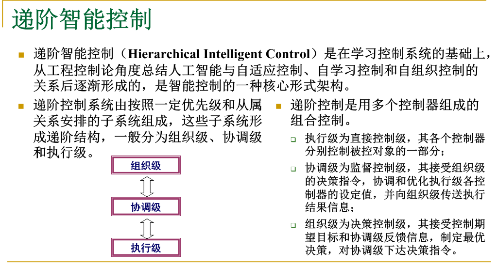
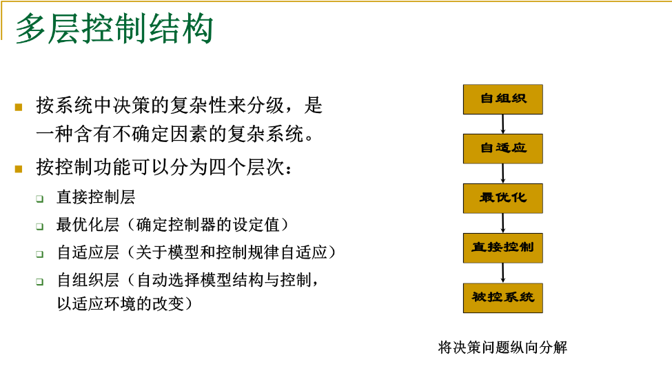
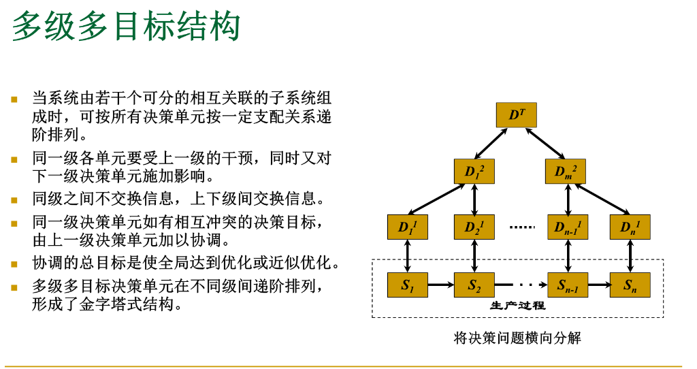

## 递阶控制的一般原理

### 智能机器的概念：
智能机器的高层功能模仿了人类行为，实现控制系统的规划、决策、学习、数据存取和任务协调等功能，进行知识处理与管理。

其统一度量衡：熵（H）

在信息论中指的是信息源中所包含的平均信息量，是不确定性的度量。熵越高，不确定性越大。

### IPDI原理： 
H（R）=H（MI）+H（DB）

R为知识流量，MI为机器智能，DB为事件数据库

R一般不变，精度（DB）递增伴随智能（MI）递减

### 递阶控制的分解与协调原理：
递阶控制通过“分解”与“协调”的思路，将复杂的全局优化问题，转化为多个相对简单的、 受协调的局部优化问题，从而有效地管理复杂系统

1，分解总问题

2，将子问题独立并求出其独立解

3，引入协调机制，设计协调参数$ \lambda $,求解

4，迭代寻优

### 协调的基本原则：
#### 关联预测协调原则：（直接干预法）
1，协调级预测关联

2，子系统决策

3，协调级修正关联

优点：可行法

缺点：子问题可能无解

#### 关联平衡协调原则：（目标协调法）
1，协调级预定子系统目标

2，子系统决策

3，协调级修正子目标

优点：子问题始终有解

缺点：需要引入目标干预信号，进行迭代搜索；不可行法（不可在线应用）

## 2、分级递阶智能控制
## 3、递阶智能控制例子
## 4、集散递阶智能控制
