## 一、模糊控制概述
### 1.1 起源与发展
+ **1965年**：美国加州大学伯克利分校的扎德（L.A. Zadeh）教授首次提出**模糊集合**理论
+ **1974年**：英国学者Mamdani首次将模糊控制应用于蒸汽机控制
+ **1980年代**：日本在家电领域成功应用（如洗衣机、空调）
+ **现代**：与神经网络、遗传算法等结合，形成智能控制的重要分支

### 1.2 核心思想
模糊控制模仿人类专家的经验和思维，用模糊逻辑处理不精确、不确定的信息。与经典控制理论需要精确数学模型不同，模糊控制基于“**语言规则**”而非数学方程。

## 二、模糊数学基础
### 2.1 模糊集合 vs 清晰集合
| 特征 | 清晰集合（普通集合） | 模糊集合 |
| --- | --- | --- |
| 归属关系 | 非此即彼（0或1） | 程度归属（0到1之间） |
| 特征函数 | $ \chi_A(x) = 0 \text{或} 1 $ | $ \mu_A(x) \in [0,1] $ |
| 示例 | “年龄≥18岁的成年人” | “青年人” |

**模糊集合的数学定义**：  
对于论域$ X $上的模糊集合$ A $，有映射：

$ \mu_A: X \rightarrow [0,1] $

其中$ \mu_A(x) $称为$ x $对$ A $的**隶属度**。

### 2.2 模糊集合的表示方法
#### (1) 离散论域（有限个元素）
$ A = \sum_{i=1}^n \frac{\mu_A(x_i)}{x_i} = \frac{\mu_A(x_1)}{x_1} + \frac{\mu_A(x_2)}{x_2} + \cdots + \frac{\mu_A(x_n)}{x_n} $

**示例**：论域$ X=\{1,2,3,4,5\} $，模糊集合$ A $=“大”

$ A = \frac{0}{1} + \frac{0}{2} + \frac{0.6}{3} + \frac{0.8}{4} + \frac{1}{5} $

#### (2) 连续论域
$ A = \int_X \frac{\mu_A(x)}{x} $

### 2.3 隶属度函数（Membership Function）
#### 常用类型：
1. **三角形函数**：

$$\mu(x) =
\begin{cases} 
0, & x \leq a \\
\frac{x-a}{b-a}, & a < x \leq b \\
\frac{c-x}{c-b}, & b < x \leq c \\
0, & x > c 
\end{cases}$$

2. **梯形函数**：

$$\mu(x) =
\begin{cases} 
0, & x \leq a \\
\frac{x-a}{b-a}, & a < x \leq b \\
1, & b < x \leq c \\
\frac{d-x}{d-c}, & c < x \leq d \\
0, & x > d 
\end{cases}$$

3. **高斯函数**：

$ \mu(x) = e^{-\frac{(x-c)^2}{2\sigma^2}} $

4. **S形、Z形、π形曲线**（用于表示“年轻”、“年老”等概念）

#### 隶属度函数设计原则：
+ **凸性**：单峰，保证模糊集合是凸模糊集
+ **完备性**：论域中任一点至少属于一个模糊子集的支集
+ **语义明确**：排列顺序符合常识，区分度合理
+ **规范重叠**：相邻子集合理重叠，通常每个点属于不超过2个子集

#### 确定方法：
+ **主观经验法**：专家评分
+ **调查统计法**：通过统计调查确定
+ **分析推理法**：基于理论分析

**调查统计法示例**（确定“青年”的隶属度）：  
通过对129人调查“青年”的年龄范围，统计27岁被认为属于“青年”的次数为101次，则：

$ \mu_{\text{青年}}(27) = \frac{101}{129} \approx 0.78 $

### 2.4 模糊集合的基本运算
设$ A, B $为模糊集合，$ \mu_A(x), \mu_B(x) $为其隶属度函数：

1. **并集**：$ A \cup B $，$ \mu_{A\cup B}(x) = \max[\mu_A(x), \mu_B(x)] $
2. **交集**：$ A \cap B $，$ \mu_{A\cap B}(x) = \min[\mu_A(x), \mu_B(x)] $
3. **补集**：$ \overline{A} $，$ \mu_{\overline{A}}(x) = 1 - \mu_A(x) $
4. **代数运算**：
    - 代数和：$ \mu_{A+B}(x) = \mu_A(x) + \mu_B(x) - \mu_A(x)\mu_B(x) $
    - 代数积：$ \mu_{A\cdot B}(x) = \mu_A(x)\mu_B(x) $
    - 有界和：$ \mu_{A\oplus B}(x) = \min[1, \mu_A(x) + \mu_B(x)] $

### 2.5 模糊关系与合成
#### 模糊关系：
$$n $元模糊关系$ R $是定义在直积$ X_1 \times X_2 \times \cdots \times X_n $上的模糊集合。

**示例**：“y比x大得多”的模糊关系：

$ \mu_R(x,y) = 
\begin{cases}
0, & x \geq y \\
\frac{1}{1 + \left(\frac{10}{y-x}\right)^2}, & x < y
\end{cases}$$

#### 模糊关系表示：
+ **模糊矩阵**：当论域有限时，用矩阵表示
+ **模糊图**：用带权值的图表示

#### 模糊关系合成（最大-最小合成）：
设$ R $是$ X $到$ Y $的关系，$ S $是$ Y $到$ Z $的关系，则$ T = R \circ S $是$ X $到$ Z $的关系：

$ \mu_{R\circ S}(x,z) = \bigvee_{y\in Y} [\mu_R(x,y) \land \mu_S(y,z)] = \max_{y\in Y} \min[\mu_R(x,y), \mu_S(y,z)] $

**示例**：子女与父母的相似关系$ R $，父母与祖父母的相似关系$ S $，求子女与祖父母的相似关系$ T $：

$ T = R \circ S $

## 三、模糊语言变量与规则
### 3.1 模糊语言变量
以五元组$ (x, T(x), X, G, M) $表示：

+ $ x $：变量名称（如“温度”）
+ $ T(x) $：语言值集合（如{高, 中, 低}）
+ $ X $：论域
+ $ G $：语法规则（生成语言值名称）
+ $ M $：语义规则（确定隶属度函数）

### 3.2 语言语气算子
修饰模糊语言的程度：

+ 集中化算子（$ \lambda > 1 $）：$ H_\lambda(\mu_A) = (\mu_A)^\lambda $
    - 极：$ \mu_{\text{极}A} = \mu_A^4 $
    - 非常：$ \mu_{\text{非常}A} = \mu_A^2 $
+ 散漫化算子（$ \lambda < 1 $）：
    - 比较：$ \mu_{\text{比较}A} = \mu_A^{0.75} $
    - 稍微：$ \mu_{\text{稍微}A} = \mu_A^{0.25} $

### 3.3 模糊蕴含关系（模糊规则）
形式：IF $ x $ is $ A $, THEN $ y $ is $ B $

+ $ A $：前件（前提）
+ $ B $：后件（结论）

#### 运算方法：
1. **最小运算法**（Mamdani）：

$ \mu_{A\to B}(x,y) = \min[\mu_A(x), \mu_B(y)] $

2. **乘积运算法**：

$ \mu_{A\to B}(x,y) = \mu_A(x) \cdot \mu_B(y) $

## 四、模糊推理
### 4.1 基本推理模式
#### (1) 广义前向推理（GMP）：
+ **大前提**：IF $ X $ is $ A $, THEN $ Y $ is $ B $
+ **小前提**：$ X $ is $ A' $
+ **结论**：$ Y $ is $ B' $

计算：$ B' = A' \circ (A \to B) $

#### (2) 广义后向推理（GMT）：
+ **大前提**：IF $ X $ is $ A $, THEN $ Y $ is $ B $
+ **小前提**：$ Y $ is $ B' $
+ **结论**：$ X $ is $ A' $

计算：$ A' = (A \to B) \circ B' $

### 4.2 模糊推理计算
#### 单输入单规则：
$ \mu_{B'}(y) = \bigvee_{x\in X} [\mu_{A'}(x) \land \mu_A(x) \land \mu_B(y)] = q \land \mu_B(y) $

其中$ q = \bigvee_{x\in X} [\mu_{A'}(x) \land \mu_A(x)] $为**相似度**。

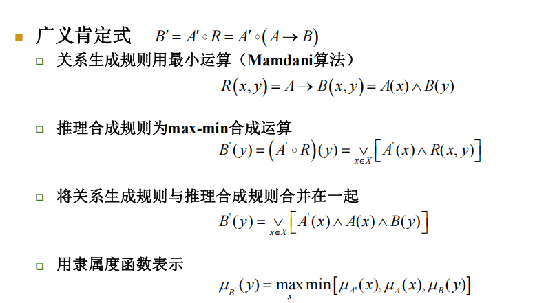

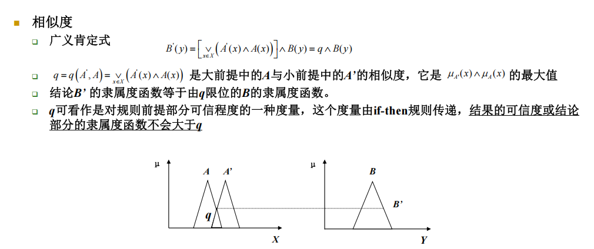

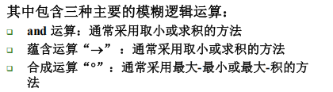

#### 多输入单规则：
规则：IF $ x $ is $ A $ AND $ y $ is $ B $, THEN $ z $ is $ C $  
输入：$ x $ is $ A' $ AND $ y $ is $ B' $  
输出：$ z $ is $ C' $

$ \mu_{C'}(z) = (q_1 \land q_2) \land \mu_C(z) $

其中：

+ $ q_1 = \bigvee_{x\in X} [\mu_{A'}(x) \land \mu_A(x)] $
+ $ q_2 = \bigvee_{y\in Y} [\mu_{B'}(y) \land \mu_B(y)] $

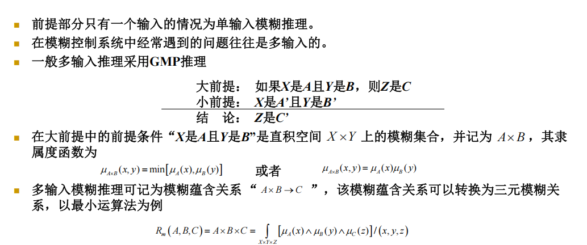

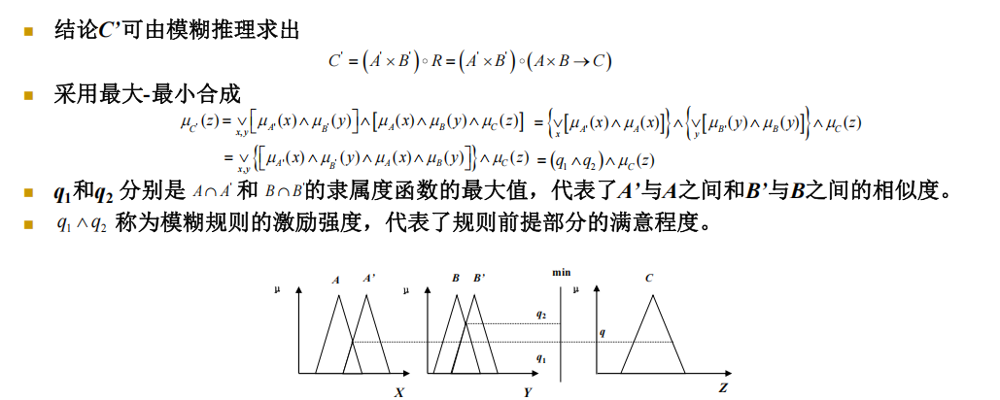

#### 多输入多规则：
多个规则并行处理，最终输出为各规则输出的并集：

$ C' = \bigcup_{i=1}^n C_i' = \bigcup_{i=1}^n [(q_{1i} \land q_{2i}) \land \mu_{C_i}(z)] $

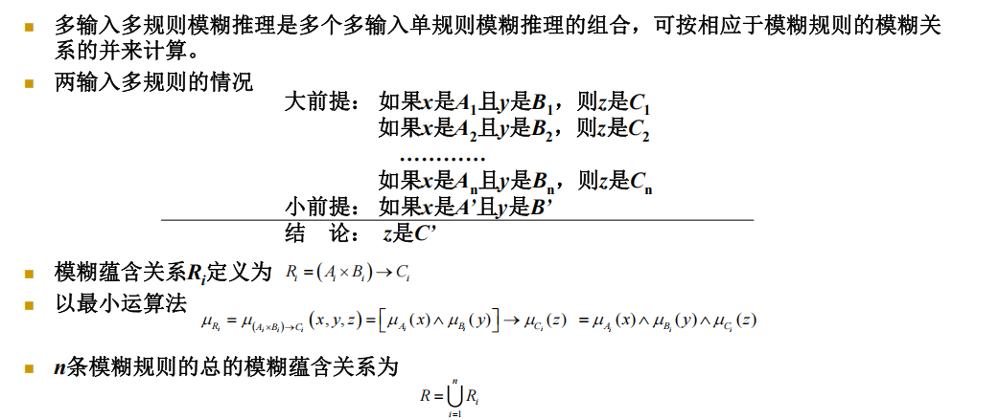

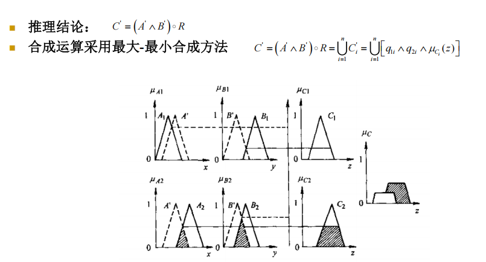

### 4.3 模糊推理步骤
1. **计算相似度**：比较输入与规则前提的匹配程度
2. **求激励强度**：通过AND/OR算子综合各前提的相似度
3. **求规则输出**：将激励强度作用于结论的隶属函数
4. **求总输出**：综合所有规则的输出

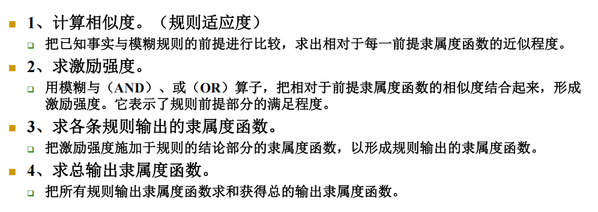

## 五、模糊控制原理与设计方法
## 5.1 模糊控制器的基本结构
模糊控制系统通常基于被控对象的输出误差 $ e $ 及其变化率 $ \dot{e} $（或离散系统的误差变化 $ \Delta e $）来实现控制。其基本结构形成一个闭环系统：

$ \text{设定值(SP)} \rightarrow \boxed{\text{比较器}(e = SP - y)} \rightarrow \boxed{\text{模糊控制器}} \rightarrow \boxed{\text{被控过程}} \rightarrow \text{输出}(y) $

**模糊控制器的内部信号处理流程**：

1. **输入量化**：将精确的输入误差 $ e $ 和误差变化 $ \dot{e} $ 通过量化因子转换为论域内的离散或连续值 $ E $ 和 $ EC $。

$ E = g_e \cdot e, \quad EC = g_{ec} \cdot \dot{e} $

2. 其中 $ g_e $, $ g_{ec} $ 为量化因子。
3. **模糊化**：将量化的精确值 $ E $, $ EC $ 转化为模糊量，表示为对应模糊集合的隶属度。
4. **模糊推理**：基于 **知识库**（包含数据库和规则库），运用模糊逻辑规则，由输入的模糊量推理出输出的模糊控制量 $ U_{fuzzy} $。
5. **解模糊化**：将推理得到的模糊输出量 $ U_{fuzzy} $ 转化为一个确定的精确值 $ u' $。
6. **输出量化**：将论域内的精确值 $ u' $ 通过比例因子 $ h $ 转换为实际作用于被控过程的控制量 $ u $。

$ u = h \cdot u' $

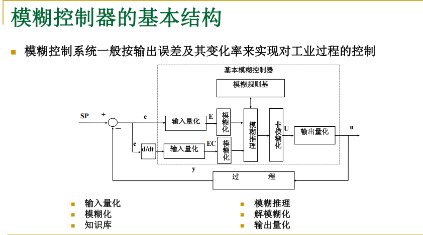

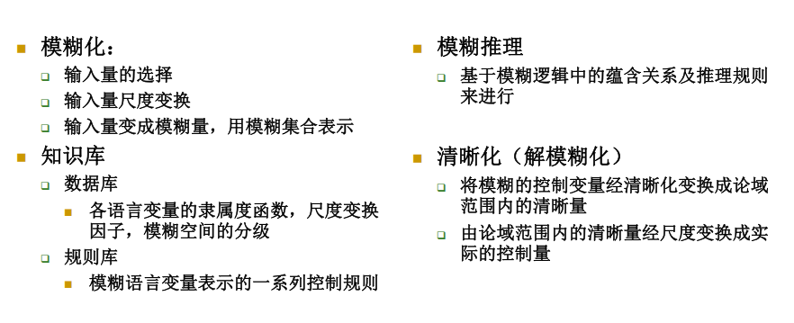

## 5.2 模糊控制器的组成与功能模块
一个完整的模糊控制器主要由以下四个核心模块构成：

### 5.2.1 模糊化 (Fuzzification)
**功能**：将精确的输入变量转化为模糊语言变量。

+ **输入量的选择**：通常选择误差 $ e $ 和误差变化率 $ \dot{e} $。
+ **尺度变换**：通过量化因子将实际物理论域映射到控制器设计的标准论域（如 $ [-3, 3] $）。
+ **模糊量构造**：确定精确输入值在预先定义的各模糊集合（如“负大NB”、“正小PS”）上的隶属度 $ \mu(x) $。

### 5.2.2 知识库 (Knowledge Base)
知识库是模糊控制器的“大脑”，包含两类信息：

+ **数据库 (Database)**：
    - 存储所有输入、输出语言变量的**隶属度函数**。
    - 定义了尺度变换因子、论域的量化等级和模糊空间划分的粒度。
+ **规则库 (Rule Base)**：
    - 存储以模糊语言变量表达的**控制规则**，形式为“IF (前提) THEN (结论)”。
    - 规则来源于专家经验、操作员实践或系统辨识。

### 5.2.3 模糊推理 (Fuzzy Inference)
**功能**：模拟人类的近似推理过程，基于模糊逻辑中的蕴含关系，从输入的模糊前提推导出输出的模糊结论。

+ 其核心是依据规则库，通过模糊合成运算，计算出对应于当前输入的模糊输出集合。

### 5.2.4 清晰化/解模糊化 (Defuzzification)
**功能**：将模糊推理得到的模糊输出集合，转换成一个可用于执行的确定性的清晰值。

+ 常用的方法包括最大隶属度法、面积均分法（最合理但难算）、重心法（折中且用的最多）

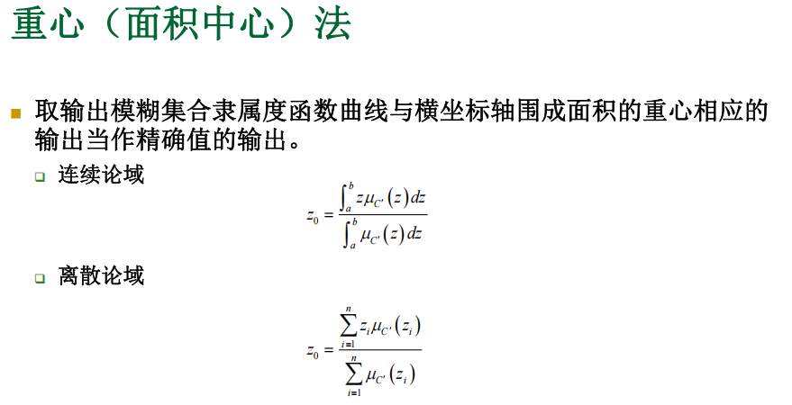

## 六、模糊控制器的设计内容与步骤
## 6.1 设计的主要内容
模糊控制器的系统化设计涵盖以下四个方面：

1. **模糊化过程设计**：确定如何将精确输入转化为模糊量。
2. **知识库设计**：包括数据库（隶属度函数、论域等）和规则库的构建。
3. **推理决策逻辑设计**：选择模糊推理的运算方法（如“与”运算用 min 还是乘积）。
4. **精确化计算设计**：确定解模糊化的方法。

## 6.2 具体设计步骤
### 6.2.1 确定输入/输出变量
+ **主要依据**：控制经验与工程知识。
+ **常见选择**：
    - **输入变量**：误差 $ e $、误差变化 $ \dot{e} $（有时增加误差变化的速率 $ \ddot{e} $）。
    - **输出变量**：通常为**控制量的变化量** $ \Delta u $（增量型），以提高系统稳定性。在某些情况下（如误差很大时），可直接输出控制量的**绝对量** $ u $。
+ **变量数量权衡**：
    - 输入变量越多，控制越精细，但规则数量呈指数增长（“维数灾”）。
    - 例如：2个输入，各分7档，最多需 $ 7^2=49 $ 条规则；3个输入则需 $ 7^3=343 $ 条规则。因此，两输入模糊控制器最为常见。

### 6.2.2 输入/输出量化（尺度变换）
将实际变量的基本论域 $ [x_{\min}^*, x_{\max}^*] $ 线性或非线性地变换到控制器设计的标准论域 $ [x_{\min}, x_{\max}] $。  
**线性变换公式**：

$ x_0 = \frac{x_{\min} + x_{\max}}{2} + k \left( x_0^* - \frac{x_{\min}^* + x_{\max}^*}{2} \right) $

其中缩放系数 $ k $ 为：

$ k = \frac{x_{\max} - x_{\min}}{x_{\max}^* - x_{\min}^*} $

+ **均匀量化**：论域内均匀分档。
+ **非均匀量化**：在零点附近分档更密，以提高对微小误差的分辨率与控制灵敏度。

### 6.2.3 模糊化设计
包括两个层面：

1. **模糊划分**：为每个变量在其论域上定义若干个模糊子集（语言值），并指定其隶属度函数。
    - 例如：误差 $ E $ 的论域上划分 {NB, NM, NS, ZE, PS, PM, PB} 七个模糊集合。
    - 划分可以是 **“粗分”** (如{N, Z, P}) 或 **“细分”**。
2. **变量模糊化方法**：将精确值 $ x_0 $ 转换为模糊量。
    - **单点模糊集合**（最常用）：若数据准确，则 $ \mu_A(x) = 1 $ 当 $ x=x_0 $，否则为0。效率高，实用性强。

$$$$ \mu_A(x) = \begin{cases} 1, & x = x_0 \\ 0, & x \ne x_0 \end{cases} $$$$

    - **三角形模糊集合**：用于处理带有不确定性的随机量，以均值 $ x_0 $ 为顶点，$ \pm\sigma $ 为底边。
    - **铃形（高斯）函数**：$ \mu_A(x) = e^{-\frac{(x-x_0)^2}{2\sigma^2}} $，描述更精确但计算复杂。

### 6.2.4 知识库设计
#### A. 数据库设计
+ **隶属度函数参数化**：确定每个模糊子集隶属度函数的形状（三角、梯形、高斯）与参数（顶点、宽度）。
+ **论域离散化与模糊划分**：确定量化等级和模糊子集的个数与布局。

#### B. 规则库设计
+ **规则来源**：
    1. 基于专家经验和控制知识。
    2. 基于操作人员实际控制行为的辨识。
    3. 基于被控过程的模糊模型。
    4. 基于学习（如神经网络、遗传算法优化）。
+ **规则形式**：对于多输入单输出系统，第 $ i $ 条规则通常为：

$ R_i: \text{IF } (x_1 \text{ is } A_1^i) \text{ AND } (x_2 \text{ is } A_2^i) \text{ THEN } (y \text{ is } B^i) $

+ **规则表**：对于两输入系统，规则常以表格形式呈现，行列分别对应两个输入的语言值，单元格内为输出的语言值。
+ **规则性能要求**：
    - **完备性**：对于论域内任意可能的输入组合，至少有一条规则的适用度大于某个阈值（如0.5），确保总能产生控制输出。
    - **一致性**：规则之间不应出现互相矛盾的结论。
    - **规则数目**：在满足完备性的前提下，应尽量减少规则数以降低复杂度。

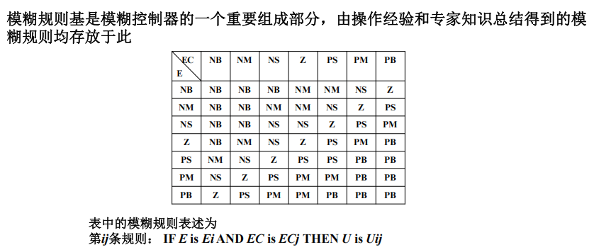

### 6.2.5 模糊推理机设计
+ **规则触发**：对于输入 $ (A', B') $，计算其与每条规则前件 $ (A_i, B_i) $ 的匹配度（相似度）。
+ **“与”运算**：常用 **取小(min)** 或 **乘积(prod)**。

$ q_i = \mu_{A_i}(A') \star \mu_{B_i}(B') $

+ **蕴含运算**：常用 **取小(Mamdani)** 或 **乘积(Larsen)**。

$ \mu_{R_i}(z) = q_i \star \mu_{C_i}(z) $

+ **规则合成**：将所有被触发规则的后件模糊集合进行 **并集(union)** 操作，常用 **取大(max)**。

$ \mu_{C'}(z) = \bigvee_{i=1}^{n} \mu_{R_i}(z) = \max_{i=1,\dots,n} [q_i \star \mu_{C_i}(z)] $

+ **多规则多输出系统**：可先将其分解为多个多输入单输出系统进行处理。

### 6.2.6 解模糊化设计
将推理得到的模糊输出集合 $ C' $ 转化为精确值 $ z_0 $。主要方法：

1. **最大隶属度法**：取 $ \mu_{C'}(z) $ 最大的点作为输出。

$ z_0 = \arg \max_{z \in Z} \mu_{C'}(z) $

    - 若最大点是一个区间，则取区间中点或端点。
    - 前提是 $ \mu_{C'}(z) $ 为单峰凸函数。
2. **重心法（面积中心法）**：最常用，输出平滑。
    - 连续论域：$$ z_0 = \frac{\int_Z z \cdot \mu_{C'}(z) \, dz}{\int_Z \mu_{C'}(z) \, dz} $$
    - 离散论域：$$ z_0 = \frac{\sum_{j=1}^{m} z_j \cdot \mu_{C'}(z_j)}{\sum_{j=1}^{m} \mu_{C'}(z_j)} $$
3. **面积均分法（中位数法）**：找到将隶属度函数下面积平分的垂直线对应的 $ z_0 $。

$ \int_{z_{\min}}^{z_0} \mu_{C'}(z) \, dz = \int_{z_0}^{z_{\max}} \mu_{C'}(z) \, dz $

## 七、模糊控制应用实例分析
## 7.1 实例一：倒立摆模糊控制
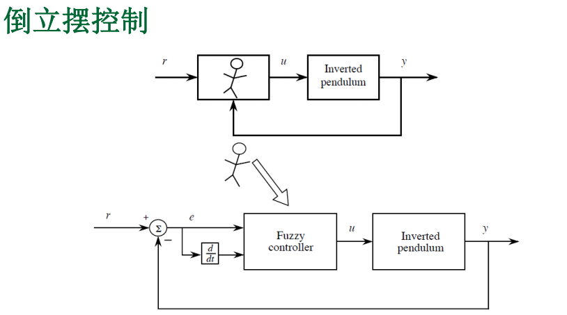

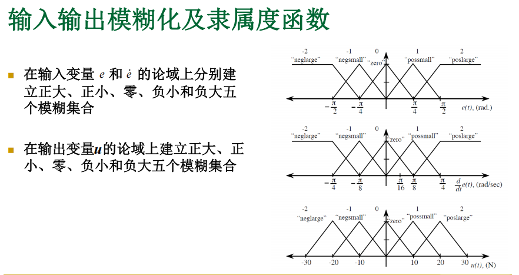

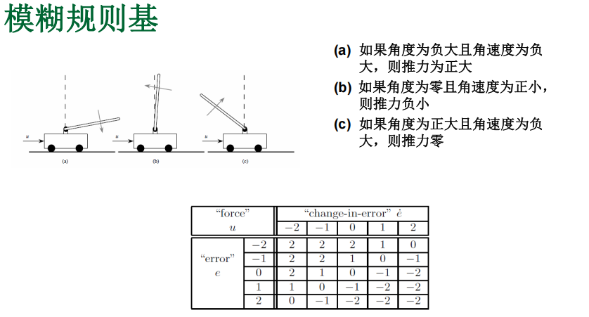

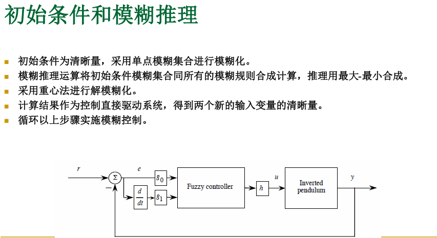

**控制问题**：通过给小车施加水平力 $ u $，使倒立摆保持竖直平衡。

+ **输入变量**：摆的角度误差 $ e = -y $ 和角速度 $ \dot{e} = -\dot{y} $。
+ **输出变量**：控制力 $ u $。
+ **设计**：
    - 输入/输出论域均划分为五个模糊集：{NL, NS, ZE, PS, PL}。
    - 隶属度函数采用三角形或梯形。
    - 根据物理直觉制定规则，例如：“IF $ e $ is NL AND $ \dot{e} $ is NL THEN $ u $ is PL”（摆向左倒且向左倒得快，则大力向右推）。
    - 采用单点模糊化、max-min推理、重心法解模糊。
+ **参数整定**：通过调整量化因子 $ g_0 $（误差）、$ g_1 $（误差变化）、$ h $（输出）来优化性能：
    - $ g_0 $ 影响比例作用，过大引起超调。
    - $ g_1 $ 影响微分作用，过大引起控制量剧烈波动。
    - $ h $ 影响控制增益，增大可加快响应。
+ **抗干扰**：可通过修改规则或隶属度函数（如非线性化输出中心值 $ c^i = 5h \cdot sign(i) \cdot i^2 $）来增强鲁棒性。

## 7.2 实例二：电加热炉温度模糊控制
**控制问题**：控制淬火炉加热区温度，对象具有非线性、大惯性和耦合性。

+ **结构**：双输入单输出。
    - 输入1：温度误差 $ e_r = y - y_{SP} $。
    - 输入2：误差变化率 $ ec_r = \Delta e / T_s $。
    - 输出：可控硅导通角变化量 $ \Delta u_r $。
+ **设计**：
    - 输入/输出基本论域归一化为 $ [-1, 1] $，标准论域取 $ [-3, 3] $。
    - 输入隶属度函数为梯形，输出为单点模糊集（简化计算）。
    - 建立 $ 7 \times 7 = 49 $ 条规则的规则表。
+ **推理与解模糊简化**：
    - 由于输出为单点，可采用 **加权平均法（直接法）** 一步得到精确输出，无需先合成模糊集再解模糊：

$ u_r = G_u \cdot \frac{\sum_{i=1}^{49} [\mu_{E_i}(e') \cdot \mu_{EC_i}(ec')] \cdot u_i}{\sum_{i=1}^{49} [\mu_{E_i}(e') \cdot \mu_{EC_i}(ec')]} $

    -   其中 $ u_i $ 是第 $ i $ 条规则对应的单点值。此法计算高效，能反映所有规则的作用。

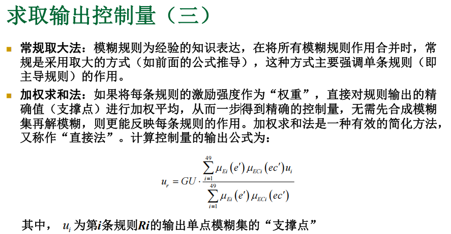

## 7.3 实例三：柔性机械臂振动抑制模糊控制
**控制问题**：控制两连杆柔性臂快速、平稳地到达目标位置，并抑制末端振动。

+ **挑战**：模型复杂、时变、存在耦合振动。
+ **独立控制设计**：为肩、肘关节分别设计模糊控制器。
    - **输入**：关节角度误差 $ e(t) $ + 连杆末端加速度 $ a(t) $（用于感知振动）。
    - **输出**：关节电机电压 $ v(t) $。
    - **规则设计原则**：误差大时以快速跟踪为主；误差小时以抑制振动（减小加速度）为主。在规则表中心设置“零”区域以增强对加速度测量噪声的鲁棒性。
+ **耦合控制设计**：为抑制肩关节运动对肘关节的耦合振动，在肘关节控制器中引入 **肩关节加速度** 作为第三个输入变量。
    - 通过增加耦合反馈，有效减少了极限环现象。
    - 为降低规则数，将耦合输入的模糊集从11个减少到7个。

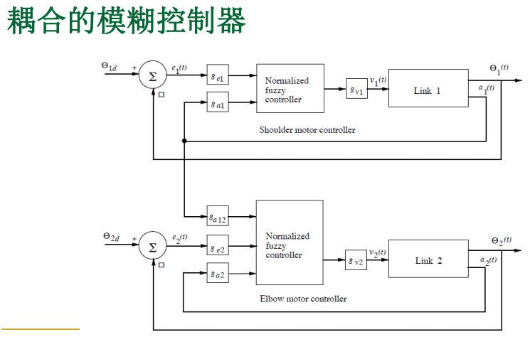

## 常规模糊控制设计步骤小结：
实行模糊控制要进行三个方面的工作： 

+ 精确量的模糊化，把语言变量的语言值化为某适当论域上的模糊子集 
+ 模糊控制算法和设计，通过一组模糊条件语句构成模糊控制规则，并计算模糊控制规则决定的模糊关系 
+ 输出信息的模糊判决，并完成由模糊量到精确量的转化

## 八、模糊控制器的实现、优化与对比
## 8.1 模糊控制总表与查表法
+ **原理**：当输入论域离散化后，可能的输入组合是有限的。可**离线**进行所有组合的模糊推理与解模糊计算，将结果 $ (E, EC) \rightarrow u $ 预先计算好，存储在一张 **控制总表** 中。
+ **在线运行**：实时控制时，只需根据量化后的输入 $ (E, EC) $ 查表，即可得到输出 $ u $。
+ **优点**：极大减少了在线计算量，易于满足实时性要求，便于在微处理器或PLC上实现。

## 8.2 控制曲面分析
+ **概念**：模糊控制器本质上实现了一个从输入空间到输出空间的非线性映射。对于两输入一输出控制器，这个映射在三维空间中形成一个曲面，称为 **控制曲面** 或 **决策面**。
+ **作用**：
    - **可视化控制器特性**：检查曲面的平滑性、单调性和非线性程度。
    - **辅助调试**：
        * 检查曲面是否覆盖整个输入/输出论域。
        * 检查期望平衡点（零点）附近的曲面斜率是否合适。
        * 发现异常平台、跳变或不连续点，可能指示规则冲突、隶属度函数设计不当或运算方法有问题。

## 8.3 模糊控制器的调整与优化步骤
1. **初步设计**：基于经验和对象理解，完成控制器各模块的初始设计。
2. **输出测试**：
    - 用覆盖整个输入论域的测试点集，检查控制器输出是否合理、符合直觉。
    - 重点测试：论域边界点、隶属度函数交界点、多规则重叠区域。
3. **控制曲面检查**：
    - 生成并观察控制曲面，检查平滑性与合理性。
    - 若曲面在零点附近过平或过陡，需调整量化因子或规则。
4. **参数微调**：
    - **调整量化因子**：$ g_e $, $ g_{ec} $ 相当于比例、微分增益；$ h $ 相当于总增益。
    - **调整隶属度函数**：改变重叠率、宽度或形状。
    - **优化规则库**：增删或修改规则。
5. **高级优化方法**：可结合神经网络（ANFIS）、遗传算法等对隶属度函数参数和规则进行自动学习和优化。

## 8.4 模糊控制与专家系统的异同
| 特性 | 模糊控制 (FC) | 专家控制 (ES) |
| :--- | :--- | :--- |
| **起源** | 控制工程、模糊数学 | 人工智能、计算机科学 |
| **核心** | 处理**数值不确定性**，模拟人类思维的模糊性 | 处理**符号知识**，模拟人类专家的逻辑推理 |
| **知识表达** | 以**模糊规则**和**隶属函数**为核心 | 以**产生式规则**、框架、谓词逻辑等为核心 |
| **推理机制** | 基于模糊逻辑的近似推理（数值计算） | 基于符号逻辑的精确推理（匹配、回溯） |
| **应用领域** | 侧重于**连续过程控制** | 更广，包括诊断、规划、决策支持等 |
| **知识获取** | 规则常由控制工程师根据经验**构造** | 规则强调从人类专家那里**提取** |

## 8.5 模糊专家控制系统
+ **融合方式**：
    1. **在专家系统中引入模糊逻辑**：用模糊集处理专家知识中的不确定性，形成模糊规则。
    2. **在模糊控制系统中引入专家系统**：用专家系统的推理机来管理和调度模糊规则，或处理更高层的诊断、决策任务。
+ **结构优势**：结合了专家系统的逻辑推理、解释能力和模糊控制系统处理不确定性的能力，形成更强大的智能控制系统。上层可由专家系统进行工况判断、模式切换，下层由模糊控制器执行实时调节。

模糊控制和专家控制的区别，异同？

## 九、模糊模型与系统辨识
## 9.1 模糊模型的类型与表示
模糊模型是用模糊逻辑和模糊集合理论描述复杂非线性系统输入输出关系的工具。主要分为两大类：

### 9.1.1 Mamdani型模糊模型（标准模糊模型）
此类模型规则的前件和后件均为模糊命题。

+ **输入输出模型（差分方程形式）**：  
第 $ i $ 条规则 $ R_i $：

$ \text{IF } y \text{ is } A_0^i \text{ and } \dot{y} \text{ is } A_1^i \text{ and } \cdots \text{ and } y^{(n-1)} \text{ is } A_{n-1}^i \text{ and } u \text{ is } B_0^i \text{ and } \cdots \text{ and } u^{(m)} \text{ is } B_m^i $

$ \text{THEN } y^{(n)} \text{ is } C^i, \quad i = 1, 2, \cdots, N $

+ 其中 $ \bar{y} = [y, \dot{y}, \cdots, y^{(n-1)}]^T $, $ \bar{u} = [u, \dot{u}, \cdots, u^{(m)}]^T $。
+ **向量简洁形式**：

$ R_i: \text{IF } \bar{y} \text{ is } \mathbb{A}^i \text{ and } \bar{u} \text{ is } \mathbb{B}^i, \text{ THEN } y^{(n)} \text{ is } C^i $

+ 其中 $ \mathbb{A}^i = A_0^i \times A_1^i \times \cdots \times A_{n-1}^i $, $ \mathbb{B}^i = B_0^i \times B_1^i \times \cdots \times B_m^i $ 是定义在乘积空间上的模糊关系。
+ **模型表示与推理**：  
系统的模糊关系 $ R_p $ 可表示为：$ R_p = (\bar{y} \times \bar{u}) \rightarrow y^{(n)} $。  
给定输入 $ (\bar{y}', \bar{u}') $ 时，模型的输出通过合成运算得到：$ y^{(n)} = (\bar{y}' \times \bar{u}') \circ R_p $。

### 9.1.2 模糊状态空间模型
将状态方程模糊化，包含状态方程和输出方程：

$$$$
\dot{x} = (x \times u) \circ R_x \\
y = x \circ R_o
\end{cases} $$

其中 $ R_x = (x \times u) \rightarrow \dot{x} $ 是状态转移模糊关系，$ R_o = x \rightarrow y $ 是输出模糊关系。

## 9.2 Takagi-Sugeno (T-S) 模糊模型
T-S模型是模糊建模中最重要、最实用的模型之一。其特点是规则的后件（结论）不是模糊集合，而是输入变量的线性或非线性函数。

### 9.2.1 基本思想与结构
+ **规则形式**：

$ R_i: \text{IF } x_1 \text{ is } A_1^i \text{ and } x_2 \text{ is } A_2^i \text{ and } \cdots \text{ and } x_n \text{ is } A_n^i $

$ \text{THEN } y_i = f_i(x_1, x_2, \cdots, x_n) $

+ 其中 $ f_i(\cdot) $ 通常是线性函数，也可以是其他形式的函数。因此T-S模型也称为“泛函模糊系统”。
+ **全局输出**：对于给定输入 $ \mathbf{x}_0 = [x_1^0, x_2^0, \cdots, x_n^0]^T $，首先计算每条规则的适用度（激活强度）$ \alpha_i $，然后通过加权平均得到系统总输出：

$ y = \frac{\sum_{i=1}^{L} \alpha_i \cdot y_i}{\sum_{i=1}^{L} \alpha_i} = \frac{\sum_{i=1}^{L} \alpha_i \cdot f_i(\mathbf{x}_0)}{\sum_{i=1}^{L} \alpha_i} $

+ 其中 $ \alpha_i = \prod_{j=1}^{n} \mu_{A_j^i}(x_j^0) $，通常采用取小(min)或乘积(prod)运算。

### 9.2.2 T-S模型的动态系统形式
T-S模型可以方便地表示动态系统。

+ **离散时间T-S模型**：  
第 $ i $ 条规则 $ L^i $：

$ \text{IF } y(k) \text{ is } A_1^i \text{ and } \cdots \text{ and } y(k-n+1) \text{ is } A_n^i \text{ and } u(k) \text{ is } B_1^i \text{ and } \cdots \text{ and } u(k-m+1) \text{ is } B_m^i $

$ \text{THEN } y^i(k+1) = a_1^i y(k) + \cdots + a_n^i y(k-n+1) + b_1^i u(k) + \cdots + b_m^i u(k-m+1) $

+ 全局输出为：

$ y(k+1) = \frac{\sum_{i=1}^{l} w^i \cdot y^i(k+1)}{\sum_{i=1}^{l} w^i} $

+ 其中 $ w^i $ 是第 $ i $ 条规则的适用度。
+ **连续时间T-S模型**：  
第 $ i $ 条规则 $ L^i $：

$ \text{IF } y(t) \text{ is } A_1^i \text{ and } \cdots \text{ and } y^{(n-1)}(t) \text{ is } A_n^i \text{ and } u(t) \text{ is } B_1^i \text{ and } \cdots \text{ and } u^{(m-1)}(t) \text{ is } B_m^i $

$ \text{THEN } y_i^{(n)}(t) = a_1^i y(t) + \cdots + a_n^i y^{(n-1)}(t) + b_1^i u(t) + \cdots + b_m^i u^{(m-1)}(t) $

+ 全局输出为：

$ y^{(n)}(t) = \frac{\sum_{i=1}^{l} w_i \cdot y_i^{(n)}(t)}{\sum_{i=1}^{l} w_i} $

### 9.2.3 T-S模型的性质与示例
+ **局部线性，全局非线性**：每条规则的后件是线性系统，但通过模糊加权，整体模型可以描述复杂的非线性系统。
+ **示例（规则为线性映射）**：  
考虑系统：
    - 规则1：IF $ u_1 $ is $ \tilde{A}_1^1 $ THEN $ b_1 = 2 + u_1 $
    - 规则2：IF $ u_1 $ is $ \tilde{A}_1^2 $ THEN $ b_2 = 1 + u_1 $  
设输入隶属度函数为三角形，当 $ u_1 < -1 $ 时只有规则1激活，$ u_1 > 1 $ 时只有规则2激活，$ -1 \leq u_1 \leq 1 $ 时两者加权。最终系统表现为分段线性非线性函数：

$$$$
    2 + u_1, & u_1 < -1 \\
    \frac{3 + u_1}{2}, & -1 \leq u_1 \leq 1 \\
    1 + u_1, & u_1 > 1
    \end{cases} $$

### 9.2.4 基于T-S模型的闭环系统分析
当被控对象和模糊控制器都用T-S模型表示时，可以分析闭环系统的等效模型。

+ **对象模型**：$ L^i: \text{IF } x(k) \text{ is } A^i, \text{ THEN } y^{i}(k+1) = \sum_{p=1}^{n} a_p^i y(k-p+1) + b^i u(k) $
+ **控制器模型**：$ R^j: \text{IF } x(k) \text{ is } C^j, \text{ THEN } u^{j}(k) = \sum_{p=1}^{m} c_p^j y(k-p+1) $
+ **等效闭环系统**：$ S^{ij}: \text{IF } x(k) \text{ is } (A^i \text{ and } C^j) $，

$ \text{THEN } y^{ij}(k+1) = \sum_{p=1}^{n} (a_p^i + b^i c_p^j) y(k-p+1) $

+ 这为基于T-S模型的稳定性分析和控制器综合提供了便利框架。

## 9.3 模糊系统的函数逼近理论
模糊系统一个重要的理论基础是**万能逼近定理**。

### 9.3.1 万能逼近定理表述
对于一个模糊系统，其规则为：

$ \text{IF } x_1 \text{ is } A_1' \text{ and } x_2 \text{ is } A_2' \text{ and } \cdots \text{ and } x_n \text{ is } A_n' \text{ THEN } y \text{ is } \theta_j $

采用乘积推理、单点模糊化和中心平均解模糊器，系统输出为：

$ y = g(\mathbf{x}) = \frac{\sum_{j=1}^{m} \left( \prod_{i=1}^{n} \mu_{A_i^j}(x_i) \right) \theta_j}{\sum_{j=1}^{m} \left( \prod_{i=1}^{n} \mu_{A_i^j}(x_i) \right)} = \sum_{j=1}^{m} P_j(\mathbf{x}) \theta_j $

其中 $ P_j(\mathbf{x}) $ 是模糊基函数。

**定理**：给定任意连续函数 $ f: U^n \rightarrow \mathbb{R} $ 和任意 $ \varepsilon > 0 $，都存在一个形如上式的模糊系统 $ g(\mathbf{x}) $，使得

$ \sup_{\mathbf{x} \in U^n} |g(\mathbf{x}) - f(\mathbf{x})| < \varepsilon $

即，模糊系统能以任意精度一致逼近任意紧集上的连续函数。

### 9.3.2 定理的意义与启示
1. **理论依据**：为模糊系统应用于非线性系统建模、控制和信号处理提供了坚实的数学基础。
2. **存在性定理**：定理只证明存在性，未给出构造方法。实际中需要通过经验、数据或优化算法来设计模糊系统。
3. **分辨力与复杂度的权衡**：提高逼近精度通常需要增加规则数（即模糊划分数目），但这会导致“规则爆炸”和计算复杂。设计时必须在精度和复杂度之间折衷。
4. **与其他逼近器的关系**：模糊系统与多项式逼近器、神经网络一样是万能逼近器，但其独特优势在于能系统性地融入语言信息（专家经验）。

## 9.4 模糊模型辨识
模糊模型辨识是从系统的输入输出数据中，确定模糊模型的结构和参数的过程。

### 9.4.1 标准模糊模型的辨识
考虑输出为模糊单点集（singleton）的模型：

$ y = f(\mathbf{x}|\theta) = \frac{\sum_{i=1}^{R} b_i \mu_i(\mathbf{x})}{\sum_{i=1}^{R} \mu_i(\mathbf{x})} $

其中 $ b_i $ 是第 $ i $ 条规则后件模糊集的中心。定义模糊基函数 $ \xi_i(\mathbf{x}) = \frac{\mu_i(\mathbf{x})}{\sum_{i=1}^{R} \mu_i(\mathbf{x})} $，则模型可线性参数化：

$ f(\mathbf{x}|\theta) = \sum_{i=1}^{R} b_i \xi_i(\mathbf{x}) = \boldsymbol{\theta}^T \boldsymbol{\xi}(\mathbf{x}) $

其中 $ \boldsymbol{\theta} = [b_1, b_2, \cdots, b_R]^T $, $ \boldsymbol{\xi}(\mathbf{x}) = [\xi_1(\mathbf{x}), \xi_2(\mathbf{x}), \cdots, \xi_R(\mathbf{x})]^T $。  
这等价于一个**线性回归模型**，可用**最小二乘法(LS)** 从数据 $ \{\mathbf{x}(k), y(k)\} $ 中辨识参数 $ \boldsymbol{\theta} $。

### 9.4.2 T-S模糊模型的辨识
T-S模型的后件是线性函数：

$ g_i(\mathbf{x}) = a_{i,0} + a_{i,1}x_1 + \cdots + a_{i,n}x_n $

通常前提的隶属度函数取为高斯型：

$ \mu_i(\mathbf{x}) = \prod_{j=1}^{n} \exp\left( -\frac{1}{2} \left( \frac{x_j - c_j^i}{\sigma_j^i} \right)^2 \right) $

模型全局输出为：

$ y = F_{ts}(\mathbf{x}, \Theta) = \frac{\sum_{i=1}^{R} g_i(\mathbf{x}) \mu_i(\mathbf{x})}{\sum_{i=1}^{R} \mu_i(\mathbf{x})} $

+ **当前提参数固定时**：模型关于后件参数 $ \{a_{i,j}\} $ 是线性的。通过定义扩展的回归向量 $ \boldsymbol{\phi}(\mathbf{x}) $ 和参数向量 $ \Theta $，同样可化为 $ y = \Theta^T \boldsymbol{\phi}(\mathbf{x}) $ 的形式，用最小二乘法辨识。
+ **当前提与后件参数同时优化时**：问题变为非线性优化。定义总参数向量 $ \Theta $ 包含所有 $ c_j^i, \sigma_j^i, a_{i,j} $。采用梯度下降法、聚类法或进化算法等非线性优化技术，最小化目标函数（如误差平方和）：

$ J(\Theta) = \frac{1}{2} \sum_{k=1}^{M} |y(k) - F_{ts}(\mathbf{x}(k), \Theta)|^2 $

+ 迭代公式为：$ \Theta(j+1) = \Theta(j) - \lambda_j \left. \frac{\partial J}{\partial \Theta} \right|_{\Theta=\Theta(j)} $。

## 十、模糊PID控制与自适应模糊控制
## 10.1 模糊PID控制
### 10.1.1 引入积分环节的必要性
简单的模糊控制器（以误差 $ e $ 和误差变化率 $ \dot{e} $ 为输入）本质上是一个非线性**PD控制器**。由于缺乏积分环节，系统可能存在**稳态误差**，且在平衡点附近可能因量化等级有限而产生小幅振荡。为此，需要引入积分作用，构成模糊PID控制器。

### 10.1.2 模糊PID控制器的典型结构
一种巧妙的结构在保持规则数简洁的同时，引入了积分作用。

+ **离散PID公式回顾**：

$ u_{PID}(k) = K_c \left[ e(k) + \frac{T}{T_i} \sum_{i=0}^{k} e(i) + \frac{T_d}{T} (e(k) - e(k-1)) \right] $

+ 可分解为：$ u_{PID}(k) = u_{PD}(k) + u_{I}(k) $，其中 $ u_{PD}(k) $ 是PD部分，$ u_I(k) $ 是积分部分。
+ **一种模糊PID结构**：  
经过推导，可以构造如下形式的模糊PID控制器：

$ u_{FPID}(k) = u_{FPD}(k) + \alpha T \sum_{i=0}^{k} u_{FPD}(i) $

+ 其中 $ u_{FPD}(k) $ 是一个以 $ e(k) $ 和 $ \dot{e}(k) $ 为输入的**模糊PD控制器**的输出，$ \alpha $ 是一个待定系数。
+ **结构优势**：
    - 核心仍然是一个**两输入**的模糊PD控制器，规则数与常规模糊控制器相同，避免了规则数膨胀。
    - 通过对模糊PD输出的历史值进行累加（积分），自然地引入了积分作用。
    - 结构清晰，易于实现和整定。

## 10.2 自适应模糊控制概述
### 10.2.1 应用背景与目标
+ **背景**：
    1. **经验依赖性强**：传统模糊控制器设计严重依赖专家经验，对于新对象或新工况难以设计。
    2. **参数难以确定**：隶属度函数、规则、量化因子等参数的选择缺乏系统性方法。
    3. **应对不确定性**：被控对象存在参数变化、未建模动态或外部干扰时，固定参数的模糊控制器性能会下降。
+ **目标**：
    - **控制功能**：根据系统状态产生合适的控制信号。
    - **学习/适应功能**：根据控制效果在线或离线地调整控制器自身参数，以持续改善控制性能。

### 10.2.2 可调整的内容
自适应模糊控制器主要可调整以下部分：

1. **控制规则**：修改规则前件或后件的参数；增加或删除规则。
2. **隶属度函数**：调整形状、中心位置、宽度（对于三角形、高斯型等）。
3. **量化因子**：调整输入误差、误差变化率和输出控制量的尺度变换因子 $ g_e, g_{ec}, h $。

### 10.2.3 主要结构形式
1. **直接自适应模糊控制**：

> 根据系统输出与期望性能之间的偏差，**直接调整控制器**的参数。其结构为：  
参考输入 $ r(t) $ → **模糊控制器（参数可调）** → 被控对象 → 输出 $ y(t) $  
                                ↑  
                          **自适应机构**（依据性能偏差调整）
>

2. **间接自适应模糊控制**：

> 首先**在线辨识被控对象的模糊模型**，然后根据辨识出的模型在线设计或调整控制器参数。其结构包含两个并行的过程：模糊模型辨识和控制器参数更新。
>

3. **模糊模型参考自适应控制(FMRLC)**：

> 一种结合了直接自适应和参考模型的强大方法。其核心思想是使被控对象的输出跟踪一个稳定的**参考模型**的输出，通过两者的偏差来驱动自适应律。
>

## 10.3 模糊模型参考学习控制 (FMRLC)
FMRLC 是一种典型的、结构清晰的自适应模糊控制方案，具备“学习”能力，能记忆并改进对特定工况的控制。

### 10.3.1 系统结构
FMRLC 由四个核心部分组成：

1. **被控对象**：需要控制的系统。
2. **模糊控制器**：主控制器，其规则库可调。
3. **参考模型**：描述期望的闭环系统动态（如 $ G_m(s) = \frac{1}{s+1} $），用于生成期望输出 $ y_m(kT) $。
4. **学习机制**：包括 **模糊逆模型** 和 **知识库调节器**。
    - **模糊逆模型**：根据对象输出误差 $ y_e = y_m - y $ 及其变化，推断出为消除此误差所需的**控制量调整值** $ p(kT) $。
    - **知识库调节器**：根据 $ p(kT) $ 和上一时刻的控制局势，修改模糊控制器规则库中相应规则的参数。

### 10.3.2 工作原理与算法（以单输入单输出为例）
**步骤1：模糊控制器工作**

+ 输入：$ e(kT) = r(kT) - y(kT) $, $ c(kT) = \frac{e(kT) - e(kT-T)}{T} $。
+ 通过量化因子 $ g_e, g_c $ 映射到标准论域。
+ 查询或计算模糊规则库，经解模糊得到控制量 $ u(kT) $。
+ 规则形式：IF $ \tilde{e} $ is $ E^j $ and $ \tilde{c} $ is $ C^l $ THEN $ \tilde{u} $ is $ U^m $。

**步骤2：学习机制工作（下一个采样周期）**

1. **计算误差**：$ y_e(kT) = y_m(kT) - y(kT) $， $  \dot{y}_e(kT) = [y_e(kT) - y_e(kT-T)]/T $。
2. **模糊逆模型推理**：将 $ y_e, \dot{y}_e $ 输入模糊逆模型，得到控制量应做的调整值 $ p(kT) $。逆模型的规则基于控制工程直觉，例如：“如果输出误差为正且正在增大，则应显著增加控制量”。
3. **知识库调节器修改控制器规则**：  
a. **确定活跃规则**：查找在上一时刻 $ (kT-T) $，哪些控制器的规则被显著激活（即其前件与输入 $ (e(kT-T), c(kT-T)) $ 的匹配度 $ \mu_i > 0 $）。这些规则对应的输出模糊集称为“活跃集”。  
b. **调整活跃集的参数**：对于每个活跃的输出模糊集，调整其隶属度函数的**中心值** $ b_m $：

$ b_m(kT) = b_m(kT-T) + p(kT) $

4.    这一调整的直观解释是：如果上次在这个控制局势下控制量不足（$ p>0 $），那么就调高相应规则输出值的“建议值”，使得下次遇到类似情况时输出更大的控制量。  
c. **保持鲁棒性**：通常规则表中对应“零误差”、“零变化”区域的输出模糊集中心保持不动，以维持对测量噪声的鲁棒性。

### 10.3.3 柔性臂振动抑制的FMRLC应用
+ **问题**：柔性臂负载变化会显著改变系统模态，固定参数的模糊控制器性能下降。
+ **FMRLC方案**：为肩、肘关节分别设计独立的FMRLC。
    - **模糊控制器**：输入为关节角度误差和连杆末端加速度，输出为关节电机电压。
    - **参考模型**：取为一阶惯性环节 $ G_m(s) = \frac{3}{s+3} $，用于平滑指令并定义期望的动态。
    - **模糊逆模型**：输入为关节跟踪误差及其变化率，输出为电压调整量。其规则基于物理直觉，例如：“如果位置误差大、加速度中等且运动方向正确（误差在减小），则电压调整量应较小”。
+ **效果**：通过在线学习，系统在不同负载下都能快速抑制振动，性能显著优于非自适应控制。

## 十一、基于李雅普诺夫稳定的自适应模糊控制
对于一类结构已知但参数未知的非线性系统，可以基于李雅普诺夫稳定性理论，设计具有严格稳定性保证的自适应模糊控制器。主要分为间接型和直接型。

## 11.1 间接自适应模糊控制（针对仿射非线性系统）
### 11.1.1 问题描述与理想控制律
考虑 $ n $ 阶单输入单输出仿射非线性系统：

$ x^{(n)} = f(\mathbf{x}) + g(\mathbf{x}) u, \quad y = x $

其中状态向量 $ \mathbf{x} = [x, \dot{x}, \cdots, x^{(n-1)}]^T \in \mathbb{R}^n $，$ f(\mathbf{x}) $ 和 $ g(\mathbf{x}) $ 是**未知**的连续非线性函数，且通常假设 $ g(\mathbf{x}) \neq 0 $（可控性条件）。  
设期望跟踪指令为 $ y_m(t) $，定义跟踪误差 $ \mathbf{e} = [e, \dot{e}, \cdots, e^{(n-1)}]^T $，其中 $ e = y_m - y $。  
选择增益向量 $ \mathbf{K} = [k_n, \cdots, k_1]^T $，使得多项式 $ s^n + k_1 s^{n-1} + \cdots + k_n $ 的根均具有负实部（Hurwitz）。

如果 $ f $ 和 $ g $ 已知，可采用**反馈线性化**技术得到理想控制律：

$ u^* = \frac{1}{g(\mathbf{x})} \left[ -f(\mathbf{x}) + y_m^{(n)} + \mathbf{K}^T \mathbf{e} \right] $

将此 $ u^* $ 代入原系统，可得闭环误差动态方程为：$ \mathbf{e}^{(n)} + k_1 \mathbf{e}^{(n-1)} + \cdots + k_n e = 0 $，从而保证 $ \lim_{t \to \infty} e(t) = 0 $。

### 11.1.2 模糊逼近与控制器设计
由于 $ f $ 和 $ g $ 未知，用两个模糊系统 $ \hat{f}(\mathbf{x}|\boldsymbol{\theta}_f) $ 和 $ \hat{g}(\mathbf{x}|\boldsymbol{\theta}_g) $ 分别对其进行逼近。模糊系统采用如下参数化形式（以 $ \hat{f} $ 为例）：

+ **模糊规则**：$ R^{(l_1 \cdots l_n)}: \text{IF } x_1 \text{ is } A_1^{l_1} \text{ and } \cdots \text{ and } x_n \text{ is } A_n^{l_n} \text{ THEN } \hat{f} \text{ is } F^{l_1 \cdots l_n} $
+ **模糊系统输出**（采用乘积推理、单点模糊化、中心平均解模糊）：

$ \hat{f}(\mathbf{x}|\boldsymbol{\theta}_f) = \frac{\sum_{l_1=1}^{p_1} \cdots \sum_{l_n=1}^{p_n} \bar{y}_f^{l_1 \cdots l_n} \left( \prod_{i=1}^n \mu_{A_i^{l_i}}(x_i) \right)}{\sum_{l_1=1}^{p_1} \cdots \sum_{l_n=1}^{p_n} \left( \prod_{i=1}^n \mu_{A_i^{l_i}}(x_i) \right)} = \boldsymbol{\theta}_f^T \boldsymbol{\xi}(\mathbf{x}) $

+ 其中 $ \boldsymbol{\theta}_f $ 是所有后件中心 $ \bar{y}_f^{l_1 \cdots l_n} $ 构成的向量，$ \boldsymbol{\xi}(\mathbf{x}) $ 是模糊基函数向量。

**实际控制律**采用逼近值代替理想值：

$ u = \frac{1}{\hat{g}(\mathbf{x}|\boldsymbol{\theta}_g)} \left[ -\hat{f}(\mathbf{x}|\boldsymbol{\theta}_f) + y_m^{(n)} + \mathbf{K}^T \mathbf{e} \right] $

### 11.1.3 自适应律与稳定性分析
为了在线调整参数 $ \boldsymbol{\theta}_f $ 和 $ \boldsymbol{\theta}_g $，基于李雅普诺夫方法设计自适应律。

1. **定义误差状态方程**：将实际控制律代入系统方程，整理得闭环误差动态：

$ \dot{\mathbf{e}} = \Lambda \mathbf{e} + \mathbf{b} \left[ (\hat{f} - f) + (\hat{g} - g) u \right] $

2. 其中 $ \Lambda $ 是由增益 $ \mathbf{K} $ 构成的友矩阵，$ \mathbf{b} = [0, \cdots, 0, 1]^T $。
3. **定义最优参数与最小逼近误差**：

$ \boldsymbol{\theta}_f^* = \arg \min_{\boldsymbol{\theta}_f \in \Omega_f} \left[ \sup_{\mathbf{x} \in \mathbb{R}^n} |\hat{f}(\mathbf{x}|\boldsymbol{\theta}_f) - f(\mathbf{x})| \right] $

4. 类似定义 $ \boldsymbol{\theta}_g^* $。最小逼近误差为 $ \omega = (\hat{f}(\mathbf{x}|\boldsymbol{\theta}_f^*) - f(\mathbf{x})) + (\hat{g}(\mathbf{x}|\boldsymbol{\theta}_g^*) - g(\mathbf{x})) u $。
5. **构造李雅普诺夫函数**：

$ V = \frac{1}{2} \mathbf{e}^T \mathbf{P} \mathbf{e} + \frac{1}{2\gamma_1} \tilde{\boldsymbol{\theta}}_f^T \tilde{\boldsymbol{\theta}}_f + \frac{1}{2\gamma_2} \tilde{\boldsymbol{\theta}}_g^T \tilde{\boldsymbol{\theta}}_g $

6. 其中 $ \tilde{\boldsymbol{\theta}}_f = \boldsymbol{\theta}_f - \boldsymbol{\theta}_f^* $，$ \tilde{\boldsymbol{\theta}}_g = \boldsymbol{\theta}_g - \boldsymbol{\theta}_g^* $；$ \mathbf{P} $ 是满足李雅普诺夫方程 $ \Lambda^T \mathbf{P} + \mathbf{P} \Lambda = -\mathbf{Q} $ 的正定矩阵（$ \mathbf{Q} > 0 $）。
7. **设计自适应律**：对 $ V $ 求导，并令其负定或半负定，可推导出参数更新律：

$ \dot{\boldsymbol{\theta}}_f = -\gamma_1 \mathbf{e}^T \mathbf{P} \mathbf{b} \boldsymbol{\xi}(\mathbf{x}) $

$ \dot{\boldsymbol{\theta}}_g = -\gamma_2 \mathbf{e}^T \mathbf{P} \mathbf{b} \boldsymbol{\eta}(\mathbf{x}) u $

8. 其中 $ \gamma_1, \gamma_2 > 0 $ 为学习率。可以证明，在此自适应律下，$ \dot{V} = -\frac{1}{2} \mathbf{e}^T \mathbf{Q} \mathbf{e} + \mathbf{e}^T \mathbf{P} \mathbf{b} \omega \leq 0 $（当逼近误差 $ \omega $ 足够小时）。根据李雅普诺夫稳定性理论，系统所有信号有界，且跟踪误差 $ \mathbf{e} $ 渐近收敛于零或一个小的残集。

### 11.1.4 倒立摆仿真实例
+ **对象**：单级倒立摆非线性模型。
+ **目标**：跟踪指令 $ x_d(t) = 0.1\sin(\pi t) $。
+ **设计**：为 $ f $ 和 $ g $ 分别设计25条规则（$ x_1 $和$ x_2 $各5个模糊集）。隶属度函数取高斯型。自适应律参数取 $ \gamma_1=50, \gamma_2=1 $。
+ **结果**：仿真显示，位置能有效跟踪正弦指令，控制输入平滑，验证了方法的有效性。

## 11.2 直接自适应模糊控制
与间接型不同，直接自适应模糊控制不辨识对象模型，而是**直接利用控制经验知识**来构造和调整模糊控制器。

### 11.2.1 问题描述
考虑系统：

$ x^{(n)} = f(\mathbf{x}) + b u, \quad y = x $

其中 $ f(\mathbf{x}) $ 未知，$ b > 0 $ 是未知常数（已知其符号）。这种结构比仿射形式更简单。

### 11.2.2 控制器设计与自适应律
+ **理想控制律**（若 $ f $ 和 $ b $ 已知）：$ u^* = \frac{1}{b}[-f(\mathbf{x}) + y_m^{(n)} + \mathbf{K}^T \mathbf{e}] $。
+ **实际控制器**：用一个模糊系统 $ u_D(\mathbf{x}|\boldsymbol{\theta}) $ 直接逼近这个理想控制律 $ u^* $。其构造与参数化方式与11.1.2节类似。

$ u = u_D(\mathbf{x}|\boldsymbol{\theta}) = \boldsymbol{\theta}^T \boldsymbol{\xi}(\mathbf{x}) $

+ **自适应律设计**：同样基于李雅普诺夫方法，可推导出参数更新律为：

$ \dot{\boldsymbol{\theta}} = \gamma \mathbf{e}^T \mathbf{p}_n \boldsymbol{\xi}(\mathbf{x}) $

+ 其中 $ \mathbf{p}_n $ 是李雅普诺夫方程中矩阵 $ \mathbf{P} $ 的最后一列。可以证明该算法能保证闭环系统的稳定性和跟踪性能。

**总结**：间接法基于系统模型知识，直接法基于控制知识。两者都利用模糊系统的万能逼近能力，并结合李雅普诺夫理论设计自适应律，从而在保证稳定性的前提下实现对不确定非线性系统的有效控制。

