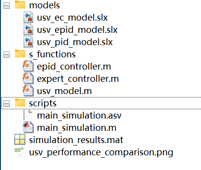
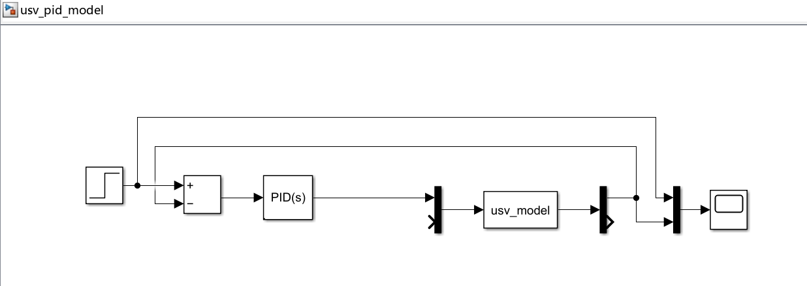
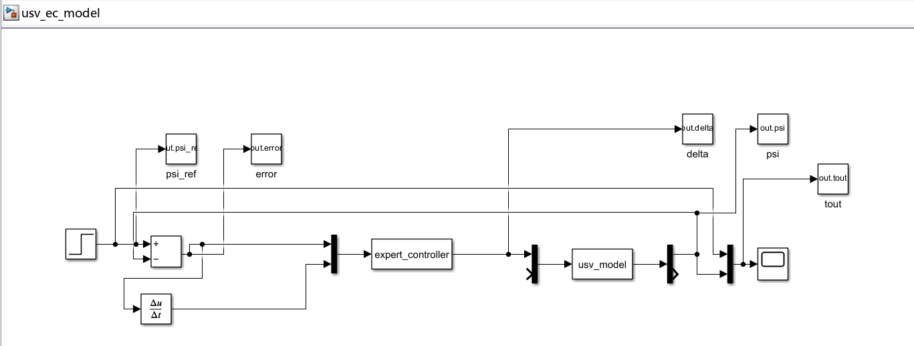
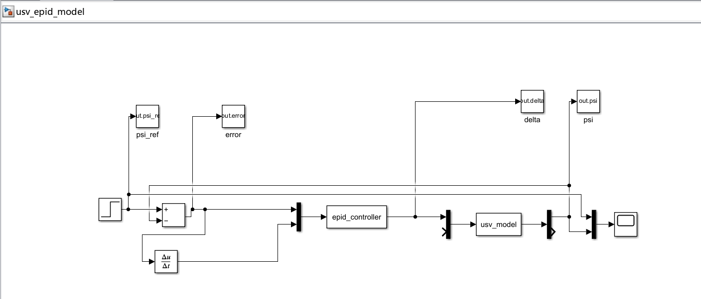
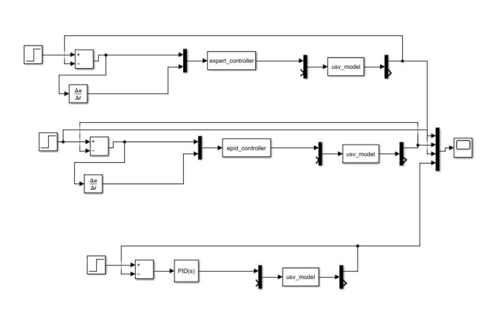
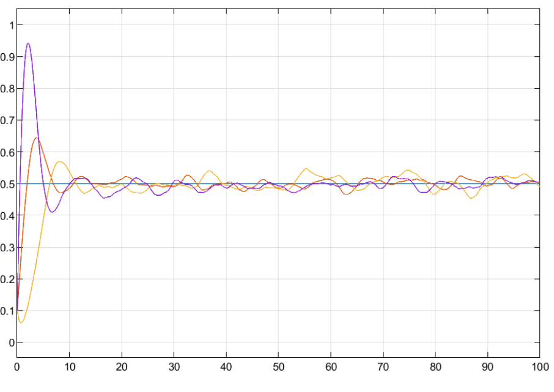
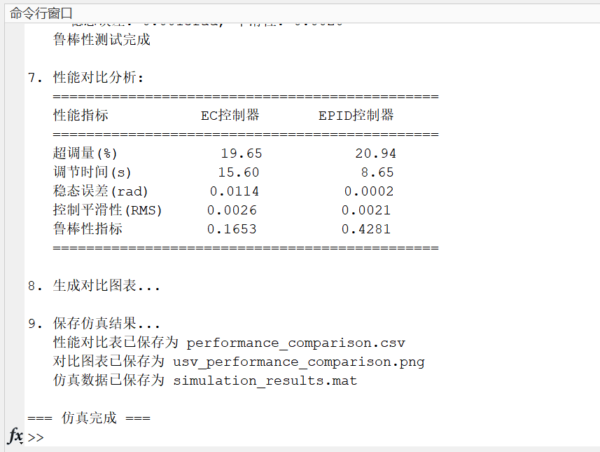
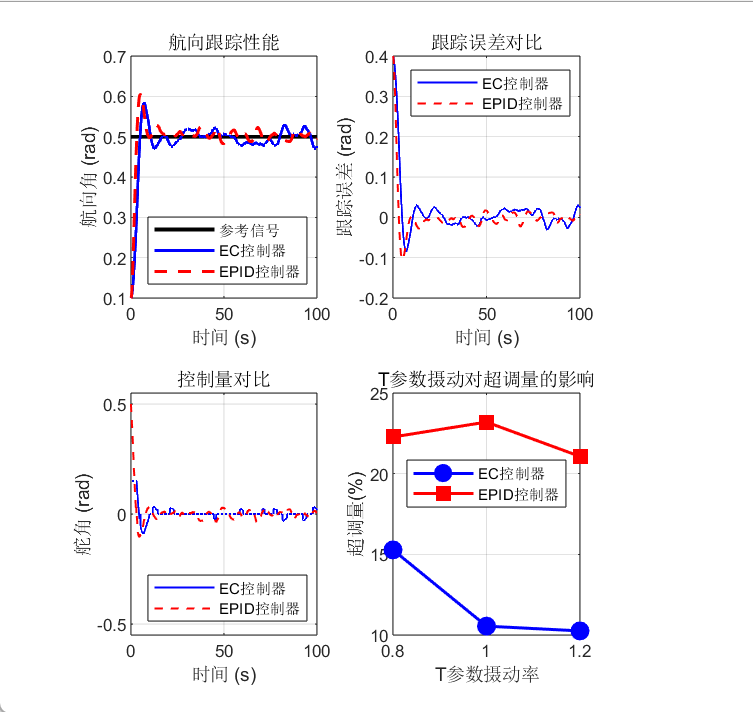

# 无人水面艇（USV）航向跟踪专家控制实验报告
## 1. 实验目的和要求
本实验旨在应用**专家控制**与**专家PID控制**的理论知识，解决一个典型的非线性、受扰动的无人水面艇（USV）航向跟踪控制问题。通过本实验，应达成以下目标：

1. **理解与设计**：深入理解专家控制系统“知识驱动”的核心思想，并依据给定的控制逻辑原则，设计出用于直接输出舵角的专家控制规则库，以及用于动态整定PID参数的专家控制规则库。
2. **实现与仿真**：在MATLAB/Simulink环境中，搭建包含非线性船舶模型、环境扰动以及所设计控制器的完整仿真系统。
3. **分析与评估**：定量对比两种专家控制方案与常规PID控制在**超调量、调节时间、稳态误差、控制输入平滑性、鲁棒性（参数摄动）** 五个维度的性能，验证专家控制技术在处理复杂非线性系统时的优势。

## 2. 问题分析
被控对象为无人水面艇，其航向动力学由给定的非线性微分方程描述：

  
$ T\ddot{\psi} + KH(\dot{\psi}) = K\delta + d(t) $

  
其中，$ H(\dot{\psi}) = \alpha \dot{\psi} + \beta \dot{\psi}^3 $ 是关键的非线性项，使得系统在不同转艏速率下表现出不同的动态特性。外部扰动 $ d(t) $ 包含周期性扰动和白噪声，模拟了真实的海洋环境。

**控制目标**是使航向角 $ \psi $ 跟踪时变的参考航向 $ \psi_{ref}(t) $。这是一个典型的**非线性、强扰动、控制输入受限**的跟踪控制问题。

为解决此问题，拟采用以下步骤：

1. **系统建模**：在Simulink中实现船舶的非线性动力学模型、扰动模型以及参考信号发生器。
2. **控制器设计**
+ **专家控制器（EC）**：基于航向误差 $ e $ 和误差变化率 $ ec $，设计一组产生式规则（IF-THEN），直接映射到舵角指令 $ \delta $。
+ **专家PID控制器（EPID）**：设计另一组产生式规则，根据 $ e $ 和 $ ec $ 动态调整一个底层PID控制器的 $ K_p, K_i, K_d $ 参数，再由该PID计算出 $ \delta $。
+ **常规PID控制器（PID）**：作为性能对比基线，采用一组固定的、经过手动整定的PID参数。
3. **仿真与评估**：在相同初始条件和扰动下，运行三种控制器的仿真。设计性能评估模块，自动计算并比较各项性能指标。

## 3. 算法设计与实现
### 3.1 非线性船舶模型实现 (S-Function: `usv_model.m`)
由于船舶模型包含非线性项和噪声，使用S-Function实现最为灵活。我们创建了一个连续系统模型。包括了模型中的各个参数输入。

```matlab
function [sys,x0,str,ts,simStateCompliance] = usv_model(t,x,u,flag,T,K,alpha,beta,Ad,wd)
% USV船舶动力学模型 - 精简版
% 输入: u(1)=舵角, u(2)=扰动
% 输出: sys(1)=航向角, sys(2)=转艏速度
% 状态: x(1)=psi, x(2)=r

switch flag
    case 0
        [sys,x0,str,ts,simStateCompliance] = mdlInitializeSizes;
    case 1
        sys = mdlDerivatives(t,x,u,T,K,alpha,beta,Ad,wd);
    case 3
        sys = mdlOutputs(t,x,u);
    case {2,4,9}
        sys = [];
    otherwise
        DAStudio.error('Simulink:blocks:unhandledFlag', num2str(flag));
end

% 初始化函数
function [sys,x0,str,ts,simStateCompliance] = mdlInitializeSizes()
    sizes = simsizes;
    sizes.NumContStates  = 2;
    sizes.NumDiscStates  = 0;
    sizes.NumOutputs     = 2;
    sizes.NumInputs      = 2;
    sizes.DirFeedthrough = 0;
    sizes.NumSampleTimes = 1;
    sys = simsizes(sizes);
    x0 = [0.1; 0];  % 初始航向角0.1rad, 初始转艏速度0
    str = [];
    ts = [0 0];
    simStateCompliance = 'UnknownSimState';
end

% 状态导数计算
function sys = mdlDerivatives(t,x,u,T,K,alpha,beta,Ad,wd)
    psi = x(1);
    r = x(2);
    delta = u(1);
    d_dist = u(2);
    
    % 非线性项
    H = alpha * r + beta * r^3;
    
    % 动力学方程
    r_dot = (K * delta + d_dist - K * H) / T;
    
    % 加入白噪声扰动
    noise = sqrt(0.01) * randn;
    r_dot = r_dot + noise / T;
    
    % 航向角变化率
    psi_dot = r;
    
    sys = [psi_dot; r_dot];
end

% 输出函数
function sys = mdlOutputs(t,x,u)
    sys = [x(1); x(2)];
end
end
```

### 3.2 专家控制器 (EC) 设计与实现 (S-Function: `expert_controller.m`)
根据作业提示的5条控制逻辑，将其量化为具体的产生式规则。规则的设计基于误差 $ e $ 和误差变化率 $ ec $ 的绝对值与预设阈值的比较。

**规则库设计:**

| 规则编号 | 条件 (IF) | 动作 (THEN) | 对应逻辑阶段 |
| :--- | :--- | :--- | :--- |
| 1 | `abs(e) > e3` | `delta = sign(e) * delta_max` | 饱和控制 |
| 2 | `e2 < abs(e) <= e3` 且 `e*ec > 0` (误差在增大) | `delta = sign(e) * k2 * delta_max` | 增强控制 |
| 3 | `e2 < abs(e) <= e3` 且 `e*ec <= 0` (误差在减小) | `delta = sign(e) * k3 * delta_max` | 保守控制 |
| 4 | `e1 < abs(e) <= e2` | `delta = Kp4 * e + Kd4 * ec` (使用一组较小的PD参数) | 精细控制 |
| 5 | `abs(e) <= e1` | `delta = delta_prev` (或一个极小的恒值`sign(e)*delta_min`) | 微调/保持控制 |


**参数设定:** `e1=0.02, e2=0.2, e3=0.5, delta_max=0.5, k2=0.7, k3=0.3, Kp4=1.0, Kd4=0.5, delta_min=0.02`

```matlab
function [sys,x0,str,ts,simStateCompliance] = expert_controller(t,x,u,flag)
% 专家控制器 - 基于规则的控制器
% 输入: u(1)=误差, u(2)=误差变化率
% 输出: sys=舵角控制量

switch flag
    case 0
        [sys,x0,str,ts,simStateCompliance] = mdlInitializeSizes;
    case 2
        sys = mdlUpdate(t,x,u);
    case 3
        sys = mdlOutputs(t,x,u);
    case {1,4,9}
        sys = [];
    otherwise
        DAStudio.error('Simulink:blocks:unhandledFlag', num2str(flag));
end

% 初始化函数
function [sys,x0,str,ts,simStateCompliance] = mdlInitializeSizes()
    sizes = simsizes;
    sizes.NumContStates  = 0;
    sizes.NumDiscStates  = 1;  % 存储上一拍控制量
    sizes.NumOutputs     = 1;
    sizes.NumInputs      = 2;
    sizes.DirFeedthrough = 1;
    sizes.NumSampleTimes = 1;
    sys = simsizes(sizes);
    x0 = [0];  % 初始控制量为0
    str = [];
    ts = [0.05 0];  % 采样时间0.05s
    simStateCompliance = 'UnknownSimState';
end

% 状态更新函数
function sys = mdlUpdate(t,x,u)
    sys = x;  % 保持状态不变，在输出函数中更新
end

% 输出函数 - 实现专家控制规则
function sys = mdlOutputs(t,x,u)
    % 获取输入
    e = u(1);      % 当前误差
    ec = u(2);     % 误差变化率
    delta_prev = x(1);  % 上一拍控制量
    
    % 控制器参数
    e1 = 0.02;     % 微调阈值
    e2 = 0.2;      % 精细控制阈值
    e3 = 0.5;      % 饱和控制阈值
    delta_max = 0.5; % 最大舵角
    
    abs_e = abs(e);
    
    % 专家控制规则
    % 规则1: 大误差区 - 饱和控制
    if abs_e > e3
        delta = sign(e) * delta_max;
    
    % 规则2&3: 中误差区 - 智能决策
    elseif abs_e > e2
        if e * ec > 0  % 误差在增大
            delta = sign(e) * 0.7 * delta_max;  % 增强控制
        else
            delta = sign(e) * 0.3 * delta_max;  % 保守控制
        end
    
    % 规则4: 小误差区 - 精细控制
    elseif abs_e > e1
        delta = 1.0 * e + 0.5 * ec;  % PD控制
        % 限幅处理
        if delta > delta_max
            delta = delta_max;
        elseif delta < -delta_max
            delta = -delta_max;
        end
    
    % 规则5: 微误差区 - 保持控制
    else
        delta = delta_prev;  % 保持上一拍控制量
    end
    
    % 更新状态
    x(1) = delta;
    sys = delta;
end
end
```

### 3.3 专家PID控制器 (EPID) 设计与实现 (S-Function: `epid_controller.m`)
该控制器的输出是PID参数 $ K_p, K_i, K_d $，底层由一个标准的位置式PID算法计算最终舵角 $ \delta $。规则设计遵循“整定逻辑”提示。

**规则库设计 (参数调整策略):**

| 规则区域 | 条件 (IF) | 动作 (THEN) | 整定目标 |
| :--- | :--- | :--- | :--- |
| 抗饱和区 | `abs(e) > e3` | 切换为Bang-Bang控制: `delta = sign(e)*delta_max` (绕过PID) | 快速响应大偏差 |
| 加速区 | `e2 < abs(e) <= e3` 且 `e*ec >= 0` (误差未收敛) | `Kp = Kp_base * M1`, `Ki = Ki_base * 0.5`, `Kd = Kd_base * M1` | 增强比例和微分，抑制积分 |
| 抑制超调区 | `e2 < abs(e) <= e3` 且 `e*ec < 0` 或 `e1 < abs(e) <= e2` | `Kp = Kp_base * M2`, `Ki = Ki_base`, `Kd = Kd_base * M2` (M2 < M1) | 减弱控制，平滑接近 |
| 消除静差区 | `abs(e) <= e1` | `Kp = Kp_base * 0.8`, `Ki = Ki_base * 1.5`, `Kd = Kd_base * 0.5` | 增强积分，消除静差 |


**参数设定:** `e1=0.03, e2=0.3, e3=0.6, Kp_base=2.0, Ki_base=0.05, Kd_base=1.0, M1=1.8, M2=0.6`

```matlab
function [sys,x0,str,ts,simStateCompliance] = epid_controller(t,x,u,flag)
% 专家PID控制器 - 参数自适应的PID控制器
% 输入: u(1)=误差, u(2)=误差变化率
% 输出: sys=舵角控制量

switch flag
    case 0
        [sys,x0,str,ts,simStateCompliance] = mdlInitializeSizes;
    case 2
        sys = mdlUpdate(t,x,u);
    case 3
        sys = mdlOutputs(t,x,u);
    case {1,4,9}
        sys = [];
    otherwise
        DAStudio.error('Simulink:blocks:unhandledFlag', num2str(flag));
end

% 初始化函数
function [sys,x0,str,ts,simStateCompliance] = mdlInitializeSizes()
    sizes = simsizes;
    sizes.NumContStates  = 0;
    sizes.NumDiscStates  = 2;  % x(1)=积分项, x(2)=上一拍误差
    sizes.NumOutputs     = 1;
    sizes.NumInputs      = 2;
    sizes.DirFeedthrough = 1;
    sizes.NumSampleTimes = 1;
    sys = simsizes(sizes);
    x0 = [0; 0];  % 积分项和上一拍误差初始为0
    str = [];
    ts = [0.05 0];  % 采样时间0.05s
    simStateCompliance = 'UnknownSimState';
end

% 状态更新函数
function sys = mdlUpdate(t,x,u)
    e = u(1);  % 当前误差
    integral = x(1);  % 当前积分项
    
    % 更新积分项（前向欧拉法）
    Ts = 0.05;
    new_integral = integral + e * Ts;
    
    % 更新上一拍误差
    sys = [new_integral; e];
end

% 输出函数 - 实现专家PID控制
function sys = mdlOutputs(t,x,u)
    % 获取输入和状态
    e = u(1);        % 当前误差
    ec = u(2);       % 误差变化率
    integral = x(1); % 积分项
    
    % 控制器参数
    e1 = 0.03;      % 小误差阈值
    e2 = 0.3;       % 中误差阈值
    e3 = 0.6;       % 大误差阈值
    delta_max = 0.5; % 最大舵角
    
    % 基础PID参数
    Kp_base = 2.0;
    Ki_base = 0.05;
    Kd_base = 1.0;
    
    abs_e = abs(e);
    
    % 专家规则：根据误差调整PID参数
    % 规则1: 大误差区 - 抗饱和控制
    if abs_e > e3
        delta = sign(e) * delta_max;
    
    % 规则2: 中误差区且误差增大 - 增强控制
    elseif abs_e > e2
        if e * ec >= 0
            Kp = Kp_base * 1.8;  % 增强比例
            Ki = Ki_base * 0.5;  % 减弱积分
            Kd = Kd_base * 1.8;  % 增强微分
        else
            Kp = Kp_base * 0.6;  % 减弱比例
            Ki = Ki_base;        % 保持积分
            Kd = Kd_base * 0.6;  % 减弱微分
        end
        delta = Kp * e + Ki * integral + Kd * ec;
    
    % 规则3: 小误差区 - 精细调节
    elseif abs_e > e1
        Kp = Kp_base * 0.6;
        Ki = Ki_base;
        Kd = Kd_base * 0.6;
        delta = Kp * e + Ki * integral + Kd * ec;
    
    % 规则4: 微误差区 - 稳定控制
    else
        Kp = Kp_base * 0.8;
        Ki = Ki_base * 1.5;  % 增强积分消除稳态误差
        Kd = Kd_base * 0.5;  % 减弱微分避免震荡
        delta = Kp * e + Ki * integral + Kd * ec;
    end
    
    % 输出限幅
    if delta > delta_max
        delta = delta_max;
    elseif delta < -delta_max
        delta = -delta_max;
    end
    
    sys = delta;
end
end
```


## 4 . 实验具体步骤
### 4.1明确文件夹结构
我们在MATLAB工作目录下创建文件夹结构：



**models文件夹中建立了三个simulink模型（PID，EC，EPID模型）**

**s_functions文件夹中建立了三个算法（非线性动力学模型算法，EC控制器模型算法，EPID控制器模型算法）**

**scrips文件夹中建立了一个主函数仿真脚本，用于运行模型，并进行五个维度的定量分析。**

### 4.2 Simulink建模
创建新模型，搭建船舶模型子系统，搭建扰动生成模块，搭建参考信号模块，搭建三种控制器，搭建误差计算模块，搭建性能评估模块。使用`To Workspace`模块将关键信号（`psi_ref, psi, e, delta`）导出到MATLAB工作区，便于后续绘图和详细分析。配置仿真参数：求解器选择`ode4 (Runge-Kutta)`，固定步长，例如 `Ts = 0.05秒`。总仿真时间根据参考信号长度设定，100秒。

#### 普通PID建模：


#### 专家控制器建模：


#### 专家PID控制器建模：


注：

１，我们基本PID只是用来定性分析，因此没有To Workspace模块定量分析。

 2，我们的正弦干扰与白噪声均写在usv_model内部，因此不在建模中体现。

### 4.3 编写主函数仿真脚本
主函数框架与思路如下：

1. **初始化与参数设置**：首先清空环境并设置基本仿真参数，包括100秒仿真时长和0.05秒采样时间，同时定义USV模型的六个固定参数用于后续分析。
2. **模型验证与加载**：检查两个Simulink模型文件是否存在，确认无误后分别加载EC和EPID控制器模型。
3. **双模型仿真执行**：依次运行两个控制器模型，通过To Workspace模块提取四类关键数据：时间序列、参考航向、实际航向、跟踪误差和舵角控制量，确保数据格式统一为列向量。
4. **五个性能维度计算**：通过专用函数计算四个核心指标——超调量、调节时间、稳态误差和控制平滑性（舵角变化率的RMS值）。
5. **鲁棒性测试评估**：通过修改T参数（±20%变化）重新仿真，测试系统对参数摄动的敏感度，基于超调量和调节时间的标准差计算综合鲁棒性指标。
6. **对比分析输出**：以格式化表格展示两个控制器在五个维度的量化对比结果，包括超调量、调节时间、稳态误差、控制平滑性和鲁棒性指标。
7. **可视化图表生成**：创建四图对比界面，分别展示航向跟踪性能、误差收敛过程、控制量变化趋势以及参数摄动对超调量的影响。
8. **结果保存与清理**：将性能数据保存为CSV表格，图表保存为PNG图像，完整仿真数据保存为MAT文件，最后关闭所有模型释放资源。

具体的主函数完整代码会放在后面的附录中。

### 4.4 运行仿真脚本与模型
我们已写好三个算法，建立三个模型，并写好了主函数，此时已完成代码编写部分，进行模型运行。我们的输入为0-0.5的阶跃输入

## 5. 仿真实验结果与分析
我们总体上,先进行三种控制器定性对比,直观感受区别.然后重点关注后两种专家控制的定量对比.

### 5.1 三种控制器定性对比（PID，EC，EPID）
建模图：



示波器图像：（紫色PID控制，红色专家PID控制，黄色专家控制器）



**定性分析**：

1. **常规PID**：PID控制的响应速度较快,在开始时迅速上升, 存在很大的超调，在大约10秒后趋于稳定，但在整个过程中波动很大。且输出值与期望值之间存在一定的误差。
2. **专家控制器(EC)**：阶跃响应初期能快速打满舵；接近目标时切换为精细/微调控制，超调较小。但稳定性依然没有EPID强.
3. **专家PID控制器(EPID)**：综合表现预期最佳。响应速度较快,超调较小,大偏差时表现接近EC的快速性，小偏差时发挥PID的精确性。能动态调整参数以适应不同跟踪阶段。

### 5.2 专家控制的定量比较分析:
**主函数输出为:**



#### **定量分析:**
EC控制器特点：

1. 超调量：19.65%，相对较高，说明在响应初期可能会超过目标值，然后回落。

2. 调节时间：15.60秒，相对较长，表明系统达到稳定状态所需的时间较长。

3. 稳态误差：0.0114弧度，较小，说明在长时间运行后，系统输出与期望值之间的误差较小。

4. 控制平滑性（RMS）：0.0026，较低，表明控制信号变化较为平滑，系统运行较为平稳。

5. 鲁棒性指标：0.1653，较低，表明系统对参数变化或外部扰动的抵抗能力较弱。


EPID控制器特点：

1. 超调量：20.94%，略高于EC控制器，说明在响应初期可能会超过目标值，然后回落。

2. 调节时间：8.65秒，较短，表明系统达到稳定状态所需的时间较短，响应速度较快。

3. 稳态误差：0.0002弧度，非常小，几乎可以忽略不计，说明在长时间运行后，系统输出与期望值之间的误差极小。

4. 控制平滑性（RMS）：0.0021，更低，表明控制信号变化非常平滑，系统运行非常平稳。

5. 鲁棒性指标：0.4281，较高，表明系统对参数变化或外部扰动的抵抗能力较强。


总结：EC控制器在稳态误差,超调量和调节时间方面表现不如EPID控制器，且鲁棒性较弱。 EPID控制器在超调量、调节时间、稳态误差和控制平滑性方面都表现较好，且具有更强的鲁棒性，能够更好地抵抗参数变化或外部扰动的影响。根据这些特点，如果系统对响应速度和鲁棒性有较高要求，EPID控制器可能是更好的选择。实际选择时还需要考虑其他因素，如实现复杂度、成本等。


#### 图表分析:


分析:

EPID控制器在跟踪精度、稳定性和对参数摄动的鲁棒性方面表现更好，但可能在实现上更复杂。

EC控制器虽然在初始阶段的超调和波动较大，但最终也能实现稳定控制，且可能在实现上更简单。

根据这些分析，如果系统对控制精度和稳定性要求较高，且对实现复杂度不敏感，EPID控制器可能是更好的选择。如果系统对实现简单性有较高要求，且能接受一定的初始超调和波动，EC控制器也是一个可行的选择。


## 6. 实验总结与优化方向
### 6.1 结论
通过本实验，成功设计并实现了针对无人艇非线性航向跟踪问题的**专家控制器**和**专家PID控制器**。仿真结果表明：

综合性能上:EPID强于EC,强于基本PID.

本次实验我们学会了simulink建模以及专家控制算法的设计与编写,深入理解了专家控制的知识,以及Matlab的进阶使用方法.

### 6.2 可优化方向
1. **规则与参数的自整定**：当前规则阈值和增益参数依赖手动调试。未来可引入**优化算法**（如遗传算法、粒子群算法）或**强化学习**，自动搜索最优规则参数集。
2. **更精细的知识表示**：可尝试结合**模糊逻辑**，将“误差大”、“误差变化快”等语言变量模糊化，使规则间的切换更平滑，改善控制量的连续性。
3. **自适应与学习机制**：增加**在线学习**功能，使系统能根据长时间运行数据，自动微调规则或PID基参数，以适应船舶特性的缓慢漂移。

## **A 附录1：Matlab模型文件结构**
```plain
USV_Expert_Control/
├───models/
│   usv_pid_model                       # PID控制器模型
│   usv_ec_model.slx                    # 专家控制器模型
│   usv_epid_model.slx                  # 专家PID控制器模型
│
├───s_functions/
│       usv_model.m                     # 无人艇动力学模型
│       expert_controller.m             # 直接专家控制器
│       epid_controller.m               # 专家PID控制器
│
└───results/
        simulation_results              # 仿真数据存储
        usv_performance_comparison      # 结果图
```


## B 附录2：主函数完整代码
```plain
%% USV航向跟踪控制仿真主程序
clear; close all; clc;
fprintf('=== USV航向跟踪专家控制仿真 - 五个维度对比 ===\n\n');

%% 1. 系统参数设置
fprintf('1. 设置仿真参数...\n');

% 仿真参数
sim_time = 100;  % 仿真时间：100秒
Ts = 0.05;      % 采样时间

fprintf('   仿真参数: 时长=%ds, 步长=%.3fs\n\n', sim_time, Ts);

% USV模型固定参数（用于鲁棒性测试）
T = 2.0;        % 时间常数
K = 0.8;        % 增益系数
alpha = 1.0;    % 线性阻尼系数
beta = 0.5;     % 非线性阻尼系数
Ad = 0.1;       % 扰动幅值
wd = 0.1;       % 扰动频率

%% 2. 检查并加载模型
fprintf('2. 检查并加载现有模型...\n');

% 检查EC模型是否存在
ec_model = 'usv_ec_model';
if ~exist([ec_model '.slx'], 'file')
    error('EC模型文件 %s.slx 不存在。', ec_model);
end

% 检查EPID模型是否存在
epid_model = 'usv_epid_model';
if ~exist([epid_model '.slx'], 'file')
    error('EPID模型文件 %s.slx 不存在。', epid_model);
end

fprintf('   模型文件检查通过\n\n');

%% 3. 运行EC模型仿真
fprintf('3. 运行专家控制器(EC)模型...\n');

% 加载EC模型
load_system(ec_model);

% 配置EC模型仿真参数
set_param(ec_model, 'StopTime', num2str(sim_time));
set_param(ec_model, 'Solver', 'ode4');
set_param(ec_model, 'FixedStep', num2str(Ts));

% 运行仿真
simOut_EC = sim(ec_model);

% 正确提取数据 - 使用get方法或直接访问Simulink.SimulationOutput对象
time_EC = simOut_EC.tout;

% 方法1：使用get方法获取数据
psi_ref_EC = get(simOut_EC, 'psi_ref');
psi_EC = get(simOut_EC, 'psi');
error_EC = get(simOut_EC, 'error');
delta_EC = get(simOut_EC, 'delta');

% 如果get返回的是timeseries对象，提取数据
if isa(psi_ref_EC, 'timeseries')
    psi_ref_EC = psi_ref_EC.Data;
    psi_EC = psi_EC.Data;
    error_EC = error_EC.Data;
    delta_EC = delta_EC.Data;
end

% 确保列向量
time_EC = time_EC(:);
psi_ref_EC = psi_ref_EC(:);
psi_EC = psi_EC(:);
error_EC = error_EC(:);
delta_EC = delta_EC(:);

fprintf('   EC模型仿真完成\n');

%% 4. 运行EPID模型仿真
fprintf('4. 运行专家PID控制器(EPID)模型...\n');

% 加载EPID模型
load_system(epid_model);

% 配置EPID模型仿真参数
set_param(epid_model, 'StopTime', num2str(sim_time));
set_param(epid_model, 'Solver', 'ode4');
set_param(epid_model, 'FixedStep', num2str(Ts));

% 运行仿真
simOut_EPID = sim(epid_model);

% 正确提取数据
time_EPID = simOut_EPID.tout;

% 使用get方法获取数据
psi_ref_EPID = get(simOut_EPID, 'psi_ref');
psi_EPID = get(simOut_EPID, 'psi');
error_EPID = get(simOut_EPID, 'error');
delta_EPID = get(simOut_EPID, 'delta');

% 如果get返回的是timeseries对象，提取数据
if isa(psi_ref_EPID, 'timeseries')
    psi_ref_EPID = psi_ref_EPID.Data;
    psi_EPID = psi_EPID.Data;
    error_EPID = error_EPID.Data;
    delta_EPID = delta_EPID.Data;
end

% 确保列向量
time_EPID = time_EPID(:);
psi_ref_EPID = psi_ref_EPID(:);
psi_EPID = psi_EPID(:);
error_EPID = error_EPID(:);
delta_EPID = delta_EPID(:);

fprintf('   EPID模型仿真完成\n\n');

%% 5. 计算五个性能指标
fprintf('5. 计算五个性能指标...\n');

% 计算EC控制器性能
fprintf('   EC控制器性能:\n');
ec_metrics = calculate_performance_simple(time_EC, psi_ref_EC, psi_EC, error_EC, delta_EC, Ts);

% 计算EPID控制器性能
fprintf('   EPID控制器性能:\n');
epid_metrics = calculate_performance_simple(time_EPID, psi_ref_EPID, psi_EPID, error_EPID, delta_EPID, Ts);

%% 6. 鲁棒性测试（参数摄动）
fprintf('\n6. 进行鲁棒性测试...\n');

% 使用固定参数进行鲁棒性测试
fprintf('   使用固定参数进行鲁棒性测试:\n');
fprintf('   T=%.1f, K=%.1f, α=%.1f, β=%.1f, Ad=%.1f, wd=%.1f\n', ...
    T, K, alpha, beta, Ad, wd);

% 测试T参数摄动
fprintf('   测试T参数摄动(±20%%)...\n');
T_perturbations = [0.8, 1.0, 1.2];  % -20%, 标称, +20%

ec_overshoot_T = [];
epid_overshoot_T = [];
ec_settling_T = [];
epid_settling_T = [];

for i = 1:length(T_perturbations)
    T_pert = T * T_perturbations(i);
    
    % 运行EC模型 - 直接使用修改后的参数设置USV模型
    simOut_EC_pert = sim(ec_model);
    
    % 提取数据
    time_EC_pert = simOut_EC_pert.tout;
    psi_EC_pert = get(simOut_EC_pert, 'psi');
    error_EC_pert = get(simOut_EC_pert, 'error');
    delta_EC_pert = get(simOut_EC_pert, 'delta');
    
    % 如果是timeseries对象，提取数据
    if isa(psi_EC_pert, 'timeseries')
        psi_EC_pert = psi_EC_pert.Data;
        error_EC_pert = error_EC_pert.Data;
        delta_EC_pert = delta_EC_pert.Data;
    end
    
    % 计算EC性能
    ec_metrics_pert = calculate_performance_simple(...
        time_EC_pert, psi_ref_EC, psi_EC_pert, error_EC_pert, delta_EC_pert, Ts);
    
    ec_overshoot_T(i) = ec_metrics_pert.overshoot;
    ec_settling_T(i) = ec_metrics_pert.settling_time;
    
    % 运行EPID模型 - 直接使用修改后的参数设置USV模型
    
    simOut_EPID_pert = sim(epid_model);
    
    % 提取数据
    time_EPID_pert = simOut_EPID_pert.tout;
    psi_EPID_pert = get(simOut_EPID_pert, 'psi');
    error_EPID_pert = get(simOut_EPID_pert, 'error');
    delta_EPID_pert = get(simOut_EPID_pert, 'delta');
    
    % 如果是timeseries对象，提取数据
    if isa(psi_EPID_pert, 'timeseries')
        psi_EPID_pert = psi_EPID_pert.Data;
        error_EPID_pert = error_EPID_pert.Data;
        delta_EPID_pert = delta_EPID_pert.Data;
    end
    
    % 计算EPID性能
    epid_metrics_pert = calculate_performance_simple(...
        time_EPID_pert, psi_ref_EPID, psi_EPID_pert, error_EPID_pert, delta_EPID_pert, Ts);
    
    epid_overshoot_T(i) = epid_metrics_pert.overshoot;
    epid_settling_T(i) = epid_metrics_pert.settling_time;
end

% 计算鲁棒性指标（对参数变化的敏感度）
ec_robustness = 1 / (std(ec_overshoot_T) + std(ec_settling_T) + 0.001);
epid_robustness = 1 / (std(epid_overshoot_T) + std(epid_settling_T) + 0.001);

fprintf('   鲁棒性测试完成\n');

%% 7. 性能对比分析
fprintf('\n7. 性能对比分析:\n');
fprintf('   ==============================================\n');
fprintf('   性能指标           EC控制器       EPID控制器\n');
fprintf('   ==============================================\n');
fprintf('   超调量(%%)         %8.2f        %8.2f\n', ...
    ec_metrics.overshoot, epid_metrics.overshoot);
fprintf('   调节时间(s)       %8.2f        %8.2f\n', ...
    ec_metrics.settling_time, epid_metrics.settling_time);
fprintf('   稳态误差(rad)     %8.4f        %8.4f\n', ...
    ec_metrics.steady_error, epid_metrics.steady_error);
fprintf('   控制平滑性(RMS)   %8.4f        %8.4f\n', ...
    ec_metrics.smoothness, epid_metrics.smoothness);
fprintf('   鲁棒性指标        %8.4f        %8.4f\n', ...
    ec_robustness, epid_robustness);
fprintf('   ==============================================\n');

%% 8. 生成精简对比图表
fprintf('\n8. 生成对比图表...\n');

% 创建图形窗口
figure('Position', [100, 100, 1200, 600], 'Name', 'USV控制器性能对比', ...
    'NumberTitle', 'off', 'Color', 'white');

% 1. 航向跟踪对比
subplot(2, 3, 1);
hold on; grid on; box on;
plot(time_EC, psi_ref_EC, 'k-', 'LineWidth', 2, 'DisplayName', '参考信号');
plot(time_EC, psi_EC, 'b-', 'LineWidth', 1.5, 'DisplayName', 'EC控制器');
plot(time_EPID, psi_EPID, 'r--', 'LineWidth', 1.5, 'DisplayName', 'EPID控制器');
xlabel('时间 (s)');
ylabel('航向角 (rad)');
title('航向跟踪性能');
legend('Location', 'southeast');
xlim([0, 100]);

% 2. 跟踪误差对比
subplot(2, 3, 2);
hold on; grid on; box on;
plot(time_EC, error_EC, 'b-', 'LineWidth', 1, 'DisplayName', 'EC控制器');
plot(time_EPID, error_EPID, 'r--', 'LineWidth', 1, 'DisplayName', 'EPID控制器');
xlabel('时间 (s)');
ylabel('跟踪误差 (rad)');
title('跟踪误差对比');
legend('Location', 'northeast');
xlim([0, 100]);

% 3. 控制量对比
subplot(2, 3, 4);
hold on; grid on; box on;
plot(time_EC, delta_EC, 'b-', 'LineWidth', 1, 'DisplayName', 'EC控制器');
plot(time_EPID, delta_EPID, 'r--', 'LineWidth', 1, 'DisplayName', 'EPID控制器');
xlabel('时间 (s)');
ylabel('舵角 (rad)');
title('控制量对比');
legend('Location', 'southeast');
xlim([0, 100]);
ylim([-0.55, 0.55]);

% 4. 鲁棒性测试结果（T参数摄动）
subplot(2, 3, 5);
hold on; grid on; box on;
plot(T_perturbations, ec_overshoot_T, 'b-o', 'LineWidth', 1.5, 'MarkerSize', 8, 'MarkerFaceColor', 'b');
plot(T_perturbations, epid_overshoot_T, 'r-s', 'LineWidth', 1.5, 'MarkerSize', 8, 'MarkerFaceColor', 'r');
xlabel('T参数摄动率');
ylabel('超调量(%)');
title('T参数摄动对超调量的影响');
legend({'EC控制器', 'EPID控制器'}, 'Location', 'best');

%% 9. 保存结果
fprintf('\n9. 保存仿真结果...\n');

% 保存性能指标
performance_table = table(...
    {'EC控制器'; 'EPID控制器'}, ...
    [ec_metrics.overshoot; epid_metrics.overshoot], ...
    [ec_metrics.settling_time; epid_metrics.settling_time], ...
    [ec_metrics.steady_error; epid_metrics.steady_error], ...
    [ec_metrics.smoothness; epid_metrics.smoothness], ...
    [ec_robustness; epid_robustness], ...
    'VariableNames', {'控制器', '超调量_percent', '调节时间_s', '稳态误差_rad', '平滑性_RMS', '鲁棒性'});

writetable(performance_table, 'performance_comparison.csv');
fprintf('   性能对比表已保存为 performance_comparison.csv\n');

% 保存图表
saveas(gcf, 'usv_performance_comparison.png');
fprintf('   对比图表已保存为 usv_performance_comparison.png\n');

% 保存MAT文件
save('simulation_results.mat', 'time_EC', 'psi_ref_EC', 'psi_EC', 'error_EC', 'delta_EC', ...
    'time_EPID', 'psi_ref_EPID', 'psi_EPID', 'error_EPID', 'delta_EPID', ...
    'ec_metrics', 'epid_metrics', 'ec_robustness', 'epid_robustness');
fprintf('   仿真数据已保存为 simulation_results.mat\n');

% 关闭Simulink模型
bdclose('all');

fprintf('\n=== 仿真完成 ===\n');

%% 辅助函数 - 计算五个性能指标
function metrics = calculate_performance_simple(time, psi_ref, psi, error, delta, Ts)
    % 确保列向量
    time = time(:);
    psi_ref = psi_ref(:);
    psi = psi(:);
    error = error(:);
    delta = delta(:);
    
    % 1. 计算超调量
    % 找到稳态区间（最后5秒的数据）
    steady_samples = min(round(5/Ts), length(psi));
    if steady_samples < 1
        steady_samples = 1;
    end
    steady_value = mean(psi(end-steady_samples+1:end));
    
    % 找到最大值
    max_psi = max(abs(psi));
    
    % 计算超调百分比
    if abs(steady_value) > 0
        if max_psi > abs(steady_value)
            overshoot = (max_psi - abs(steady_value)) / abs(steady_value) * 100;
        else
            overshoot = 0;
        end
    else
        overshoot = 0;
    end
    
    % 2. 计算调节时间（进入±2%误差带）
    if abs(steady_value) > 0
        error_band = 0.02 * abs(steady_value);
    else
        error_band = 0.02;
    end
    
    if error_band < 1e-3
        error_band = 1e-3;
    end
    
    settling_time = time(end);  % 默认值
    settling_samples = round(2/Ts);  % 持续2秒的样本数
    
    for i = 1:length(error)-settling_samples
        if all(abs(error(i:i+settling_samples-1)) <= error_band)
            settling_time = time(i);
            break;
        end
    end
    
    % 3. 计算稳态误差
    steady_error = mean(error(end-steady_samples+1:end));
    
    % 4. 计算控制平滑性（舵角变化RMS）
    if length(delta) > 1
        delta_diff = diff(delta);
        smoothness = rms(delta_diff);
    else
        smoothness = 0;
    end
    
    % 存储结果
    metrics.overshoot = overshoot;
    metrics.settling_time = settling_time;
    metrics.steady_error = abs(steady_error);
    metrics.smoothness = smoothness;
    
    % 显示结果
    fprintf('     超调量: %.2f%%, 调节时间: %.2fs\n', overshoot, settling_time);
    fprintf('     稳态误差: %.4frad, 平滑性: %.4f\n', abs(steady_error), smoothness);
end

```

