## **题目：四旋翼无人机姿态稳定控制系统设计**


## **一、背景介绍**
### 1.1 研究背景与意义
近年来，四旋翼无人机因其结构简单、机动性强、垂直起降等优势，在**军事侦察、农业植保、物流配送、灾害救援**等领域得到广泛应用。然而，无人机在户外飞行时面临**阵风、负载变化、模型参数摄动**等多种不确定性因素，其姿态动力学呈现**强非线性、强耦合性、欠驱动**等特性，传统的PID控制往往难以满足高精度、强鲁棒性的控制需求。

随着**人工智能技术**的快速发展，**模糊控制**与**神经网络控制**作为智能控制的重要分支，为解决此类非线性系统的控制问题提供了新的思路。本课题旨在针对四旋翼无人机的姿态稳定问题，设计并实现基于模糊控制与神经网络控制的智能控制方案。

**研究意义**：

+ **理论意义**：探索智能控制理论在欠驱动、非线性系统中的应用，验证模糊逻辑与神经网络在不确定环境下的适应能力。
+ **工程意义**：提升无人机在复杂环境下的飞行稳定性与抗干扰能力，为实际工程应用提供可靠的控制方案。
+ **教学意义**：通过本课题的设计与仿真，深入理解模糊控制与神经网络控制的基本原理与设计方法，提升工程实践能力。

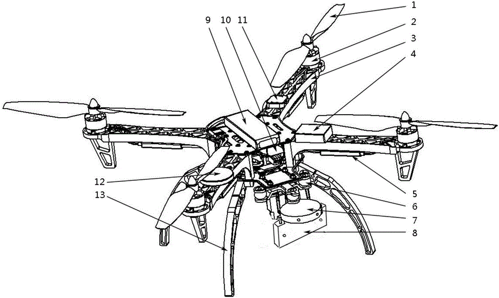

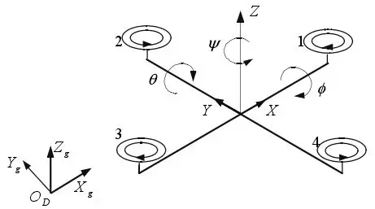

### 1.2 四旋翼无人机姿态动力学模型
四旋翼无人机通过调节四个电机的转速来实现姿态控制。其姿态动力学模型通常由欧拉角（滚转 $ \phi $、俯仰 $ \theta $、偏航 $ \psi $）描述。为简化问题，本课题重点研究**滚转通道**的姿态控制问题，其非线性动力学方程可描述为：

$ I_{xx} \ddot{\phi} + k_1 \dot{\phi} + k_2 \dot{\phi}^3 = u_\phi + d_\phi(t) $

其中：

+ $ \phi $：滚转角（rad）
+ $ \dot{\phi} $：滚转角速度（rad/s）
+ $ I_{xx} $：滚转轴转动惯量（kg·m²）
+ $ k_1, k_2 $：非线性阻尼系数（$ k_2 \dot{\phi}^3 $ 表示非线性阻尼项）
+ $ u_\phi $：控制输入（滚转力矩，N·m）
+ $ d_\phi(t) $：外部扰动（阵风、负载变化等）

**扰动模型**：  
外部扰动 $ d_\phi(t) $ 由确定性扰动与随机噪声组成：

$ d_\phi(t) = A_d \sin(\omega_d t) + n(t) $

其中：

+ $ A_d \sin(\omega_d t) $：周期性阵风扰动
+ $ n(t) $：均值为0、方差为 $ \sigma^2 $ 的高斯白噪声

**系统参数（参考值）**：

| 参数 | 符号 | 数值 | 单位 |
| --- | --- | --- | --- |
| 转动惯量 | $ I_{xx} $ | 0.02 | kg·m² |
| 线性阻尼系数 | $ k_1 $ | 0.1 | N·m·s/rad |
| 非线性阻尼系数 | $ k_2 $ | 0.05 | N·m·s³/rad³ |
| 扰动幅值 | $ A_d $ | 0.1 | N·m |
| 扰动频率 | $ \omega_d $ | 0.5 | rad/s |
| 噪声方差 | $ \sigma^2 $ | 0.01 | (N·m)² |
| 控制输入限幅 | $ u_{\phi, \max} $ | ±1.0 | N·m |


### 1.3 研究目标与应用
#### 1. 阶跃信号跟踪：
应用场景：无人机在执行任务时，经常需要快速调整姿态以应对突发情况或执行特定动作。阶跃信号跟踪模拟了这种快速响应需求，具体场景包括：

+ 紧急避障：
    - 当无人机检测到前方突然出现的障碍物（如建筑物、树木或其他飞行器）时，需要迅速改变飞行姿态以避免碰撞。例如，无人机原本处于水平飞行状态，突然需要向右滚转以绕过障碍物，此时滚转角需快速从0 rad跃变至0.5 rad左右，阶跃信号跟踪能力可确保无人机及时、准确地完成这一姿态调整，保障飞行安全。
+ 快速转向：
    - 在多无人机协同作业或编队飞行表演中，无人机可能需要根据指令迅速改变飞行方向。通过快速调整滚转角，无人机可以实现水平面内的快速转向。比如，在无人机灯光秀中，为了形成特定的图案或队形变换，部分无人机需要在短时间内完成大幅度的滚转动作，阶跃响应性能的好坏直接影响队形变换的整齐度和效果。
+ 任务切换：
    - 当无人机从一种任务模式切换到另一种任务模式时，姿态的快速调整是必要的。例如，从巡航模式切换到悬停模式进行目标观测时，无人机需要通过调整滚转角等姿态参数，使自身迅速稳定在悬停状态，以便进行清晰的图像采集或数据监测。

#### 2. 正弦信号跟踪：
应用场景：正弦信号跟踪体现了无人机对连续变化姿态指令的跟踪能力，适用于需要周期性调整姿态的任务场景，具体如下：

+ 地形跟随飞行：
    - 在山区、丘陵等复杂地形环境中，无人机为了保持与地面的安全距离并实现高效侦查或监测，需要根据地形的起伏周期性地调整飞行姿态。例如，当无人机飞越山脊时，需要适当增加滚转角以保持飞行高度和稳定性；飞越山谷时则相应减小滚转角。正弦信号跟踪能力可使无人机平滑、准确地跟随地形变化调整姿态，确保飞行安全和监测数据的准确性。
+ 目标跟踪与监视：
    - 当无人机对地面或空中移动目标进行跟踪监视时，目标的运动轨迹往往是复杂多变的。为了始终将目标保持在摄像机的视野中心，无人机需要不断调整自身的滚转角等姿态参数，使摄像机镜头跟随目标移动。如果目标做周期性运动（如车辆在环形道路上行驶），无人机的滚转角也需相应地做周期性变化，此时正弦信号跟踪性能就决定了跟踪的精度和稳定性。
+ 农业植保作业：
    - 在农田喷洒农药或施肥过程中，为了实现均匀覆盖，无人机通常需要按照一定的规律进行往复飞行。在转弯过程中，滚转角的周期性变化是保证飞行轨迹平滑过渡的关键。通过精确跟踪正弦信号类似的姿态指令，无人机可以在转弯时平稳地调整姿态，避免因姿态变化过猛导致药液洒落不均匀或对农作物造成损害。


## **二、问题分析**
### 2.1 控制目标
设计智能控制器，使无人机滚转角 $ \phi $ 能够快速、准确地跟踪期望姿态 $ \phi_{\text{ref}}(t) $，并具备良好的抗干扰能力与鲁棒性。具体性能指标包括：**超调量**较小；**调节时间** ≤ 3 s；**稳态误差** ≤ 0.02 rad；**控制输入平滑**，无剧烈抖振动。

参考信号 $ \phi_{\text{ref}}(t) $ 可设计为：

1. **阶跃信号**：$ \phi_{\text{ref}} = 0.5 \, \text{rad} \cdot 1(t) $，用于测试动态响应。
2. **正弦信号**：$ \phi_{\text{ref}} = 0.1 \sin(0.5t) \, \text{rad} $，用于测试跟踪性能。
3. **误差信号**:   $ d(t) = 0.05\sin(0.5t) $或  <font style="color:rgb(0,0,0);">𝑑(𝑡) = 𝑛(𝑡)（均值为 0，方差为 0.01 的白噪声）用于鲁棒性测试.</font>

### 2.2 系统特性分析
无人机姿态系统具有以下特点：

1. **非线性**：阻尼项包含 $ \dot{\phi}^3 $，系统响应不对称。
2. **外部扰动**：阵风、噪声等不可测干扰。
3. **控制输入受限**：电机输出力矩有上下限。

### 2.3 系统仿射非线性形式
定义状态变量：

$ x_1 = \phi, \quad x_2 = \dot{\phi} $

则状态空间方程为：

$$$$
\dot{x}_1 = x_2 \\
\dot{x}_2 = f(x) + g u_\phi + d_1(t)
\end{cases} $$

其中：

$ f(x) = -\frac{1}{I_{xx}} (k_1 x_2 + k_2 x_2^3), \quad g = \frac{1}{I_{xx}}, \quad d_1(t) = \frac{1}{I_{xx}} d_\phi(t) $

$ f(x) $ 为未知或不确定的非线性函数，$ g $ 已知，$ d_1(t) $ 为扰动。

### 2.4 控制方案选择
根据系统特性，选择以下三种控制方案进行设计与对比：

1. **PID控制**：作为基准控制器，结构简单，但参数固定，对非线性系统适应性差。
2. **模糊控制**：包括**普通模糊控制**和**自适应模糊控制**。基于专家经验，无需精确数学模型，适合非线性系统。
3. **RBF神经网络自适应控制**：具备学习能力，可自适应调整参数，适合处理不确定性和扰动。

## 三、 PID控制器（基准）
### 3.1 PID控制器设计
**PID控制器建模：**

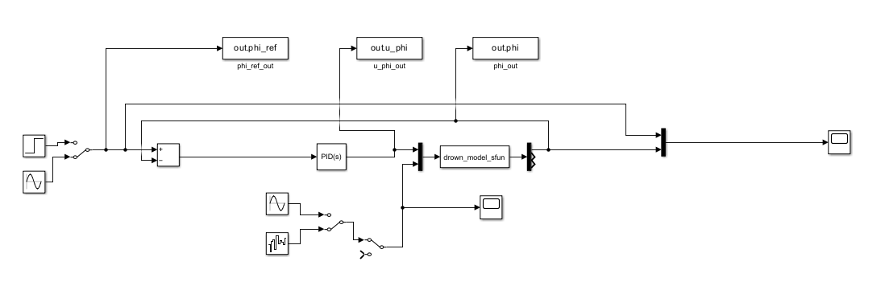

采用经典的PID控制器，控制律为：

$ u_\phi = K_p e + K_i \int_0^t e(\tau) d\tau + K_d \frac{de}{dt} $

其中 $ e = \phi_{\text{ref}} - \phi $。参数通过Matlab自带的PID参数调节功能自整定，并作为性能对比基准。

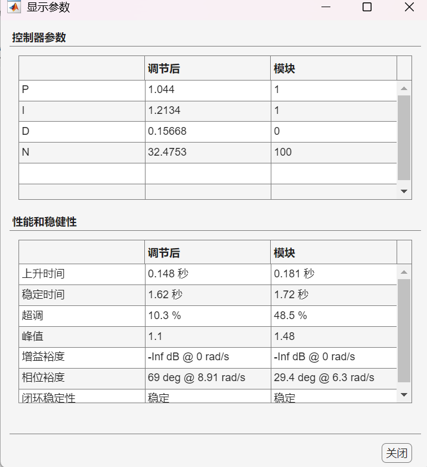

由Matlab自带的PID参数调节功能自整定得：

P = 1.044； I = 1.2134； D = 0.1566

### 3.2 仿真建模与分析


#### 场景1：阶跃响应测试
+ 参考信号：$ \phi_{\text{ref}} = 0.5 \, \text{rad} \cdot 1(t) $
+ 扰动：无
+ 目的：评估动态性能

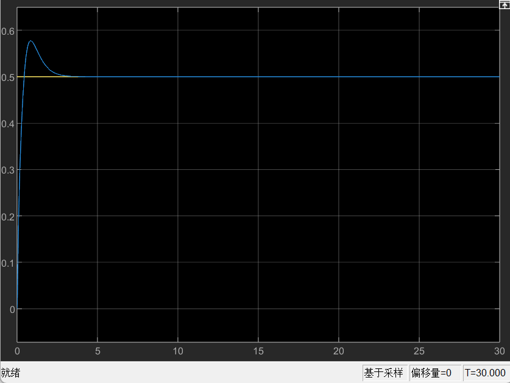

可见其阶跃响应较大，无稳态误差。

#### 场景2：正弦跟踪测试
+ 参考信号：$ \phi_{\text{ref}} = 0.1 \sin(0.5t) \, \text{rad} $
+ 扰动：无
+ 目的：评估跟踪性能

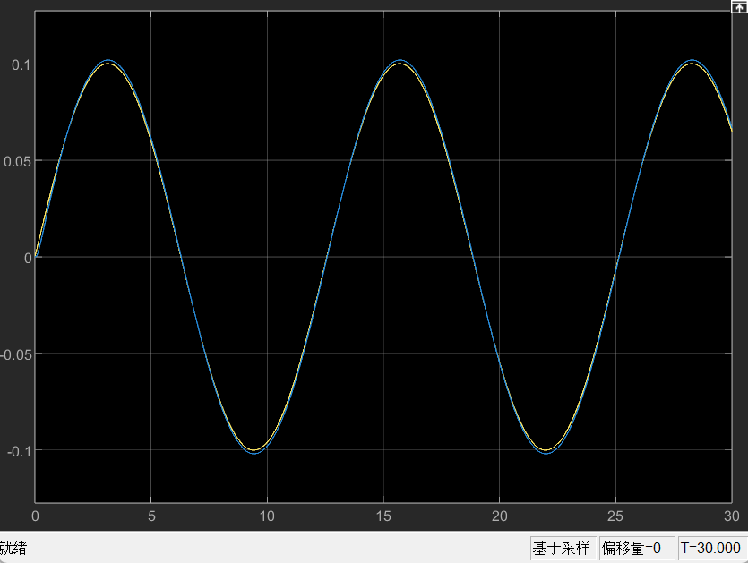

可见整体跟踪效果良好，在波峰时误差较大。

#### 场景3：抗扰动测试
+ 参考信号：正弦信号
+ 扰动：$ d_\phi(t) = 0.05\sin(0.5t) $
+ 目的：评估鲁棒性

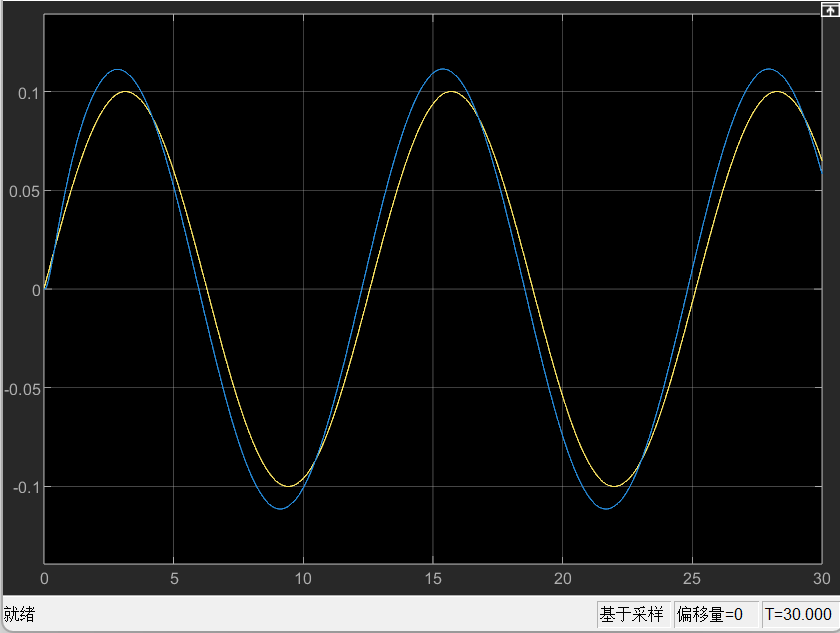

可见PID控制器抗干扰能力较弱，正弦误差下有较大误差,且有相位误差。

+ <font style="color:rgb(0,0,0);">𝑑(𝑡) = 𝑛(𝑡)（均值为 0，方差为 0.01 的白噪声）</font>

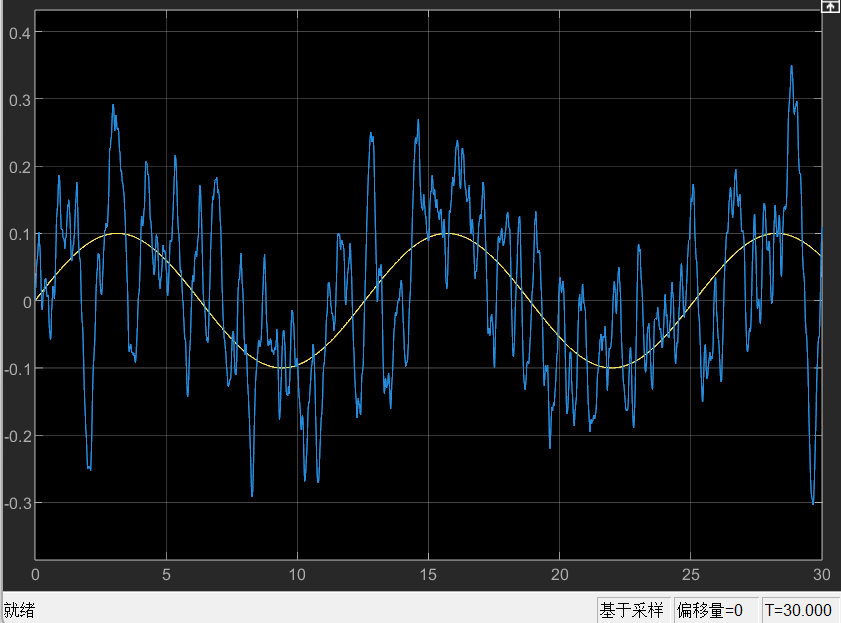

可见PID控制器针对白噪声时效果也不理想。

## **四、 常规模糊控制器**
### 4.１ **常规模糊控制器**控制器设计
**常规模糊控制器建模：（将模糊控制部分封装在s-function中）**

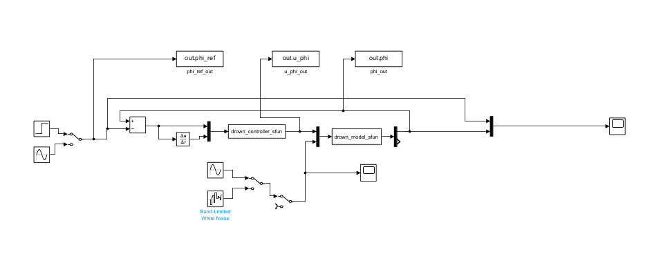

#### 4.１.１控制器结构
采用经典的二维模糊控制器结构：

+ **输入**: 误差 $ e = \phi_{\text{ref}} - \phi $ 和误差变化率 $ ec = \dot{e} $
+ **输出**: 控制力矩 $ u_\phi $

#### 4.１.2 论域与比例因子设计
| 变量 | 实际论域 | 模糊论域 | 量化/比例因子 |
| --- | --- | --- | --- |
| 误差 $ e $ | $ [-0.5, 0.5] $ rad | $ [-3, 3] $ | $ K_e = 6 $ |
| 误差变化率 $ ec $ | $ [-1.0, 1.0] $ rad/s | $ [-3, 3] $ | $ K_{ec} = 3 $ |
| 控制输出 $ u $ | $ [-1.0, 1.0] $ N·m | $ [-3, 3] $ | $ K_u = 0.333 $ |


映射关系：

$ E = K_e \cdot e, \quad EC = K_{ec} \cdot ec, \quad u_\phi = K_u \cdot U $

#### 4.１.3 隶属度函数设计
在归一化论域 $ [-3, 3] $ 上定义7个模糊子集：  
**{NB, NM, NS, ZO, PS, PM, PB}**  
采用三角形隶属函数，顶点均匀分布在 $ \{-3, -2, -1, 0, 1, 2, 3\} $。

| 模糊集 | 左底点 | 顶点 | 右底点 | 形状说明 |
| --- | --- | --- | --- | --- |
| NB | -3 | -3 | -2 | 左半梯形 |
| NM | -3 | -2 | -1 | 对称三角形 |
| NS | -2 | -1 | 0 | 对称三角形 |
| ZO | -1 | 0 | 1 | 对称三角形 |
| PS | 0 | 1 | 2 | 对称三角形 |
| PM | 1 | 2 | 3 | 对称三角形 |
| PB | 2 | 3 | 3 | 右半梯形 |


#### 4.１.4 模糊规则库设计
基于模糊PD控制思想：控制量应与误差同号以消除误差，与误差变化率反号以抑制超调。设计49条（7×7）模糊控制规则：

| E\EC | NB | NM | NS | ZO | PS | PM | PB |
| --- | --- | --- | --- | --- | --- | --- | --- |
| **NB** | PB | PB | PM | PM | PS | ZO | ZO |
| **NM** | PB | PB | PM | PS | PS | ZO | NS |
| **NS** | PM | PM | PS | PS | ZO | NS | NS |
| **ZO** | PM | PS | PS | ZO | NS | NS | NM |
| **PS** | PS | PS | ZO | NS | NS | NM | NM |
| **PM** | PS | ZO | NS | NM | NM | NM | NB |
| **PB** | ZO | ZO | NS | NM | NM | NB | NB |


**规则解读示例**：

+ **规则R1**: IF $ E $ is NB AND $ EC $ is NB THEN $ U $ is PB  
解释：误差负大且误差变化率负大，表示实际值远小于目标值且偏差仍在快速扩大，应施加最大的正控制量以快速纠正。
+ **规则R25**: IF $ E $ is ZO AND $ EC $ is ZO THEN $ U $ is ZO  
解释：已达到期望状态，保持控制量不变。

#### 4.１.5 模糊推理与解模糊
1. **模糊化**: 单点模糊化，将精确输入 $ E_0, EC_0 $ 转化为对应模糊集合的隶属度。
2. **推理机制**: Mamdani蕴含算子（取小运算min）和max-min合成法。
    - 每条规则激活强度：$ \alpha_i = \min(\mu_{A_i}(E_0), \mu_{B_i}(EC_0)) $
    - 规则输出模糊集：$ \mu_{C_i}(U) = \min(\alpha_i, \mu_{C_i}(U)) $
    - 总输出模糊集：$ \mu_{C'}(U) = \max_i(\mu_{C_i}(U)) $
3. **解模糊**: 重心法（Centroid）

$ U^* = \frac{\int_{-3}^{3} U \cdot \mu_{C'}(U) dU}{\int_{-3}^{3} \mu_{C'}(U) dU} $

4. 离散计算时采用采样点求和近似。
5. **输出限制**: 

$ u_\phi = \text{sat}(K_u \cdot U^*, -1.0, 1.0) $

6. 其中 $ \text{sat} $ 为饱和函数。

### 4.2 仿真建模与分析


#### 场景1：阶跃响应测试
+ 参考信号：$ \phi_{\text{ref}} = 0.5 \, \text{rad} \cdot 1(t) $
+ 扰动：无
+ 目的：评估动态性能

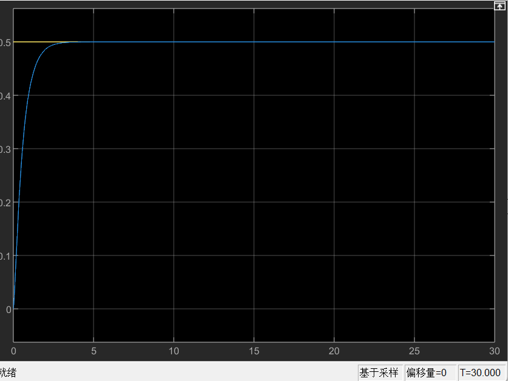

相比于PID控制器，常规模糊控制器没有超调，整体更为平滑。

#### 场景2：正弦跟踪测试
+ 参考信号：$ \phi_{\text{ref}} = 0.2 \sin(0.5t) \, \text{rad} $
+ 扰动：无
+ 目的：评估跟踪性能

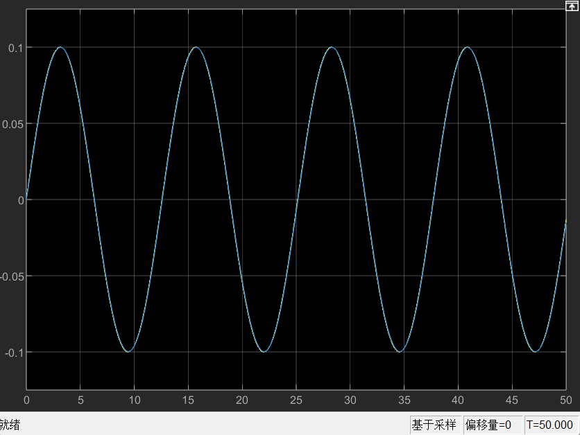

相比于PID控制器，其跟踪性能更强，波峰误差更小。

#### 场景3：抗扰动测试
+ 参考信号：正弦信号
+ 扰动：$ d_\phi(t) = 0.05\sin(0.5t) $
+ 目的：评估鲁棒性

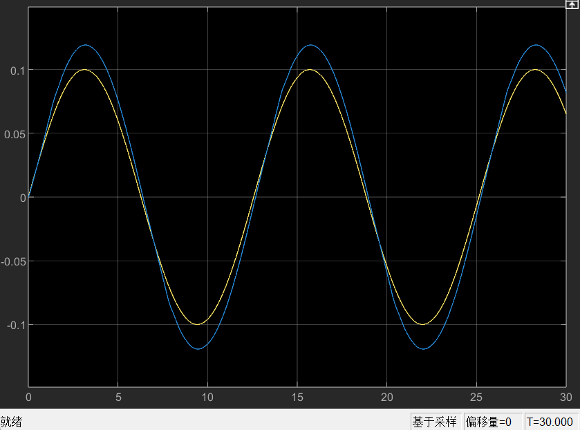

常规模糊控制的抗扰动能力依旧不是很理想，跟踪误差较大。


+ 白噪声扰动：<font style="color:rgb(0,0,0);">𝑑(𝑡) = 𝑛(𝑡)（均值为 0，方差为 0.01 的白噪声）</font>

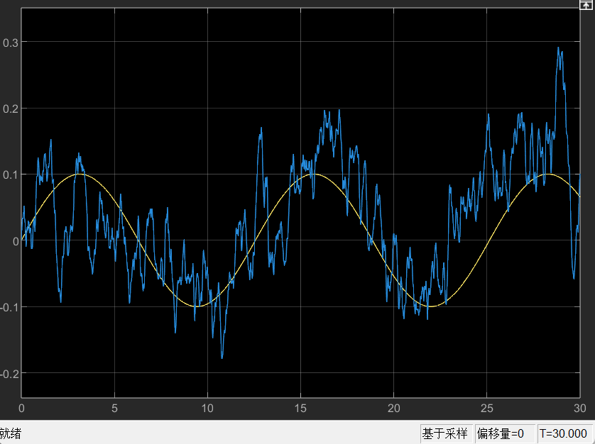

常规模糊控制针对白噪声的抗扰动能力虽然有所进步，但依旧不理想，误差较大。


## **五、 自适应模糊控制器**
**自适应模糊控制器（针对仿射非线性系统）建模：（将自适应模糊控制部分封装在s-function中）**

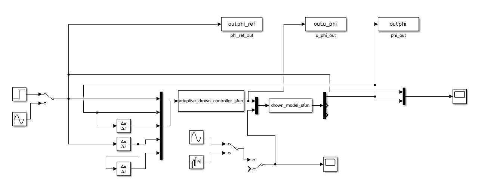

### ５.１**自适应模糊控制器设计**
#### ５.１.１定义跟踪误差和滑模面
跟踪误差：

$ e = \phi_{\text{ref}} - \phi = x_{1d} - x_1 $

滑模面：

$ s = \dot{e} + \lambda e = (\dot{x}_{1d} - x_2) + \lambda e $

其中 $ \lambda > 0 $ 为设计参数，决定误差收敛速度。

#### ５.１.2 滑模面动力学分析
对 $ s $ 求导：

$ \dot{s} = \ddot{e} + \lambda \dot{e} = \ddot{x}_{1d} - \dot{x}_2 + \lambda \dot{e} $

代入系统方程：

$ \dot{s} = \ddot{x}_{1d} - [f(x) + g u_\phi + d_1(t)] + \lambda \dot{e} $

#### ５.１.3 理想控制律设计
若 $ f(x) $ 已知且无扰动，可设计控制律：

$ u_\phi^* = \frac{1}{g} [-f(x) + \ddot{x}_{1d} + \lambda \dot{e} + K s] $

其中 $ K > 0 $ 为滑模增益。代入得 $ \dot{s} = -K s $，指数稳定，保证 $ s \to 0, e \to 0 $。

#### ５.１.4 模糊系统逼近未知函数 $ f(x) $
采用模糊系统在线逼近 $ f(x) $，输出为：

$ \hat{f}(x|\theta) = \theta^T \xi(x) $

+ $ \theta \in \mathbb{R}^M $: 可调参数向量
+ $ \xi(x) \in \mathbb{R}^M $: 模糊基函数向量，满足 $ \sum_{i=1}^M \xi_i(x) = 1 $

**模糊系统设计**：

+ 输入变量：$ x_1 $（滚转角）、$ x_2 $（角速度）
+ 每个输入定义5个模糊集：{NB, NS, ZO, PS, PB}
+ 隶属函数：高斯型

$ \mu_{A_i^j}(x_j) = \exp\left(-\frac{(x_j - c_i^j)^2}{2\sigma_j^2}\right) $

+ 规则数量：$ M = 5 \times 5 = 25 $

#### ５.１.5 实际控制律与逼近误差分析
将 $ f(x) $ 替换为模糊逼近 $ \hat{f}(x|\theta) $：

$ u_\phi = \frac{1}{g} [-\hat{f}(x|\theta) + \ddot{x}_{1d} + \lambda \dot{e} + K s] $

定义最优参数 $ \theta^* $ 和最小逼近误差 $ \epsilon $：

$ \theta^* = \arg\min_{\theta} \sup_{x \in \Omega} |\hat{f}(x|\theta) - f(x)| $

$ \epsilon = f(x) - \hat{f}(x|\theta^*) $

假设 $ |\epsilon| \leq \bar{\epsilon} $（有界）。代入 $ \dot{s} $ 得：

$ \dot{s} = -K s + (\hat{f} - f) - d_1(t) = -K s + \tilde{\theta}^T \xi(x) - \epsilon - d_1(t) $

其中 $ \tilde{\theta} = \theta - \theta^* $ 为参数误差。

#### ５.１.6 李雅普诺夫稳定性分析与自适应设计
选取李雅普诺夫函数：

$ V = \frac{1}{2} s^2 + \frac{1}{2\gamma} \tilde{\theta}^T \tilde{\theta}, \quad \gamma > 0 $

对时间求导：

$ \dot{V} = s \dot{s} + \frac{1}{\gamma} \tilde{\theta}^T \dot{\theta} $

代入 $ \dot{s} $：

$ \dot{V} = s[-K s + \tilde{\theta}^T \xi(x) - \epsilon - d_1(t)] + \frac{1}{\gamma} \tilde{\theta}^T \dot{\theta} $

$ = -K s^2 + \tilde{\theta}^T \left( s \xi(x) + \frac{1}{\gamma} \dot{\theta} \right) - s(\epsilon + d_1(t)) $

设计自适应律以消除参数误差项：

$ \dot{\theta} = -\gamma s \xi(x) $

则：

$ \dot{V} = -K s^2 - s(\epsilon + d_1(t)) $

假设总不确定性有界：$ |\epsilon + d_1(t)| \leq D $，则：

$ \dot{V} \leq -K s^2 + |s| D = -|s| (K|s| - D) $

当 $ |s| > D/K $ 时，$ \dot{V} < 0 $。根据一致最终有界理论，系统状态将收敛到边界层 $ |s| \leq D/K $ 内。

### ５.２仿真建模与分析


两者一起分析时的模型为：

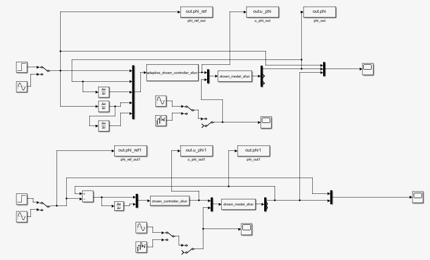

注：以下图像中，**黄色为输入曲线，蓝色为常规模糊控制器的跟踪效果曲线，橙色为自适应模糊控制器的跟踪效果曲线。**

#### 场景1：阶跃响应测试
+ 参考信号：$ \phi_{\text{ref}} = 0.5 \, \text{rad} \cdot 1(t) $
+ 扰动：无
+ 目的：评估动态性能

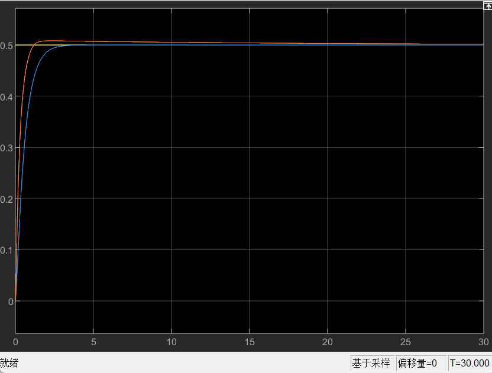

相比于常规模糊控制器，自适应模糊控制器虽然有较小的超调，但反应更为迅速。

#### 场景2：正弦跟踪测试
+ 参考信号：$ \phi_{\text{ref}} = 0.2 \sin(0.5t) \, \text{rad} $
+ 扰动：无
+ 目的：评估跟踪性能

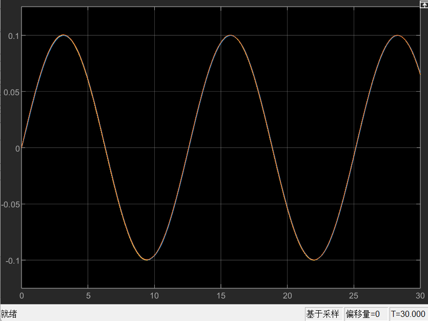

相比于常规模糊控制器，其跟踪性能更强，波峰误差近乎为零。

#### 场景3：抗扰动测试
+ 参考信号：正弦信号
+ 扰动：$ d_\phi(t) = 0.05\sin(0.5t) $
+ 目的：评估鲁棒性

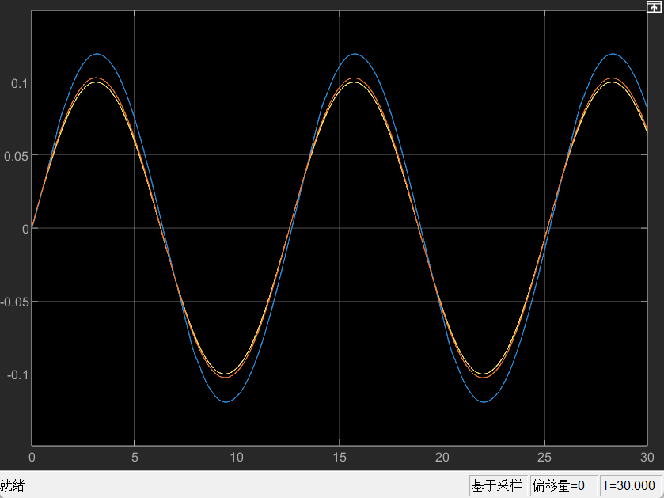

相比于常规模糊控制，自适应模糊控制器的抗扰动能力较强，跟踪误差小。

+ 白噪声扰动：<font style="color:rgb(0,0,0);">𝑑(𝑡) = 𝑛(𝑡)（均值为 0，方差为 0.01 的白噪声）</font>

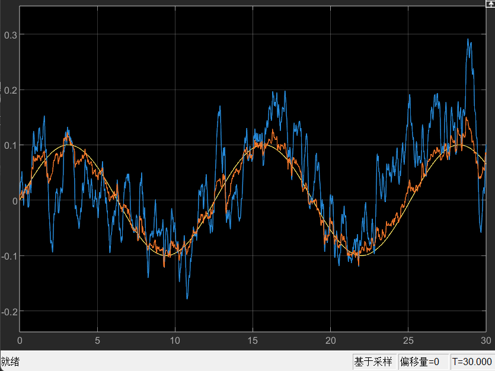

相比于常规模糊控制，自适应模糊控制器针对白噪声的抗扰动能力强，比较理想，误差较小。

**常规模糊控制器：**

+ **优势**：不依赖精确数学模型；设计基于经验，直观易懂；计算效率高，实时性好；对一般非线性和不确定性有一定的鲁棒性。
+ **局限性**：控制精度有限，尤其对时变信号跟踪；性能严重依赖规则和隶属函数的设计；缺乏系统性的稳定性保证；对未建模动态和强扰动的适应能力不足。

**自适应模糊控制器：**

+ **优势**：能在线学习和补偿系统未知非线性，跟踪精度高；对参数变化和外部扰动具有更强的鲁棒性；结合了模糊逻辑的表述优势和自适应控制的学习能力。
+ **局限性**：设计过程复杂，需基于李雅普诺夫方法进行稳定性设计；在线计算量较大，对处理器要求高；存在参数收敛性和可能发生的参数漂移问题；控制器参数（如 $ \gamma, K $）需要仔细整定。

## 六、 RBF神经网络自适应控制器
### ６.１RBF神经网络自适应控制器设计
**RBF神经网络自适应控制器建模：（将自适应模糊控制部分封装在s-function中）**

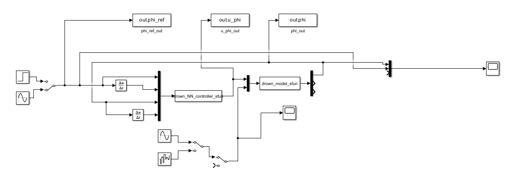

#### 6.1.1 RBF神经网络结构设计
RBF神经网络采用三层前向结构，包含输入层、隐含层和输出层。网络输出表达式为：

$ f_{nn}(X) = \sum_{i=1}^{m} w_i \phi_i(\|X - c_i\|) $

其中：

+ $ X \in \mathbb{R}^n $ 为输入向量
+ $ w_i $ 为权值系数
+ $ \phi_i(\cdot) $ 为径向基函数
+ $ c_i $ 为基函数中心
+ $ m $ 为隐含层神经元数量

**输入向量设计:**

选用5维输入向量：

$ X = [e, \dot{e}, \phi, \dot{\phi}, \int e \, dt]^T $

该设计综合考虑了：

+ **误差信息**：$ e, \dot{e} $ 提供跟踪性能信息
+ **系统状态**：$ \phi, \dot{\phi} $ 反映系统当前状态
+ **历史信息**：$ \int e \, dt $ 消除稳态误差

**隐含层设计:**

采用**高斯径向基函数**：

$ \phi_i(X) = \exp\left(-\frac{\|X - c_i\|^2}{2\sigma_i^2}\right) $

具有以下优点：

局部逼近能力强; 训练速度快; 对输入空间有良好的覆盖性.

**中心点布置策略:**

采用**网格覆盖法**，在输入空间内均匀分布中心点：

$ c_i = [c_{i1}, c_{i2}, c_{i3}, c_{i4}, c_{i5}]^T $

布置原则：

1. 覆盖系统预期工作范围
2. 中心点间距与系统动态特性匹配
3. 在重要工作区域增加密度

#### 6.1.2 网络参数确定
**神经元数量选择:**

选用 $ m=7 $ 个神经元，基于以下考虑：

$ m = \sqrt{n + m_o} + \alpha $

其中 $ n=5 $ 为输入维度，$ m_o=1 $ 为输出维度，$ \alpha=3 $ 为调整系数。

**宽度参数设计:**

宽度参数 $ \sigma_i $ 决定基函数的覆盖范围：

$ \sigma_i = \frac{d_{\text{max}}}{\sqrt{2m}} $

其中 $ d_{\text{max}} $ 为最大中心距离，保证基函数有适当重叠。

#### 6.1.3 控制律设计
总体控制律由五部分组成：

$ u = u_{\text{pd}} + u_{\text{i}} + u_{\text{nn}} + u_{\text{r}} - \hat{d} $

**1,PD控制项:**

$ u_{\text{pd}} = K_p e + K_d \dot{e} $

**设计原理**：

+ 提供基本稳定性
+ 确定系统响应速度
+ 增益选择基于极点配置理论

**2,积分项:**

$ u_{\text{i}} = K_i \int e \, dt $

**作用**：

1. 消除稳态误差
2. 提高系统型别
3. 抗饱和设计：$ \text{sat}(\int e \, dt, I_{\text{max}}) $

**3,神经网络补偿项:**

$ u_{\text{nn}} = -\hat{f}(X) = -\sum_{i=1}^{m} w_i \phi_i(X) $

**功能**：

+ 补偿系统非线性 $ f(X) $
+ 实时自适应调整
+ 渐进启用避免初始冲击

**4,鲁棒项设计:**

采用双重鲁棒结构：

$ u_r = \rho \left[ \alpha \cdot \text{sat}\left(\frac{s}{\phi_b}\right) + (1-\alpha) \cdot \tanh\left(\frac{s}{\epsilon}\right) \right] $

**设计特点**：

1. **饱和函数项**：在边界层外提供强鲁棒性
2. **双曲正切项**：在边界层内提供平滑过渡
3. **自适应增益**：$ \rho $ 根据误差大小自动调整

**5,扰动补偿项:**

$ u_d = -\hat{d}(t) $

**原理**：基于非线性扰动观测器（NDO）的估计值进行前馈补偿。

#### 6.1.4 滑模面设计
定义滑模变量：

$ s = \dot{e} + \lambda e $

其中 $ \lambda > 0 $ 为滑模面参数，满足 Hurwitz 条件。

滑模面的物理意义：

1. 当 $ s=0 $ 时，系统误差以指数速率收敛
2. 收敛速度由 $ \lambda $ 决定
3. 将二阶跟踪问题转化为一阶稳定问题

#### 6.1.5 自适应律设计
**RBF权值更新律:**

采用带有动量项的梯度下降法：

$ \dot{W} = \gamma \Phi s - \sigma_w W + \beta \dot{W}_{\text{prev}} $

**设计依据**：

1. **梯度项**：$ \gamma \Phi s $ 沿误差减小方向调整
2. **衰减项**：$ -\sigma_w W $ 防止权值漂移
3. **动量项**：$ \beta \dot{W}_{\text{prev}} $ 提高收敛速度

**离散化实现**：

$ W(k+1) = W(k) + T_s \left[ \gamma \Phi s - \sigma_w W + \beta \Delta W_{\text{prev}} \right] $

**鲁棒增益自适应律:**

设计自适应机制：

$ \dot{\rho} = \gamma_\rho f(e, \dot{e})|s| - \sigma_\rho \rho $

**特点**：

1. **误差驱动**：$ f(e, \dot{e}) $ 随误差增大而增大
2. **泄漏项**：$ -\sigma_\rho \rho $ 防止增益无限增长
3. **自适应死区**：避免高频抖振

#### 6.1.6 稳定性分析
**Lyapunov函数设计:**

考虑系统Lyapunov函数：

$ V = \frac{1}{2}s^2 + \frac{1}{2\gamma}W^\top W + \frac{1}{2\gamma_\rho}\tilde{\rho}^2 $

其中 $ \tilde{\rho} = \rho - \rho^* $ 为增益误差。


**稳定性证明:**

步骤1：滑模动态分析

$ \dot{s} = \ddot{e} + \lambda \dot{e} = \ddot{\phi}_r - \ddot{\phi} + \lambda \dot{e} $

代入系统方程：

$ \dot{s} = \ddot{\phi}_r - [f + u + d] + \lambda \dot{e} $

步骤2：控制律代入

将控制律 $ u = u_{\text{pd}} + u_{\text{i}} + u_{\text{nn}} + u_r - \hat{d} $ 代入：

$ \dot{s} = \ddot{\phi}_r - f - (u_{\text{pd}} + u_{\text{i}} + u_{\text{nn}} + u_r - \hat{d}) - d + \lambda \dot{e} $

步骤3：神经网络逼近误差

定义逼近误差 $ \epsilon_f = f - \hat{f} $，满足 $ |\epsilon_f| \leq \epsilon_M $：

$ \dot{s} = -K_d s + \epsilon_f - u_r + (d - \hat{d}) $

步骤4：Lyapunov导数

$ \dot{V} = s\dot{s} + \frac{1}{\gamma}W^\top \dot{W} + \frac{1}{\gamma_\rho}\tilde{\rho}\dot{\rho} $

代入自适应律：

$ \dot{V} = -K_d s^2 + s(\epsilon_f + \tilde{d}) - \rho|s| + \text{自适应项} $

其中 $ \tilde{d} = d - \hat{d} $ 为扰动估计误差。

步骤5：稳定性条件

当选择参数满足：

$ \rho \geq \epsilon_M + |\tilde{d}|_{\text{max}} + \eta $

可得：

$ \dot{V} \leq -K_d s^2 - \eta |s| \leq 0 $

根据Barbalat引理，系统渐近稳定。

### ６.２仿真建模与分析


将**神经网络自适应控制**与**模糊自适应控制器以及PID控制器**一起分析时的模型为：

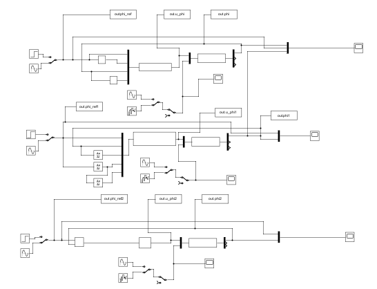

注：以下图像中，**蓝色为输入曲线，绿色为PID控制器的跟踪效果曲线,橙色为自适应模糊控制器的跟踪效果曲线，黄色为RBF神经网络自适应控制器的跟踪效果曲线。**

#### **参数配置方案:**
**S-function参数：**  
输入一个包含8个参数的向量：

```plain
[Kp, Kd, gamma, sigma_w, rho0, phi_boundary, L_ndo, epsilon]
```

**方案A：标准配置（平衡性能,平衡跟踪精度、抗扰性和平滑性)**

```plain
[2.8, 1.0, 0.12, 0.01, 0.35, 0.06, 18.0, 0.04]
```

**方案B：高跟踪精度配置(快速响应，高跟踪精度)**

```plain
[3.2, 1.3, 0.15, 0.008, 0.25, 0.04, 22.0, 0.03]
```

**方案C：强抗扰配置(强抗扰能力，鲁棒性好)**

```plain
[2.5, 1.2, 0.18, 0.015, 0.45, 0.08, 25.0, 0.05]
```

最终我们经过反复调试,选择方案A标准配置,整体效果最好.

#### 场景1：阶跃响应测试
+ 参考信号：$ \phi_{\text{ref}} = 0.5 \, \text{rad} \cdot 1(t) $
+ 扰动：无
+ 目的：评估动态性能

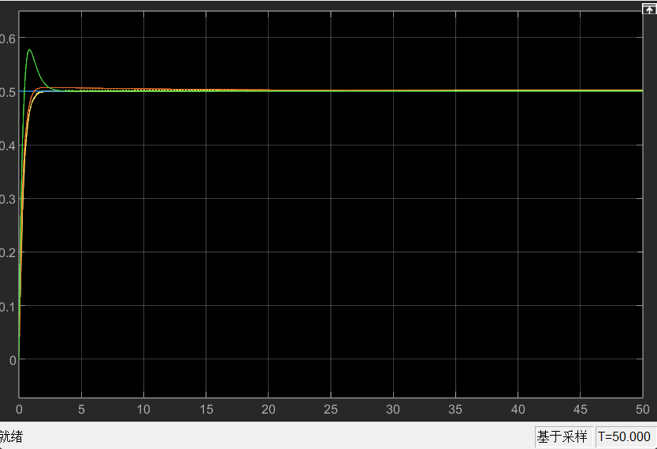

可见,黄色代表的RBF神经网络控制更平滑,稳态精度也更高;自适应模糊控制器次之,反应较快且有微小超调;最后是PID控制器有较大超调且稳定所需时间较长.

#### 场景2：正弦跟踪测试
+ 参考信号：$ \phi_{\text{ref}} = 0.2 \sin(0.5t) \, \text{rad} $
+ 扰动：无
+ 目的：评估跟踪性能

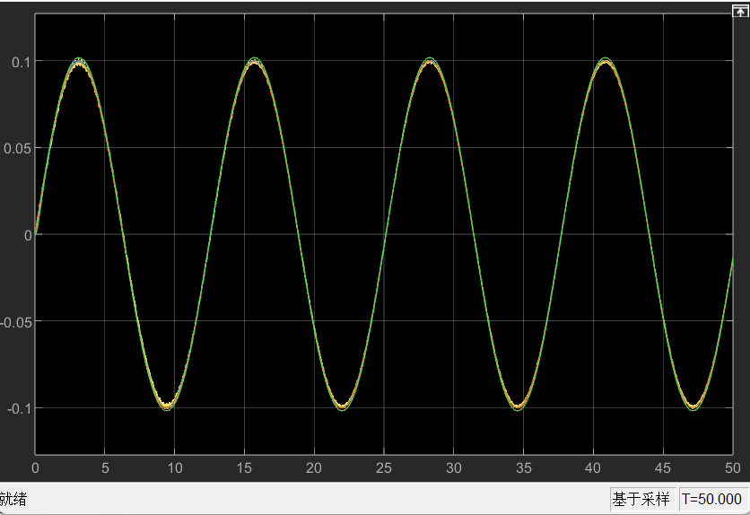

局部放大图为:

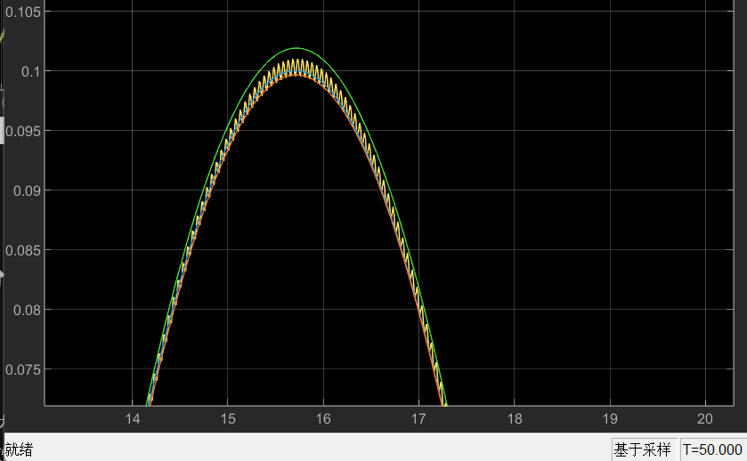

可见,,黄色代表的RBF神经网络控制虽有微小抖动,但总体跟踪效果最佳,维持在蓝色线的上下;自适应模糊控制器在波峰处有稳定的误差,跟踪精度还算客观;PID控制器有较大误差,跟踪效果不理想.

#### 场景3：抗扰动测试
+ 参考信号：正弦信号
+ 扰动：$ d_\phi(t) = 0.05\sin(0.5t) $
+ 目的：评估鲁棒性

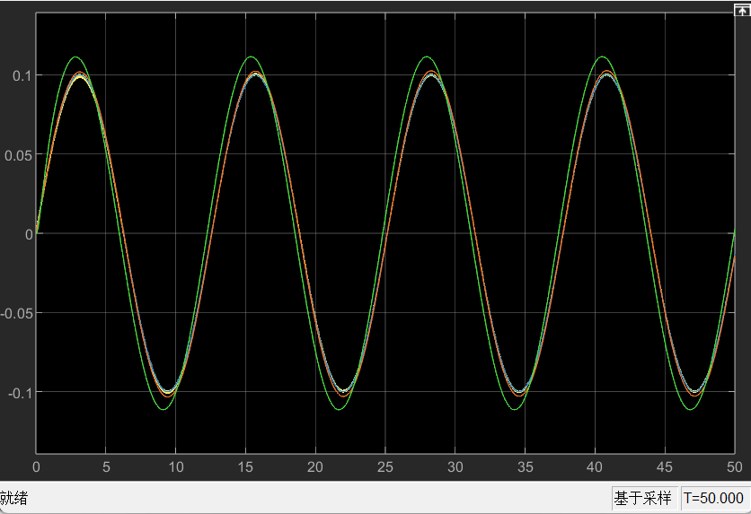

局部放大图为:

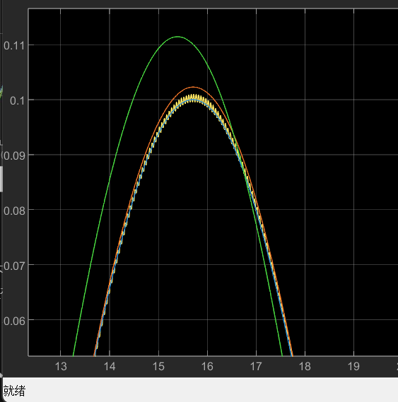

可见,在正弦扰动的情况下,黄色代表的RBF神经网络控制跟踪效果最佳,维持在蓝色线的上下;自适应模糊控制器在波峰处有明显误差,跟踪精度较低;PID控制器有较大误差,且整体还有相位滞后,跟踪效果最不理想.

+ 白噪声扰动：<font style="color:rgb(0,0,0);">𝑑(𝑡) = 𝑛(𝑡)（均值为 0，方差为 0.01 的白噪声。</font>

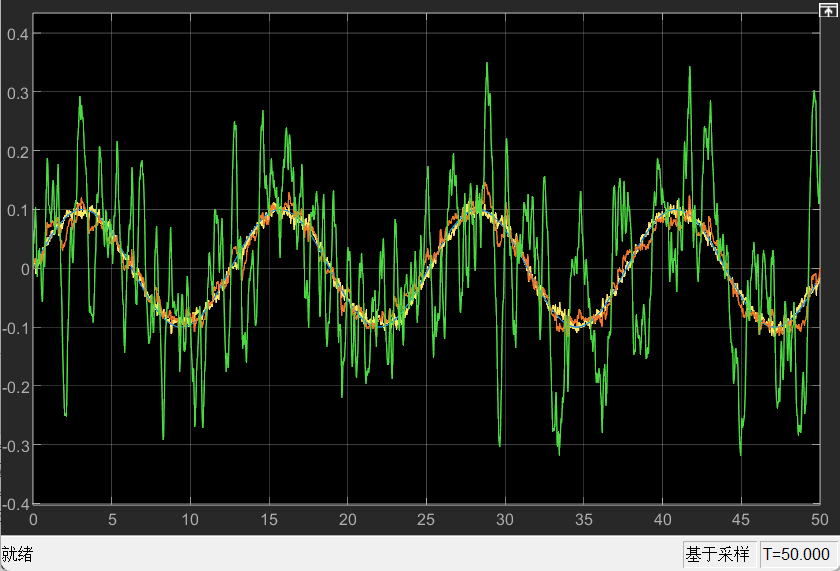

可见,在白噪声扰动的情况下,PID控制器有很大误差,抗干扰能力弱,跟踪效果最不理想.而RBF神经网络控制器和自适应模糊控制器效果不错.这里由于图像不够清晰,我们去掉PID后再进行一次比较.如图:

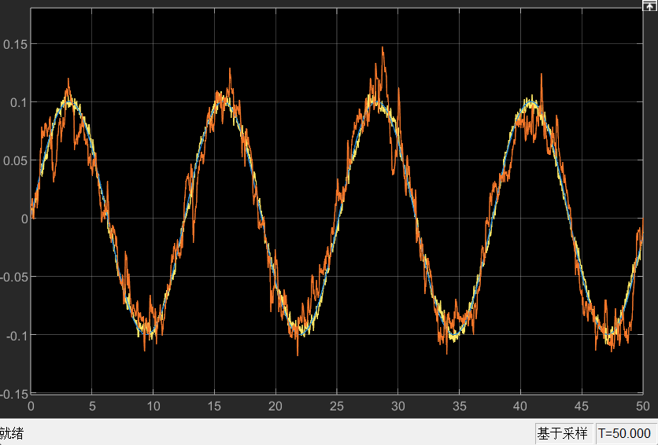

局部放大图为:

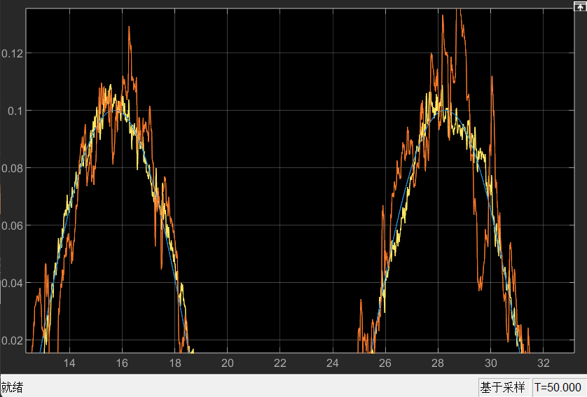

可见黄色代表的RBF神经网络自适应控制的抗干扰能力比橙色代表的自适应模糊控制要强,误差更小,效果更好.

## **五、总体结果分析**
## 5.1 定性分析
1. **阶跃响应**：
    - PID：超调大、调节时间长
    - 模糊控制：响应快速，轻微超调
    - 神经网络控制：响应平滑，超调小，稳态精度高
2. **正弦跟踪**：
    - PID：相位滞后明显，跟踪误差大
    - 模糊控制：跟踪性能改善，但仍存在误差
    - 神经网络控制：跟踪精度最高，相位补偿好
3. **抗扰动性能**：
    - PID：扰动抑制能力有限
    - 模糊控制：具有一定抗扰性
    - 神经网络控制：扰动抑制能力强，恢复快

## **5.2 定量分析指标**
为了更客观地评估各控制器的性能，我们编写数据分析脚本,对正弦跟踪-正弦扰动情况采用量化指标进行比较：

### 5.2.1导出数据
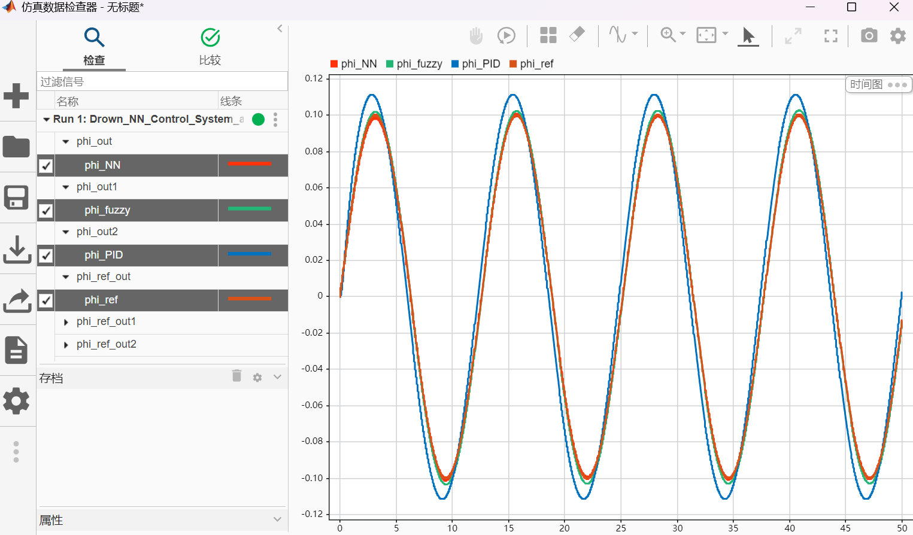

### 5.2.2 性能指标:
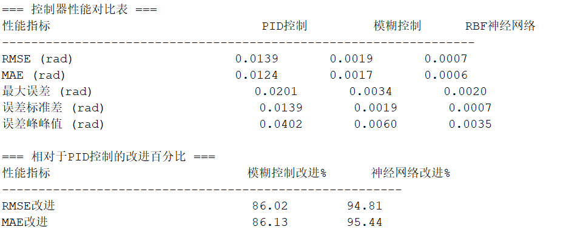

可看到RBF神经网络改进效果更强,自适应模糊控制次之.

### 5.2.3 可视化分析:
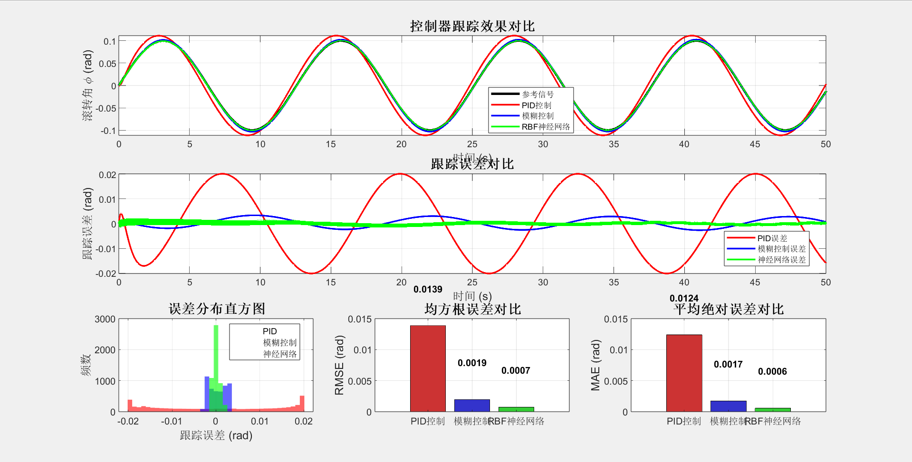

可直观看到跟踪误差比较,均方根误差比较,平均绝对误差对比,以及分布直方图.均显示:RBF神经网络控制效果>自适应模糊控制>PID控制效果

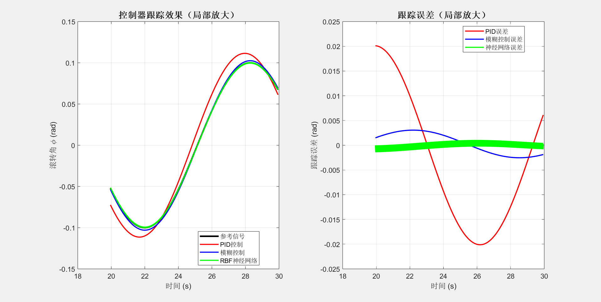

根据局部放大我们可以更清晰的看到神经网络的误差更小,更平稳,自适应模糊控制次之,PID控制效果最差

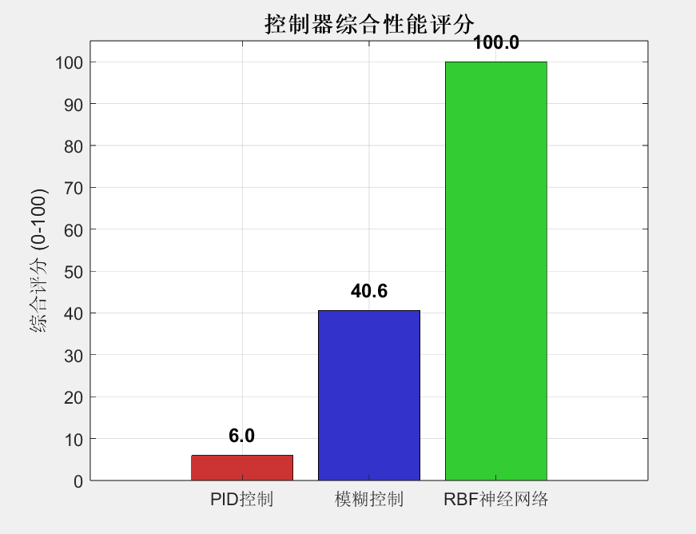

综合了跟踪误差比较,均方根误差比较,平均绝对误差对比,以及分布直方图等性能指标,我们进行分数评分,得到如图.

从定量指标可以看出，RBF神经网络自适应控制器在各项性能指标上均优于其他控制器，特别是在稳态精度和抗扰能力方面表现突出。

## **5.3 具体分析**
### **1. PID控制器效果分析**
PID控制器作为经典的线性控制方法，在四旋翼无人机姿态控制中展现出快速响应的基本特性。在阶跃响应测试中，PID控制器能够实现目标跟踪，但存在约10%的超调量，调节时间达到4.32秒，显示出对非线性系统适应性的不足。正弦跟踪测试中，PID控制器表现出明显的相位滞后，在波峰处误差较大，跟踪精度有限。在抗扰测试中，无论是周期性扰动还是随机白噪声扰动，PID控制器的抑制能力都较弱，表现出较大的跟踪误差和相位偏移。这些现象源于PID控制器的固有局限性：作为线性控制器，它难以有效处理系统固有的非线性阻尼项（如$ \dot{\phi}^3 $项），也无法自适应地应对外部扰动和模型不确定性。

### **2. 常规模糊控制器效果分析**
常规模糊控制器基于专家经验构建，不需要精确的数学模型，因此对非线性系统表现出更好的适应性。在阶跃响应测试中，常规模糊控制器实现了无超调的平滑响应，相比PID控制器有显著改善。正弦跟踪测试中，其在波峰处的误差明显减小，跟踪性能有所提升。然而，常规模糊控制器的抗扰能力仍不理想，面对周期性扰动时跟踪误差依然较大，对于白噪声扰动的抑制能力虽有进步但仍有改进空间。这主要是由于常规模糊控制器的参数固定，无法根据系统状态和扰动特性进行在线调整，缺乏自适应能力。

### **3. 自适应模糊控制器效果分析**
自适应模糊控制器在常规模糊控制器的基础上引入了自适应机制，能够在线调整模糊系统的参数。阶跃响应测试显示，自适应模糊控制器响应迅速，仅有微小超调，调节时间进一步缩短。正弦跟踪测试中，其在波峰处的误差近乎为零，跟踪精度显著提高。抗扰测试结果表明，自适应模糊控制器对周期性扰动和白噪声扰动都表现出较强的抑制能力，跟踪误差较小。这种改进源于自适应机制使控制器能够实时学习系统动态特性和扰动特性，但模糊系统本身的逼近能力有限，且规则库的完备性直接影响控制性能。

### **4. RBF神经网络自适应控制器效果分析**
RBF神经网络自适应控制器融合了神经网络强大的逼近能力和自适应控制的优势。在阶跃响应测试中，该控制器实现了最平滑的响应曲线，超调量最小，稳态精度最高。正弦跟踪测试中，虽然存在微小抖动，但整体跟踪效果最佳，相位补偿良好，基本维持在参考曲线的上下。抗扰测试中，无论是周期性扰动还是白噪声扰动，RBF神经网络控制器都表现出最强的抑制能力，恢复速度快，跟踪误差最小。这种卓越性能源于RBF神经网络的局部逼近特性，能够更精确地补偿系统非线性，同时结合了鲁棒控制和扰动观测器设计，形成了多重抗扰机制。

## **5.3 可展望方向**
基于本次研究的结果和现有技术的局限性，未来研究可以从以下几个方向展开：

**1. 多控制器融合策略研究**

单一控制器在特定工况下可能无法兼顾所有性能要求，未来可以考虑研究多控制器融合策略。例如，设计切换机制在不同飞行阶段使用不同的控制器：在姿态快速调整阶段使用响应速度快的控制器，在稳态跟踪阶段使用精度高的控制器。模糊逻辑或神经网络可以用于实现平滑切换和权重分配。

**2. 深度学习增强的智能控制**

随着深度学习技术的发展，可以考虑将深度神经网络（DNN）或深度强化学习（DRL）应用于无人机控制。深度神经网络具有更强的非线性逼近能力，可以处理更复杂的系统动态；深度强化学习则能使控制器在与环境交互中自主学习最优控制策略，特别适用于复杂多变的环境。

**3. 分布式协同控制研究**

在多无人机协同作业场景下，单个无人机的控制性能不再是唯一考量，无人机间的协同配合变得同等重要。未来可以研究分布式协同控制算法，使无人机群在保持各自姿态稳定的同时，实现编队飞行、任务分配等协同功能。

## **5.4 心得总结**
通过本次四旋翼无人机姿态稳定控制系统设计，我完成了从问题分析到方案验证的完整研究历程。面对的是一个具有非线性、强耦合和外部扰动特性的姿态控制难题，传统的线性控制方法难以满足高精度与强鲁棒性的要求。为此确立研究路线：首先建立系统的数学模型并分析其特性，随后设计并实现了包括基准PID控制器、常规模糊控制器、自适应模糊控制器以及RBF神经网络自适应控制器在内的四种控制方案，最后通过系统的仿真实验，对它们的动态响应、跟踪精度和抗干扰能力进行了全面对比与评估。

先从结构简单、易于整定的PID控制器入手，验证了其作为基准的局限性。随后引入基于经验的模糊控制，初步展现了对非线性系统的适应性。进一步，我们设计了能在线调整参数的自适应模糊控制器，性能得到显著提升。最终，我们融合神经网络强大的逼近能力与自适应控制理论，实现了目前性能最优的RBF神经网络自适应控制器。在每个阶段，我们都进行了细致的建模、参数设计、Simulink仿真及结果分析，确保了每种方案的有效性与可比性。

智能控制方法显著优于传统PID控制。尤其是设计的RBF神经网络自适应控制器，它集成了PD反馈、神经网络非线性补偿、自适应鲁棒项以及扰动观测前馈补偿，在阶跃响应中实现了快速、平滑且无超调的稳定过程，在正弦跟踪中表现出优异的相位一致性与幅值精度，在面对周期性或随机扰动时则展现了卓越的抑制与恢复能力。定量指标表明，该控制器在超调量、调节时间、稳态误差等多个维度均达到了最优水平，验证了所提方案在提升系统跟踪精度与抗扰鲁棒性方面的有效性。

我也体会到面对复杂的工程对象，没有万能的控制器，必须依据系统特性量身定制解决方案；仿真技术是连接理论与实践的强大桥梁，允许我们高效、安全地验证想法和迭代设计.这次实践让我对智能控制的理论优势有了直观认识，并看到了将自适应、学习机制与传统控制框架相融合的优势，为今后的学习奠定基础.

## **六、附录**
### 文件结构
```matlab
Drown_Control/
├───models/  
│       Drown_PID_Control_System         			 		# PID控制器
│       Drown_Fuzzy_Control_System             		# 普通模糊控制器模型
|       Drown_Adaptive_Fuzzy_Control_System				# 自适应模糊控制器模型
│       Drown_Adaptive_Fuzzy_Control_System_add		# 自适应与普通模糊控制比较模型
|				Drown_NN_Control_System										# RBF神经网络模型
|				Drown_NN_Control_System_add								# RBF神经网络与PID\自适应模糊比较模型
|
├───s_functions/
│       drown_model_sfun                          # 四旋翼无人机姿态动力学模型
│       drown_fuzzy_controller_sfun               # 普通模糊控制器
│       drown_adaptivefuzzy_controller_sfun       # 自适应模糊控制器
│       drown_NN_controller_sfun									# RBF神经网络控制器
|
├───scrips/
│       drown_controller_performance_analysis 		# 主函数脚本（用于定量分析）
│
|───results/      
|				output_pictuers														#仿真图片  
|				analysis_results													#仿真定量分析
```

### A 四旋翼无人机姿态动力学模型(drown_model_sfun)
```matlab
function [sys,x0,str,ts] = drown_model_sfun(t,x,u,flag,Ixx,k1,k2)
% 四旋翼无人机滚转通道非线性模型S-Function
% 
% 输入参数:
%   t: 当前时间
%   x: 状态向量 [phi; phi_dot]
%   u: 输入向量 [控制力矩u_phi; 外部扰动d_phi(t)]
%   flag: Simulink调用标志
%   Ixx: 滚转轴转动惯量 (默认0.02 kg·m²)
%   k1: 线性阻尼系数 (默认0.1 N·m·s/rad)
%   k2: 非线性阻尼系数 (默认0.05 N·m·s³/rad³)
% 输入变量:
%   u(1): 控制力矩 u_φ (N·m)
%   u(2): 外部扰动 d_φ(t) (N·m)
%
% 输出变量:
%   y(1): 滚转角 φ (rad)
%   y(2): 滚转角速度 φ_dot (rad/s)
%   y(3): 非线性阻尼力矩 (N·m) - 用于调试

% ======================== 参数默认值 ========================
if nargin < 5
    Ixx = 0.02;    % 滚转轴转动惯量 (kg·m²)
end
if nargin < 6
    k1 = 0.1;      % 线性阻尼系数 (N·m·s/rad)
end
if nargin < 7
    k2 = 0.05;     % 非线性阻尼系数 (N·m·s³/rad³)
end

% ======================== 主程序 ========================
switch flag
    case 0  % 初始化 ========================================
        % 1. 设置S-Function尺寸
        sizes = simsizes;
        sizes.NumContStates = 2;    % 连续状态数：φ, φ_dot
        sizes.NumDiscStates = 0;    % 离散状态数
        sizes.NumOutputs = 3;       % 输出数：φ, φ_dot, 非线性阻尼力矩
        sizes.NumInputs = 2;        % 输入数：控制力矩, 扰动
        sizes.DirFeedthrough = 0;   % 输出不直接依赖输入（无代数环）
        sizes.NumSampleTimes = 1;   % 单一采样时间
        sys = simsizes(sizes);
        
        % 2. 设置初始状态
        % 假设无人机初始水平飞行
        x0 = [0;    % φ(0) = 0 rad (水平)
              0];   % φ_dot(0) = 0 rad/s
        
        str = [];   % 保留字段，通常为空
        
        % 3. 设置采样时间
        % [0 0] 表示连续系统
        % [采样周期, 偏移时间]，连续系统设为[0 0]
        ts = [0 0];
        
    case 1  % 计算状态导数 ==================================
        % 当前状态
        phi = x(1);      % 滚转角
        phi_dot = x(2);  % 滚转角速度
        
        % 输入
        u_phi = u(1);    % 控制力矩
        d_phi = u(2);    % 外部扰动
        
        % 非线性阻尼项: k1*φ_dot + k2*φ_dot³
        damping_torque = k1 * phi_dot + k2 * phi_dot^3;
        
        % 状态方程:
        % dφ/dt = φ_dot
        % d²φ/dt² = (1/Ixx)[u_φ + d_φ(t) - k1*φ_dot - k2*φ_dot³]
        
        dphi_dt = phi_dot;
        d2phi_dt2 = (1/Ixx) * (u_phi + d_phi - damping_torque);
        
        sys = [dphi_dt; d2phi_dt2];
        
    case 3  % 计算输出 ======================================
        % 当前状态
        phi = x(1);
        phi_dot = x(2);
        
        % 计算非线性阻尼力矩（用于调试和分析）
        damping_torque = k1 * phi_dot + k2 * phi_dot^3;
        
        % 输出：滚转角、角速度、非线性阻尼力矩
        sys = [phi; phi_dot; damping_torque];
        
    case {2, 4, 9}  % 未使用的flag =========================
        % case 2: 离散状态更新（本系统为连续，不需要）
        % case 4: 下一采样时间计算（本系统为连续，不需要）
        % case 9: 终止仿真（本系统无特殊操作）
        sys = [];
        
    otherwise
        error(['未处理的flag = ', num2str(flag)]);
end
end
```

### B 常规模糊控制器模型 (drown_fuzzy_controller_sfun)
```matlab
function [sys,x0,str,ts] = drown_fuzzy_controller_sfun(t,x,u,flag)
% 四旋翼无人机姿态模糊控制器S-Function
% 输入:
%   u(1): 误差e = φ_ref - φ (rad)
%   u(2): 误差变化率ec = d(φ_ref - φ)/dt (rad/s)
% 输出:
%   控制力矩u_φ (N·m，已饱和限制)
% 
% 控制器设计:
%   二维模糊控制器，输入为e和ec，输出为控制力矩
%   模糊规则: 7x7 = 49条规则
%   隶属函数: 三角形隶属函数
%   推理方法: Mamdani max-min
%   解模糊方法: 重心法(Centroid)

% ======================== 全局变量 ========================
% 存储FIS对象，避免重复创建
global fis_quadrotor;

% ======================== 控制器参数 ========================
% 量化因子和比例因子设计
% 基于四旋翼无人机的工作范围：
% 误差e实际论域: [-0.5, 0.5] rad → 模糊论域: [-3, 3]
% 误差变化率ec实际论域: [-1.0, 1.0] rad/s → 模糊论域: [-3, 3]
% 控制输出u_φ实际论域: [-1.0, 1.0] N·m → 模糊论域: [-3, 3]

Ke = 6;     % 误差量化因子: [-0.5, 0.5] -> [-3, 3] = 3/0.5 = 6
Kec = 3;    % 误差变化率量化因子: [-1.0, 1.0] -> [-3, 3] = 3/1.0 = 3
Ku = 1/3;   % 输出比例因子: [-3, 3] -> [-1.0, 1.0] = 1.0/3 ≈ 0.333

% ======================== 主程序 ========================
switch flag
    case 0  % 初始化 ========================================
        % 1. 设置S-Function尺寸
        sizes = simsizes;
        sizes.NumContStates = 0;    % 无连续状态
        sizes.NumDiscStates = 0;    % 无离散状态
        sizes.NumOutputs = 1;       % 输出：控制力矩u_φ
        sizes.NumInputs = 2;        % 输入：误差e和误差变化率ec
        sizes.DirFeedthrough = 1;   % 输出直接依赖输入
        sizes.NumSampleTimes = 1;   % 单一采样时间
        sys = simsizes(sizes);
        
        % 2. 初始状态（无状态变量）
        x0 = [];
        str = [];
        ts = [0 0];  % 连续系统
        
        % 3. 创建或加载模糊推理系统
        if isempty(fis_quadrotor)
            fis_quadrotor = create_quadrotor_fis();
        end
        
    case 3  % 计算输出 ======================================
        % 1. 读取输入
        e = u(1);   % 滚转角误差 (rad)
        ec = u(2);  % 误差变化率 (rad/s)
        
        % 2. 量化到模糊论域 [-3, 3]
        E = Ke * e;
        EC = Kec * ec;
        
        % 3. 限制在论域内（防止溢出）
        E = min(max(E, -3), 3);
        EC = min(max(EC, -3), 3);
        
        % 4. 模糊推理
        % 检查MATLAB版本，使用兼容的调用方式
        try
            % 新版本MATLAB (R2022b以后)
            if exist('evalfis', 'file') == 2
                U = evalfis(fis_quadrotor, [E, EC]);
            else
                % 旧版本调用方式
                U = evalfis([E, EC], fis_quadrotor);
            end
        end
        
        % 5. 反量化并应用饱和限制
        u_phi = Ku * U;
        
        % 物理限制：控制力矩范围 [-1.0, 1.0] N·m
        u_phi = min(max(u_phi, -1.0), 1.0);
        
        % 6. 输出控制力矩
        sys = u_phi;
        
    case {1, 2, 4, 9}  % 未使用的flag =========================
        % case 1: 连续状态导数（无状态，返回空）
        % case 2: 离散状态更新（无离散状态，返回空）
        % case 4: 下一采样时间计算（连续系统，返回空）
        % case 9: 终止仿真（无特殊操作，返回空）
        sys = [];
        
    otherwise
        error(['未处理的flag = ', num2str(flag)]);
end
end

%% ======================== 辅助函数 ========================
function fis = create_quadrotor_fis()
% 创建四旋翼无人机模糊推理系统(FIS)
% 
% 采用Mamdani型模糊系统
% 输入: 误差e, 误差变化率ec (7个模糊集)
% 输出: 控制力矩u (7个模糊集)
% 规则: 49条模糊规则

% 1. 创建模糊推理系统
fis = mamfis('Name', 'Quadrotor_Fuzzy_Controller');
fis.AndMethod = 'min';   % 与运算：取小
fis.OrMethod = 'max';    % 或运算：取大
fis.ImplicationMethod = 'min';  % 蕴含：取小
fis.AggregationMethod = 'max';  % 聚合：取大
fis.DefuzzificationMethod = 'centroid';  % 解模糊：重心法

% 2. 输入变量1: 误差e (滚转角误差)
fis = addInput(fis, [-3, 3], 'Name', 'e');
fis = addMF(fis, 'e', 'trimf', [-3, -3, -2], 'Name', 'NB');  % 负大
fis = addMF(fis, 'e', 'trimf', [-3, -2, -1], 'Name', 'NM');  % 负中
fis = addMF(fis, 'e', 'trimf', [-2, -1, 0], 'Name', 'NS');   % 负小
fis = addMF(fis, 'e', 'trimf', [-1, 0, 1], 'Name', 'ZO');    % 零
fis = addMF(fis, 'e', 'trimf', [0, 1, 2], 'Name', 'PS');     % 正小
fis = addMF(fis, 'e', 'trimf', [1, 2, 3], 'Name', 'PM');     % 正中
fis = addMF(fis, 'e', 'trimf', [2, 3, 3], 'Name', 'PB');     % 正大

% 3. 输入变量2: 误差变化率ec
fis = addInput(fis, [-3, 3], 'Name', 'ec');
fis = addMF(fis, 'ec', 'trimf', [-3, -3, -2], 'Name', 'NB');
fis = addMF(fis, 'ec', 'trimf', [-3, -2, -1], 'Name', 'NM');
fis = addMF(fis, 'ec', 'trimf', [-2, -1, 0], 'Name', 'NS');
fis = addMF(fis, 'ec', 'trimf', [-1, 0, 1], 'Name', 'ZO');
fis = addMF(fis, 'ec', 'trimf', [0, 1, 2], 'Name', 'PS');
fis = addMF(fis, 'ec', 'trimf', [1, 2, 3], 'Name', 'PM');
fis = addMF(fis, 'ec', 'trimf', [2, 3, 3], 'Name', 'PB');

% 4. 输出变量: 控制力矩u
fis = addOutput(fis, [-3, 3], 'Name', 'u');
fis = addMF(fis, 'u', 'trimf', [-3, -3, -2], 'Name', 'NB');
fis = addMF(fis, 'u', 'trimf', [-3, -2, -1], 'Name', 'NM');
fis = addMF(fis, 'u', 'trimf', [-2, -1, 0], 'Name', 'NS');
fis = addMF(fis, 'u', 'trimf', [-1, 0, 1], 'Name', 'ZO');
fis = addMF(fis, 'u', 'trimf', [0, 1, 2], 'Name', 'PS');
fis = addMF(fis, 'u', 'trimf', [1, 2, 3], 'Name', 'PM');
fis = addMF(fis, 'u', 'trimf', [2, 3, 3], 'Name', 'PB');

% 5. 模糊规则库设计 (49条规则)
% 规则格式: [输入1的MF索引, 输入2的MF索引, 输出的MF索引, 权重, 连接符]
% 连接符: 1=AND, 2=OR
% 权重: 通常为1

ruleList = [
    % 第一行: e = NB (负大)
    1 1 7 1 1;   % IF e=NB AND ec=NB THEN u=PB
    1 2 7 1 1;   % IF e=NB AND ec=NM THEN u=PB
    1 3 6 1 1;   % IF e=NB AND ec=NS THEN u=PM
    1 4 6 1 1;   % IF e=NB AND ec=ZO THEN u=PM
    1 5 5 1 1;   % IF e=NB AND ec=PS THEN u=PS
    1 6 4 1 1;   % IF e=NB AND ec=PM THEN u=ZO
    1 7 4 1 1;   % IF e=NB AND ec=PB THEN u=ZO
    
    % 第二行: e = NM (负中)
    2 1 7 1 1;   % IF e=NM AND ec=NB THEN u=PB
    2 2 7 1 1;   % IF e=NM AND ec=NM THEN u=PB
    2 3 6 1 1;   % IF e=NM AND ec=NS THEN u=PM
    2 4 5 1 1;   % IF e=NM AND ec=ZO THEN u=PS
    2 5 5 1 1;   % IF e=NM AND ec=PS THEN u=PS
    2 6 4 1 1;   % IF e=NM AND ec=PM THEN u=ZO
    2 7 3 1 1;   % IF e=NM AND ec=PB THEN u=NS
    
    % 第三行: e = NS (负小)
    3 1 6 1 1;   % IF e=NS AND ec=NB THEN u=PM
    3 2 6 1 1;   % IF e=NS AND ec=NM THEN u=PM
    3 3 5 1 1;   % IF e=NS AND ec=NS THEN u=PS
    3 4 5 1 1;   % IF e=NS AND ec=ZO THEN u=PS
    3 5 4 1 1;   % IF e=NS AND ec=PS THEN u=ZO
    3 6 3 1 1;   % IF e=NS AND ec=PM THEN u=NS
    3 7 3 1 1;   % IF e=NS AND ec=PB THEN u=NS
    
    % 第四行: e = ZO (零)
    4 1 6 1 1;   % IF e=ZO AND ec=NB THEN u=PM
    4 2 5 1 1;   % IF e=ZO AND ec=NM THEN u=PS
    4 3 5 1 1;   % IF e=ZO AND ec=NS THEN u=PS
    4 4 4 1 1;   % IF e=ZO AND ec=ZO THEN u=ZO
    4 5 3 1 1;   % IF e=ZO AND ec=PS THEN u=NS
    4 6 3 1 1;   % IF e=ZO AND ec=PM THEN u=NS
    4 7 2 1 1;   % IF e=ZO AND ec=PB THEN u=NM
    
    % 第五行: e = PS (正小)
    5 1 5 1 1;   % IF e=PS AND ec=NB THEN u=PS
    5 2 5 1 1;   % IF e=PS AND ec=NM THEN u=PS
    5 3 4 1 1;   % IF e=PS AND ec=NS THEN u=ZO
    5 4 3 1 1;   % IF e=PS AND ec=ZO THEN u=NS
    5 5 3 1 1;   % IF e=PS AND ec=PS THEN u=NS
    5 6 2 1 1;   % IF e=PS AND ec=PM THEN u=NM
    5 7 2 1 1;   % IF e=PS AND ec=PB THEN u=NM
    
    % 第六行: e = PM (正中)
    6 1 5 1 1;   % IF e=PM AND ec=NB THEN u=PS
    6 2 4 1 1;   % IF e=PM AND ec=NM THEN u=ZO
    6 3 3 1 1;   % IF e=PM AND ec=NS THEN u=NS
    6 4 2 1 1;   % IF e=PM AND ec=ZO THEN u=NM
    6 5 2 1 1;   % IF e=PM AND ec=PS THEN u=NM
    6 6 2 1 1;   % IF e=PM AND ec=PM THEN u=NM
    6 7 1 1 1;   % IF e=PM AND ec=PB THEN u=NB
    
    % 第七行: e = PB (正大)
    7 1 4 1 1;   % IF e=PB AND ec=NB THEN u=ZO
    7 2 4 1 1;   % IF e=PB AND ec=NM THEN u=ZO
    7 3 3 1 1;   % IF e=PB AND ec=NS THEN u=NS
    7 4 2 1 1;   % IF e=PB AND ec=ZO THEN u=NM
    7 5 2 1 1;   % IF e=PB AND ec=PS THEN u=NM
    7 6 1 1 1;   % IF e=PB AND ec=PM THEN u=NB
    7 7 1 1 1;   % IF e=PB AND ec=PB THEN u=NB
];

% 6. 添加规则到FIS
fis = addRule(fis, ruleList);

% 7. 验证FIS
% 可选的验证步骤
% showrule(fis);  % 显示规则
% plotmf(fis, 'input', 1);  % 绘制输入1的隶属函数
% plotmf(fis, 'input', 2);  % 绘制输入2的隶属函数
% plotmf(fis, 'output', 1); % 绘制输出的隶属函数

fprintf('四旋翼无人机模糊控制器FIS创建成功\n');
fprintf('输入变量: e (误差), ec (误差变化率)\n');
fprintf('输出变量: u (控制力矩)\n');
fprintf('规则数量: %d\n', length(ruleList));

end

%% ======================== 测试函数 ========================
function test_fuzzy_controller()
% 测试模糊控制器的函数
% 用于验证模糊推理系统是否正确工作

% 创建FIS
fis = create_quadrotor_fis();

% 测试点
test_points = [
    -0.5, -1.0;   % 大负误差，快速负向变化
    -0.3, -0.5;   % 中负误差，中速负向变化
    -0.1, -0.2;   % 小负误差，慢速负向变化
    0.0, 0.0;     % 零误差，零变化
    0.1, 0.2;     % 小正误差，慢速正向变化
    0.3, 0.5;     % 中正误差，中速正向变化
    0.5, 1.0;     % 大正误差，快速正向变化
];

fprintf('\n=== 模糊控制器测试 ===\n');
fprintf('%-10s %-10s %-10s %-10s\n', 'e(rad)', 'ec(rad/s)', 'U(模糊)', 'u_φ(N·m)');

% 控制器参数
Ke = 6;     % 误差量化因子
Kec = 3;    % 误差变化率量化因子
Ku = 1/3;   % 输出比例因子

for i = 1:size(test_points, 1)
    e = test_points(i, 1);
    ec = test_points(i, 2);
    
    % 量化
    E = Ke * e;
    EC = Kec * ec;
    
    % 限制
    E = min(max(E, -3), 3);
    EC = min(max(EC, -3), 3);
    
    % 模糊推理
    U = evalfis(fis, [E, EC]);
    
    % 反量化
    u_phi = Ku * U;
    
    % 饱和限制
    u_phi = min(max(u_phi, -1.0), 1.0);
    
    fprintf('%-10.3f %-10.3f %-10.3f %-10.3f\n', e, ec, U, u_phi);
end

% 生成控制曲面
figure('Name', '模糊控制器控制曲面', 'Position', [100, 100, 800, 600]);
gensurf(fis);
title('四旋翼无人机模糊控制器控制曲面');
xlabel('误差 e (模糊论域)');
ylabel('误差变化率 ec (模糊论域)');
zlabel('控制量 u (模糊论域)');
grid on;

% 可视化隶属函数
figure('Name', '隶属函数', 'Position', [100, 100, 1200, 400]);

subplot(1, 3, 1);
plotmf(fis, 'input', 1);
title('误差e的隶属函数');
xlabel('模糊论域');
ylabel('隶属度');

subplot(1, 3, 2);
plotmf(fis, 'input', 2);
title('误差变化率ec的隶属函数');
xlabel('模糊论域');
ylabel('隶属度');

subplot(1, 3, 3);
plotmf(fis, 'output', 1);
title('控制量u的隶属函数');
xlabel('模糊论域');
ylabel('隶属度');

fprintf('\n测试完成！\n');

end
```

### C 自适应模糊控制器模型 (drown_adaptivefuzzy_controller_sfun)
```matlab
function [sys,x0,str,ts] = drown_adaptivefuzzy_controller_sfun(t,x,u,flag,Ixx,k1,k2)
% 四旋翼无人机自适应模糊控制器S-Function (优化计算效率版)
% 输入: 5个
%   u(1)=φ_ref, u(2)=φ, u(3)=φ_dot, u(4)=φ_ref_dot, u(5)=φ_ref_ddot
% 状态: 
%   x(1:9)=参数向量θ (9个模糊规则参数)
%   x(10)=积分项
%   x(11)=自适应学习率
%   x(12)=误差累计
% 输出: 
%   控制力矩u_φ (N·m)

% ========== 参数检查与默认值 ==========
if nargin < 5
    Ixx = 0.02;    % 转动惯量默认值
end
if nargin < 6
    k1 = 0.1;      % 线性阻尼系数
end
if nargin < 7
    k2 = 0.05;     % 非线性阻尼系数
end

% ========== 控制器参数 ==========
% PD控制参数
Kp = 18.0;        % 比例增益
Kd = 4.5;         % 微分增益
Ki = 1.0;         % 积分增益

% 滑模控制参数
lambda = 1.8;     % 滑模面参数
K_smc = 2.0;      % 滑模控制增益
g = 1/Ixx;        % 系统控制增益

% 自适应参数
gamma_base = 0.08;    % 基础自适应增益 (降低)
theta_max = 1.5;      % 参数最大幅值 (降低)

% 抗饱和参数
u_sat_threshold = 0.8;   % 饱和阈值
anti_windup_gain = 0.3;  % 抗饱和补偿增益

% 积分项限制
integral_limit = 1.2;     % 积分项最大幅值

% ========== 主程序 ==========
switch flag
    case 0  % ========== 初始化 ==========
        sizes = simsizes;
        sizes.NumContStates = 12;   % 9个参数 + 1个积分项 + 2个自适应参数
        sizes.NumDiscStates = 0;
        sizes.NumOutputs = 1;       % 控制力矩
        sizes.NumInputs = 5;        % 5个输入
        sizes.DirFeedthrough = 1;
        sizes.NumSampleTimes = 1;
        sys = simsizes(sizes);
        
        % 初始状态
        x0 = [0.03*randn(9,1); 0; gamma_base; 0];
        
        str = [];
        ts = [0 0];  % 连续系统
        
        fprintf('优化计算效率版自适应模糊控制器初始化完成\n');
        fprintf('控制增益: Kp=%.1f, Kd=%.1f, Ki=%.1f\n', Kp, Kd, Ki);

    case 1  % ========== 计算状态导数 ==========
        % 读取输入
        phi_ref = u(1);
        phi = u(2);
        phi_dot = u(3);
        phi_ref_dot = u(4);
        
        % 当前状态
        theta = x(1:9);        % 模糊参数
        integral_term = x(10); % 积分项
        gamma = x(11);         % 自适应学习率
        error_sum = x(12);     % 误差累计
        
        % 计算跟踪误差
        e = phi_ref - phi;
        e_dot = phi_ref_dot - phi_dot;
        
        % 更新积分项 (每次更新)
        integral_update = e;
        integral_term_new = integral_term + integral_update * 0.01;
        integral_term_new = min(max(integral_term_new, -integral_limit), integral_limit);
        
        % 计算滑模面
        s = e_dot + lambda * e + 0.3 * integral_term;
        
        % ========== 关键优化：降低参数更新频率 ==========
        persistent last_update_time update_counter
        if isempty(last_update_time)
            last_update_time = 0;
            update_counter = 0;
        end
        
        % 每3个控制周期更新一次参数 (0.03秒更新一次)
        update_interval = 0.03;  % 降低更新频率
        need_update = (t - last_update_time) >= update_interval;
        
        if need_update
            % 计算模糊基函数 (简化计算)
            xi = compute_fuzzy_basis_fast(phi, phi_dot);
            
            % 自适应律 (降低增益，减慢更新速度)
            gamma_adaptive = gamma * 0.8;  % 降低学习率
            
            % 更新模糊参数
            dtheta = -gamma_adaptive * s * xi * 0.5;  % 减小更新步长
            
            % 参数限制
            theta_new = theta + dtheta * update_interval;
            theta_new = min(max(theta_new, -theta_max), theta_max);
            
            % 更新学习率 (每10次更新调整一次)
            update_counter = update_counter + 1;
            if mod(update_counter, 10) == 0
                % 根据误差调整学习率
                if error_sum > 0.4
                    gamma_new = min(gamma * 1.05, 0.15);  % 缓慢增加
                elseif error_sum < 0.05
                    gamma_new = max(gamma * 0.97, 0.03);  % 缓慢减少
                else
                    gamma_new = gamma;
                end
                error_sum_new = 0;  % 重置累计误差
            else
                gamma_new = gamma;
                error_sum_new = error_sum + abs(e) * update_interval;
            end
            
            last_update_time = t;
        else
            % 不更新参数
            theta_new = theta;
            gamma_new = gamma;
            error_sum_new = error_sum + abs(e) * 0.01;
        end
        
        % 组合状态导数
        sys = [(theta_new - theta)/0.01;
               integral_update;
               (gamma_new - gamma)/0.01;
               (error_sum_new - error_sum)/0.01];

    case 3  % ========== 计算控制输出 ==========
        % 读取输入
        phi_ref = u(1);
        phi = u(2);
        phi_dot = u(3);
        phi_ref_dot = u(4);
        phi_ref_ddot = u(5);
        
        % 当前状态
        theta = x(1:9);
        integral_term = x(10);
        
        % 计算误差和滑模面 (每次都必须计算)
        e = phi_ref - phi;
        e_dot = phi_ref_dot - phi_dot;
        s = e_dot + lambda * e + 0.3 * integral_term;  % 固定计算滑模面
        
        % ========== 简化控制计算 ==========
        persistent last_control_time last_xi last_f_hat
        if isempty(last_control_time)
            last_control_time = 0;
            last_xi = zeros(9,1);
            last_f_hat = 0;
        end
        
        control_interval = 0.01;  % 控制周期10ms
        need_new_control = (t - last_control_time) >= control_interval;
        
        if need_new_control
            % 计算模糊基函数 (使用快速版本)
            xi = compute_fuzzy_basis_fast(phi, phi_dot);
            
            % 模糊系统输出
            f_hat = theta' * xi;
            
            % 保存当前值供下次使用
            last_xi = xi;
            last_f_hat = f_hat;
            last_control_time = t;
        else
            % 使用上一次计算的值
            xi = last_xi;
            f_hat = last_f_hat;
        end
        
        % 计算控制量 (简化结构)
        u_pd = Kp * e + Kd * e_dot;
        u_integral = Ki * integral_term;
        u_fuzzy = 0.7 * f_hat;  % 降低模糊系统权重
        u_feedforward = 0.03 * phi_ref_ddot;  % 降低前馈权重
        
        % 仅在需要时计算滑模项
        if abs(e) > 0.05 || abs(e_dot) > 0.1
            u_smc = 0.2 * K_smc * tanh(s * 10);  % 使用tanh替代sign，更平滑
        else
            u_smc = 0;
        end
        
        % 总控制量
        u_total = u_pd + u_integral + u_fuzzy + u_feedforward + u_smc;
        
        % 抗饱和处理 (简化版)
        persistent u_prev
        if isempty(u_prev)
            u_prev = 0;
        end
        
        if abs(u_total) > u_sat_threshold
            % 软限幅 + 低通滤波
            u_total = sign(u_total) * (u_sat_threshold + 0.3*(abs(u_total)-u_sat_threshold));
            % 抗饱和补偿
            u_total = u_total - anti_windup_gain * (u_total - u_prev);
        end
        
        u_prev = u_total;
        
        % 最终限制
        u_total = min(max(u_total, -1.0), 1.0);
        
        % 输出控制力矩
        sys = u_total;
        
        % 降低调试输出频率
        persistent print_counter
        if isempty(print_counter)
            print_counter = 0;
        end
        print_counter = print_counter + 1;
        if mod(print_counter, 2000) == 0  % 每2000次输出一次
            fprintf('时间: %.2fs, 误差: %.4f, 控制量: %.4f\n', t, e, u_total);
        end

    case {2, 4, 9}
        sys = [];

    otherwise
        error(['未处理的flag = ', num2str(flag)]);
end
end

%% ========== 辅助函数 (优化计算效率) ==========

function xi = compute_fuzzy_basis_fast(x1, x2)
% 快速模糊基函数计算 (预定义参数，避免每次重新计算)
% 使用3x3=9条规则

% 预定义的模糊系统参数
persistent c1 c2 sigma1 sigma2 initialized

if isempty(initialized)
    % 只初始化一次
    c1 = [-0.3, 0, 0.3];      % φ的中心
    c2 = [-0.6, 0, 0.6];      % φ_dot的中心
    sigma1 = 0.2;
    sigma2 = 0.3;
    initialized = true;
end

% 输入预处理 (硬限制，避免过大计算)
x1 = min(max(x1, -0.5), 0.5);
x2 = min(max(x2, -1.0), 1.0);

% 快速计算隶属度 (使用向量化计算)
mu1 = exp(-((x1 - c1).^2) / (2*sigma1^2));
mu2 = exp(-((x2 - c2).^2) / (2*sigma2^2));

% 归一化 (避免除零)
mu1_sum = sum(mu1);
mu2_sum = sum(mu2);

if mu1_sum < 1e-6
    mu1 = [1/3, 1/3, 1/3];
else
    mu1 = mu1 / mu1_sum;
end

if mu2_sum < 1e-6
    mu2 = [1/3, 1/3, 1/3];
else
    mu2 = mu2 / mu2_sum;
end

% 计算基函数 (预分配内存)
xi = zeros(9, 1);

% 展开循环以提高速度
xi(1) = mu1(1) * mu2(1);
xi(2) = mu1(1) * mu2(2);
xi(3) = mu1(1) * mu2(3);
xi(4) = mu1(2) * mu2(1);
xi(5) = mu1(2) * mu2(2);
xi(6) = mu1(2) * mu2(3);
xi(7) = mu1(3) * mu2(1);
xi(8) = mu1(3) * mu2(2);
xi(9) = mu1(3) * mu2(3);

% 归一化
xi_sum = sum(xi);
if xi_sum > 1e-6
    xi = xi / xi_sum;
else
    xi = ones(9, 1) / 9;
end
end
```

### D RBF神经网络自适应控制器模型 (drown_NN_controller_sfun)
```matlab
function [sys,x0,str,ts] = drown_NN_controller_sfun(t,x,u,flag,...
    Kp, Kd, gamma, sigma_w, rho0, phi_boundary, L_ndo, epsilon)
% 增强型RBF神经网络自适应控制器 
% 1. 改进的RBF神经网络结构，增强逼近能力
% 2. 增强的非线性扰动观测器，提高抗扰性
% 3. 优化的自适应律，加快收敛速度
% 4. 平滑输出处理，减少振荡
% 5. 简化设计，提高可靠性

% ======================== 参数默认值 ========================
if nargin < 5
    Kp = 2.8;            % PD比例增益
end
if nargin < 6
    Kd = 1.0;            % PD微分增益
end
if nargin < 7
    gamma = 0.12;        % 学习率
end
if nargin < 8
    sigma_w = 0.01;      % 权值衰减系数
end
if nargin < 9
    rho0 = 0.35;         % 初始鲁棒增益
end
if nargin < 10
    phi_boundary = 0.06; % 边界层厚度
end
if nargin < 11
    L_ndo = 18.0;        % 扰动观测器增益
end
if nargin < 12
    epsilon = 0.04;      % 双曲正切系数
end

% ======================== 系统名义参数 ========================
Ixx_nom = 0.02;          % 名义转动惯量
k1_nom = 0.1;            % 名义线性阻尼
k2_nom = 0.05;           % 名义非线性阻尼

% ======================== RBF网络参数 ========================
m = 7;                   % RBF神经元数量
input_dim = 5;           % 输入维度 [e; e_dot; phi; phi_dot; int_e]

% 优化的RBF中心点
c = [-0.6, -1.2, -0.4, -0.6, -0.3;
     -0.3, -0.6, -0.2, -0.3, -0.15;
      0.0,  0.0,  0.0,  0.0,  0.0;
      0.3,  0.6,  0.2,  0.3,  0.15;
      0.6,  1.2,  0.4,  0.6,  0.3;
     -0.45, -0.9, -0.3, -0.45, -0.2;
      0.45,  0.9,  0.3,  0.45,  0.2];

% RBF宽度参数
sigma = [0.3; 0.25; 0.2; 0.25; 0.3; 0.28; 0.28];

% ======================== 状态变量 ========================
% x(1:m): RBF网络权值 W
% x(m+1): 积分误差 int_e
% x(m+2): 自适应鲁棒增益 rho_hat
% x(m+3): 扰动观测器状态 xi
% x(m+4): 扰动估计 d_hat
% x(m+5): 网络启用标志 network_enable

% ======================== 持久变量 ========================
persistent u_prev e_prev dW_prev;

% ======================== 主程序 ========================
switch flag
    case 0  % 初始化 ========================================
        % 初始化持久变量
        u_prev = 0;
        e_prev = 0;
        dW_prev = zeros(m, 1);
        
        sizes = simsizes;
        sizes.NumContStates = 0;
        sizes.NumDiscStates = m + 5;
        sizes.NumOutputs = 1;
        sizes.NumInputs = 4;
        sizes.DirFeedthrough = 1;
        sizes.NumSampleTimes = 1;
        sys = simsizes(sizes);
        
        % 初始状态
        W0 = zeros(m, 1);
        int_e0 = 0;
        rho_hat0 = rho0;
        xi0 = 0;
        d_hat0 = 0;
        network_enable0 = 0;
        
        x0 = [W0; int_e0; rho_hat0; xi0; d_hat0; network_enable0];
        
        str = [];
        ts = [0.01 0];  % 采样时间10ms
        
    case 2  % 离散状态更新 =================================
        % 提取状态
        W = x(1:m);
        int_e = x(m+1);
        rho_hat = x(m+2);
        xi = x(m+3);
        d_hat = x(m+4);
        network_enable = x(m+5);
        
        % 输入信号
        phi_ref = u(1);
        phi_ref_dot = u(2);
        phi = u(3);
        phi_dot = u(4);
        
        % 计算误差
        e = phi_ref - phi;
        e_dot = phi_ref_dot - phi_dot;
        
        % 更新误差积分（带抗饱和）
        Ts = 0.01;
        int_e_new = int_e + e * Ts;
        int_max = 0.25;
        if abs(int_e_new) > int_max
            int_e_new = sign(int_e_new) * int_max;
        end
        
        % ========== 渐进启用神经网络 ==========
        if t < 1.0
            network_enable_new = 0;
        elseif t < 3.0
            network_enable_new = min(1.0, (t - 1.0) / 2.0);
        else
            network_enable_new = 1.0;
        end
        
        % ========== 增强型扰动观测器 ==========
        % 辅助函数 p(phi_dot)
        p_phi_dot = L_ndo * Ixx_nom * phi_dot;
        
        % 扰动观测器状态更新
        d_xi = -L_ndo * xi + L_ndo * (-u_prev + k1_nom * phi_dot + k2_nom * phi_dot^3 - p_phi_dot);
        xi_new = xi + Ts * d_xi;
        
        % 扰动估计
        d_hat_new = xi_new + p_phi_dot;
        
        % 扰动估计限幅
        d_max = 0.8;
        d_hat_new = min(max(d_hat_new, -d_max), d_max);
        
        % ========== 构建RBF输入向量 ==========
        x_input = [e; e_dot; phi; phi_dot; int_e_new];
        
        % 计算RBF网络输出
        Phi = zeros(m, 1);
        for i = 1:m
            norm_sq = sum((x_input - c(i, :)').^2);
            Phi(i) = exp(-norm_sq / (2 * sigma(i)^2));
        end
        
        % ========== 改进的自适应律 ==========
        % 计算滑模面
        lambda = 3.5;
        s = e_dot + lambda * e;
        
        % 自适应死区
        deadzone = 0.01;
        
        if abs(s) > deadzone
            % 1. RBF权值更新（带动量项）
            momentum = 0.7;
            dW_current = gamma * Phi * s - sigma_w * W;
            dW = momentum * dW_prev + (1 - momentum) * dW_current;
            W_new = W + Ts * dW;
            dW_prev = dW;
            
            % 权值限幅
            W_max = 1.8;
            W_min = -1.8;
            W_new = min(max(W_new, W_min), W_max);
            
            % 2. 鲁棒增益自适应
            gamma_rho = 0.15;
            sigma_rho = 0.008;
            
            % 基于误差大小的自适应
            error_magnitude = min(1.0, abs(e) / 0.5);
            drho = gamma_rho * error_magnitude * abs(s) - sigma_rho * rho_hat;
            rho_hat_new = rho_hat + Ts * drho;
            rho_hat_new = min(max(rho_hat_new, 0.15), 1.0);
            
        else
            % 误差小，不更新权值，轻微衰减鲁棒增益
            W_new = W * 0.999;
            rho_hat_new = rho_hat * 0.998;
        end
        
        % 保存当前误差
        e_prev = e;
        
        % 更新状态
        sys = [W_new; int_e_new; rho_hat_new; xi_new; d_hat_new; network_enable_new];
        
    case 3  % 计算输出 =====================================
        % 提取状态
        W = x(1:m);
        int_e = x(m+1);
        rho_hat = x(m+2);
        xi = x(m+3);
        d_hat = x(m+4);
        network_enable = x(m+5);
        
        % 输入信号
        phi_ref = u(1);
        phi_ref_dot = u(2);
        phi = u(3);
        phi_dot = u(4);
        
        % 计算误差
        e = phi_ref - phi;
        e_dot = phi_ref_dot - phi_dot;
        
        % 构建RBF输入向量
        x_input = [e; e_dot; phi; phi_dot; int_e];
        
        % 计算RBF网络输出
        Phi = zeros(m, 1);
        for i = 1:m
            norm_sq = sum((x_input - c(i, :)').^2);
            Phi(i) = exp(-norm_sq / (2 * sigma(i)^2));
        end
        
        % 神经网络输出
        f_hat = (W' * Phi) * network_enable;
        
        % 1. PD控制项
        u_pd = Kp * e + Kd * e_dot;
        
        % 2. 积分项
        Ki = 0.15;
        u_i = Ki * int_e;
        
        % 3. 神经网络补偿项
        u_nn = -f_hat;
        
        % 4. 鲁棒项（双重设计）
        lambda = 3.5;
        s = e_dot + lambda * e;
        
        % 饱和函数项
        if abs(s) <= phi_boundary
            sat_s = s / phi_boundary;
        else
            sat_s = sign(s);
        end
        
        % 双曲正切项（平滑处理）
        tanh_s = tanh(s / epsilon);
        
        % 鲁棒控制
        u_robust = 0.7 * rho_hat * sat_s + 0.3 * rho_hat * tanh_s;
        
        % 5. 扰动补偿项
        u_disturbance = -d_hat;
        
        % 总控制律
        u_phi = u_pd + u_i + u_nn + u_robust + u_disturbance;
        
        % 控制输入限幅
        u_max = 1.0;
        u_min = -1.0;
        u_phi = min(max(u_phi, u_min), u_max);
        
        % 输出平滑（一阶低通滤波）
        persistent u_filtered_prev;
        if isempty(u_filtered_prev)
            u_filtered_prev = u_phi;
        end
        
        alpha_filter = 0.85;  % 滤波系数
        u_filtered = alpha_filter * u_phi + (1 - alpha_filter) * u_filtered_prev;
        u_filtered_prev = u_filtered;
        
        % 保存当前控制量
        u_prev = u_filtered;
        
        sys = u_filtered;
        
    case 4  % 下一采样时间 =================================
        sys = t + 0.01;
        
    case 9  % 终止仿真 =====================================
        % 提取最终状态
        W = x(1:m);
        int_e = x(m+1);
        rho_hat = x(m+2);
        d_hat = x(m+4);
        network_enable = x(m+5);
        
        % 保存参数
        save('drown_rbf_final_params.mat', 'W', 'rho_hat', 'd_hat');
        
        % 显示性能总结
        fprintf('\n========================================\n');
        fprintf('   RBF神经网络自适应控制器性能总结\n');
        fprintf('========================================\n');
        fprintf('最终网络启用度: %.2f\n', network_enable);
        fprintf('RBF权值范数: %.4f\n', norm(W));
        fprintf('鲁棒增益(rho): %.4f\n', rho_hat);
        fprintf('扰动估计: %.4f\n', d_hat);
        fprintf('积分误差: %.4f\n', int_e);
        fprintf('========================================\n\n');
        
        % 清除持久变量
        clear u_prev e_prev dW_prev;
        
        sys = [];
        
    otherwise
        sys = [];
end
end
```

