## 实验目的和要求
本实验旨在应用神经网络控制的理论知识，解决一个典型的非线性、受扰动的无人水面艇（USV）航向跟踪控制问题。通过本实验，应达成以下目标：

**理解与设计**：深入理解神经网络控制系统的原理，设计并实现四种不同的神经网络控制方案：神经网络辨识、直接神经网络控制、神经网络PID控制和RBF自适应控制。

**实现与仿真**：在MATLAB/Simulink环境中，搭建包含非线性船舶模型、环境扰动以及所设计控制器的完整仿真系统。

**分析与评估**：定量对比不同神经网络控制方案在跟踪精度、超调量、调节时间、稳态误差、控制输入平滑性和鲁棒性等多个维度的性能，验证神经网络控制在处理复杂非线性系统时的优势。

## 问题分析
被控对象为无人水面艇，其航向动力学由给定的非线性微分方程描述：

$ T\ddot{\psi} + KH(\dot{\psi}) = K\delta + d(t) $

其中，$ H(\dot{\psi}) = \alpha\dot{\psi} + \beta\dot{\psi}^3 $ 是关键的非线性项，使得系统在不同转舶速率下表现出不同的动态特性。外部扰动 $ d(t) $ 包含周期性扰动和白噪声，模拟了真实的海洋环境。

控制目标是使航向角 $ \psi $ 跟踪时变的参考航向 $ \psi_{ref}(t) = 0.2\sin(0.1t) $。这是一个典型的非线性、强扰动、控制输入受限的跟踪控制问题。

为解决此问题，拟采用以下步骤：

1. **系统建模**：在Simulink中实现船舶的非线性动力学模型、扰动模型以及参考信号发生器。
2. **神经网络控制器设计**：
    - **神经网络辨识**：建立系统的神经网络模型
    - **直接神经网络控制器**：设计神经网络直接作为控制器
    - **神经网络PID控制器**：设计神经网络调整PID参数
    - **RBF自适应控制器**：设计基于RBF神经网络的自适应控制器
3. **仿真与评估**：在相同初始条件和扰动下，运行四种控制器的仿真，设计性能评估模块，自动计算并比较各项性能指标。

## 算法设计与实现
### USV动力学模型
USV动力学模型如下：

$ T\ddot{\psi} + KH(\dot{\psi}) = K\delta + d(t) $

其中：

+ $ T = 2.0s $ 为追随性指数
+ $ K = 0.8s^{-1} $ 为旋回性指数
+ $ H(\dot{\psi}) = \alpha \dot{\psi} + \beta \dot{\psi}^3 $，$ \alpha = 1.0 $，$ \beta = 0.5 $
+ $ d(t) = A_d \sin(\omega_d t) + n(t) $，$ A_d = 0.1 $，$ \omega_d = 0.1 $
+ $ n(t) $ 为均值为0，方差为0.01的白噪声

USV动力学建模：

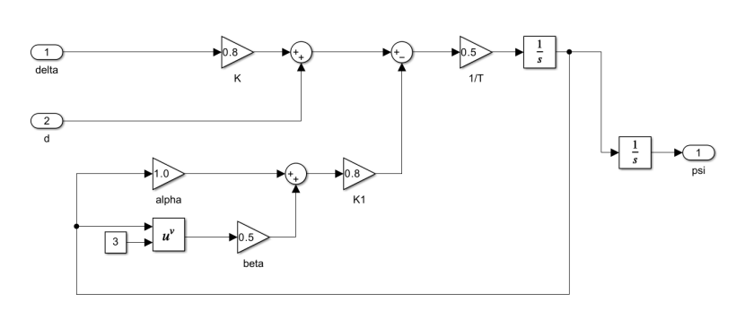

### 神经网络辨识
BP神经网络是一种多层前馈神经网络，通过反向传播算法进行训练。在系统辨识中，神经网络通过学习系统的输入输出映射关系，建立系统的数学模型。

本实验中神经网络结构采用三层前馈网络：

+ 输入层：5个神经元（对应系统的历史状态）
+ 隐藏层：2层，每层10个神经元
+ 输出层：1个神经元（预测的航向角$ \psi $）

仿真设置：

+ 仿真时间：100s
+ 采样时间：0.1s
+ 求解器：定步长，ode4(Runge-Kutta)，0.1

### 神经网络控制系统
#### 1 系统结构
直接神经网络控制系统结构框图：

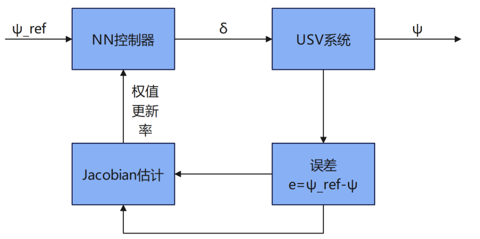

权值在线更新机制：基于梯度下降法实时调整控制器参数。

#### 2 控制器目标
最小化性能指标：

$ J = \frac{1}{2} e^2(k), \quad e(k) = \psi_{ref}(k) - \psi(k) $

#### 3 权值在线更新率（梯度下降法）
基于梯度下降的权值更新公式：

$ w(k+1) = w(k) - \eta \frac{\partial J}{\partial w(k)} $

**推导：**

对于输出层神经元：权值梯度为

$ \frac{\partial J}{\partial w_{ij}} = \frac{\partial J}{\partial \delta(k)} \cdot \frac{\partial \delta(k)}{\partial \text{net}_i} \cdot \frac{\partial \text{net}_i}{\partial w_{ij}} $

其中：

+ 性能指标对控制量的梯度：$ \frac{\partial J}{\partial \delta(k)} = -e(k) \frac{\partial \psi(k+1)}{\partial \delta(k)} $
+ 其中，$ \frac{\partial \psi(k+1)}{\partial \delta(k)} $ 是系统Jacobian，表示控制量对系统输出的影响程度。

控制量对神经元加权输入的梯度：

$ \frac{\partial \delta(k)}{\partial \text{net}_i} = f'(\text{net}_i) $

其中，$ f'(\text{net}_i) $ 是神经元的激活函数导数。

加权输入对权值的梯度：

$ \frac{\partial \text{net}_i}{\partial w_{ij}} = o_j $

其中：$ \text{net}_i $ 是输出层神经元的加权输入，$ o_j $ 是隐藏层第j个神经元的输出。

综合上述三项，得到输出层权值的完整梯度：

$ \frac{\partial J}{\partial w_{ij}} = -e(k) \frac{\partial \psi(k+1)}{\partial \delta(k)} \cdot f'(\text{net}_i) \cdot o_j $

权值更新量为负梯度方向：

$ \Delta w_{ij} = \eta \cdot e(k) \frac{\partial \psi(k+1)}{\partial \delta(k)} \cdot f'(\text{net}_i) \cdot o_j $

其中$ \eta $为学习率。

对于隐藏层权值，需要进一步使用链式法则反向传播误差。以两层网络为例（一个隐藏层，一个输出层），隐藏层权值的梯度为：

$ \frac{\partial J}{\partial w_{jk}} = \frac{\partial J}{\partial \text{net}_i} \cdot \frac{\partial \text{net}_i}{\partial o_j} \cdot \frac{\partial o_j}{\partial \text{net}_j} \cdot \frac{\partial \text{net}_j}{\partial w_{jk}} $

其中：

+ $ \frac{\partial J}{\partial \text{net}_i} = \frac{\partial J}{\partial \delta(k)} \cdot \frac{\partial \delta(k)}{\partial \text{net}_i} $；$ \frac{\partial \text{net}_i}{\partial o_j} = w_{ij} $；$ \frac{\partial o_j}{\partial \text{net}_j} = f'_h(\text{net}_j) $；$ \frac{\partial \text{net}_j}{\partial w_{jk}} = o_k $

因此，隐藏层权值更新量为：

$ \Delta w_{jk} = \eta \cdot e(k) \frac{\partial \psi(k+1)}{\partial \delta(k)} \cdot f'(\text{net}_i) \cdot w_{ij} \cdot f'_h(\text{net}_j) \cdot o_k $

**简化：**

由于Jacobian未知，定义近似项：

$ \Delta w = \eta \cdot e(k) \cdot \hat{J} \cdot \delta_{\text{neuron}} \cdot o_{\text{prev}} $

其中：

+ $ \hat{J} $ 为Jacobian估计；$ \delta_{\text{neuron}} $ 为神经元局部梯度；$ o_{\text{prev}} $ 为前一层输出

#### 4 Jacobian估计方法
1. **符号近似法**：使用符号函数近似Jacobian的符号，幅值用固定学习率补偿

$ \hat{J} = K \cdot \text{sgn}\left(\frac{\psi(k+1) - \psi(k)}{\delta(k) - \delta(k-1)}\right) $

其中K为正增益常数，sgn()为符号函数。

2. **神经网络估计法**：使用额外的神经网络在线估计系统Jacobian估计器结构设计：

训练方法：

$ J_{num} = \frac{\psi(k+1) - \psi(k)}{\delta(k) - \delta(k-1)}，\quad (\text{当}\delta(k) \neq \delta(k-1)\text{时}) $

权值更新率：

$ w_{\text{est}}(k+1) = w_{\text{est}}(k) - \eta_{\text{est}} \frac{\partial E_{\text{est}}}{\partial w_{\text{est}}} $

+ 输入：$ [\psi(k), r(k), \delta(k)] $
+ 输出：$ \frac{\partial \psi(k+1)}{\partial \delta(k)} $ 的估计值
+ 网络结构：单隐藏层，5个神经元，线性输出
+ 在线采集数据：$ \{\psi(k), r(k), \delta(k), \psi(k+1)\} $
+ 计算Jacobian：使用梯度下降法训练估计网络

### 神经网络PID控制系统
#### 1 系统框图
神经网络PID控制系统结构框图：

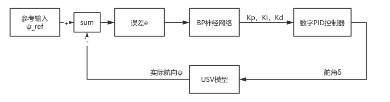

#### 2 数字PID控制器
$ \Delta u(k) = K_p[e(k) - e(k-1)] + K_i e(k) + K_d[e(k) - 2e(k-1) + e(k-2)] $

$ u(k) = u(k-1) + \Delta u(k) $

#### 3 BP神经网络设计
采用三层前馈神经网络设计：

+ 输入层：3个神经元，误差$ e $，误差积分，误差微分
+ 隐藏层：5个神经元（激活函数选择Sigmoid函数）
+ 输出层：3个神经元，$ K_p, K_i, K_d $（激活函数选择Sigmoid函数）

#### 4 权值更新率（梯度下降法）
性能指标函数：

$ J = \frac{1}{2} e^2(k) $

输出层权重更新：

$ \Delta \omega_{li}^{(2)}(k) = -\eta \frac{\partial J}{\partial \omega_{li}^{(2)}(k)} + \alpha \Delta \omega_{li}^{(2)}(k-1) $

其中，

$ \frac{\partial J}{\partial \omega_{li}^{(2)}(k)} = \frac{\partial J}{\partial \psi(k)} \frac{\partial \psi(k)}{\partial u(k-1)} \frac{\partial u(k-1)}{\partial K_l} \frac{\partial K_l}{\partial \omega_{li}^{(2)}(k)} $

具体推导：

1. $ \frac{\partial J}{\partial \psi(k)} = -e(k) $
2. $ \frac{\partial \psi(k)}{\partial u(k-1)} $：未知，用符号函数近似
3. $ \frac{\partial u(k-1)}{\partial K_l} $：$ \frac{\partial u}{\partial K_p} = e(k), \quad \frac{\partial u}{\partial K_i} = \sum e(i), \quad \frac{\partial u}{\partial K_d} = e(k) - e(k-1) $
4. $ \frac{\partial K_l}{\partial \omega_{li}^{(2)}(k)} = f'(\text{net}_l^{(2)}) \cdot o_i^{(1)} $

令：$ \delta_l^{(2)} = e(k) \cdot \text{sgn}\left(\frac{\partial \psi(k)}{\partial u(k-1)}\right) \cdot \frac{\partial u}{\partial K_l} \cdot f'(\text{net}_l^{(2)}) $

则：

$ \Delta \omega_{li}^{(2)}(k) = \eta \delta_l^{(2)} o_i^{(1)} + \alpha \Delta \omega_{li}^{(2)}(k-1) $

隐藏层权值更新：

$ \Delta \omega_{ij}^{(1)}(k) = \eta \delta_j^{(1)} o_i^{(0)} + \alpha \Delta \omega_{ij}^{(1)}(k-1) $

其中：

$ \delta_j^{(1)} = f'(\text{net}_j^{(1)}) \sum_{l=1}^{3} \delta_l^{(2)} \omega_{lj}^{(2)} $

令：$ \delta_j^{(1)} = f'(\text{net}_j^{(1)}) \sum_{l=1}^{3} \delta_l^{(2)} \omega_{lj}^{(2)} $

则：$ \Delta \omega_{ij}^{(1)}(k) = \eta \delta_j^{(1)} o_i^{(0)} + \alpha \Delta \omega_{ij}^{(1)}(k-1) $

## 实验步骤与仿真结果
### 数据采集与神经网络辨识
#### 1 数据采集
在Simulink中搭建USV模型，通过施加不同类型的激励信号和扰动，采集系统的输入输出数据。

激励信号设计：舵角$ \delta $采用幅值为0.4rad、频率为0.1rad/s的正弦信号，叠加幅值为0.05的白噪声。

扰动信号设计：随机噪声，$ d(t) \sim N(0,0.01) $

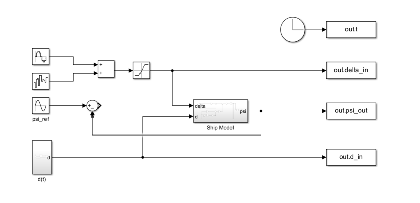

#### 2 数据预处理
基于系统动力学特性，构建特征向量：

$ x(k) = [\psi(k-1), \psi(k-2), \delta(k-1), \delta(k-2), d(k-1)]^T $

目标输出为：

$ y(k) = \psi(k) $

数据归一化：将数据映射到$ [-1, 1] $区间，避免梯度消失问题。

数据集划分：按照14:3:3划分训练集、验证集、测试集。

#### 3 神经网络训练
采用三层BP神经网络进行训练，输入层5节点，隐藏层2层（各10节点），输出层1节点，激活函数使用双曲正切函数（隐藏层）、线性函数（输出层），训练算法采用Levenberg-Marquardt算法。

算法使用流程：SaveData, PreProcess, TrainBPNetwork, TestNetwork，SaveRuslts，CalculatePerformanceMetrics

训练结果：

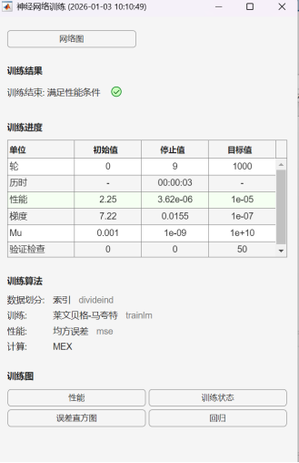

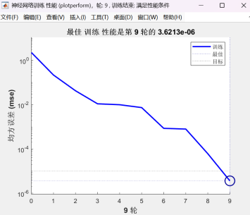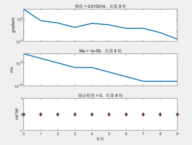

评估性能指标：

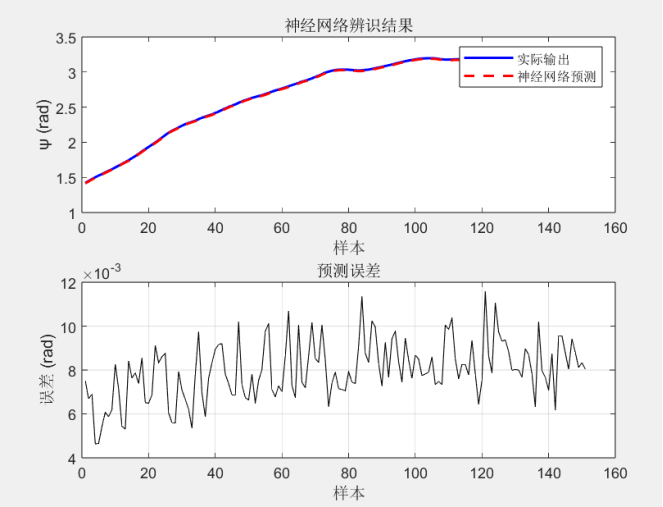

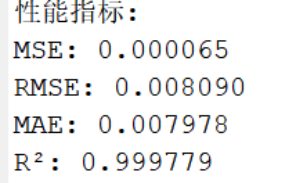

#### 4 搭建神经网络辨识模型
神经网络辨识模型整体结构：

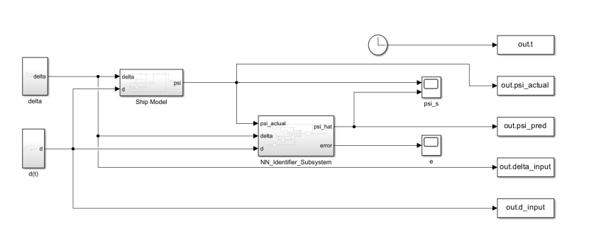

NN_Identifier_Subsystem内部结构：

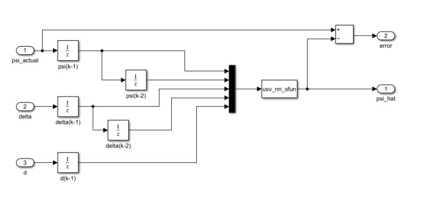

**神经网络辨识结果：**

不同扰动场景下的辨识效果：

(1) 无扰动：$ d(t)=0 $：预测值与实际值几乎相等。

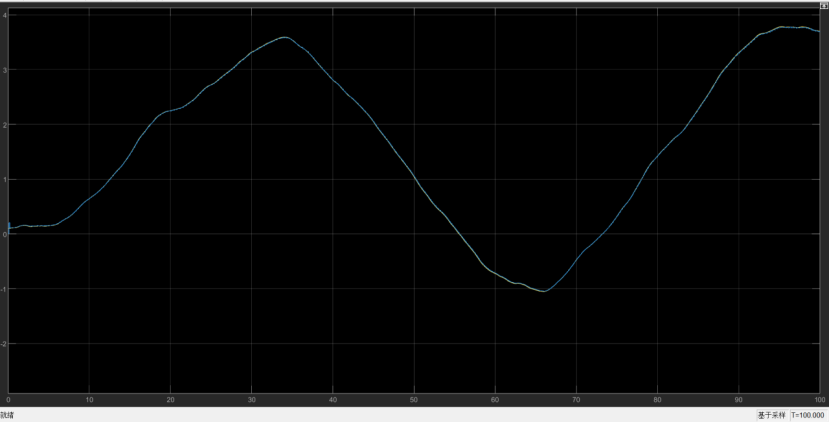

psi_actual与psi_hat曲线图

(2) 存在确定性时变扰动：$ d(t)=0.1\sin(0.1) $：预测效果良好，但在峰值处偏差稍大。

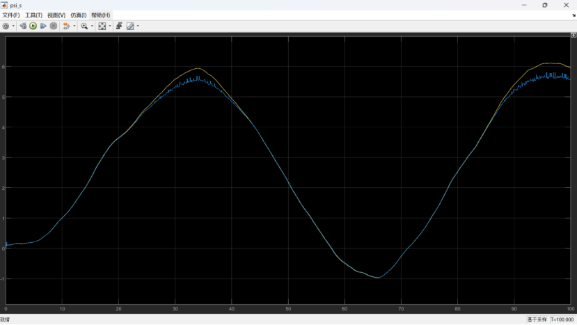

psi_actual与psi_hat曲线图

(3) 存在随机噪声：$ d(t)=n(t) $（均值为0，方差为0.01的白噪声）：预测值与实际值几乎相等。

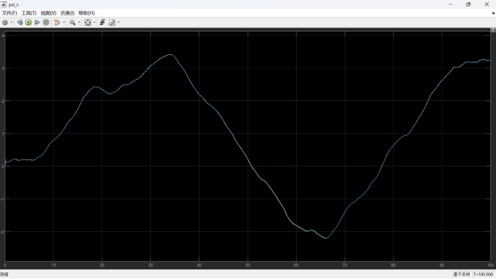

psi_actual与psi_hat曲线图

**性能指标对比：**

| 扰动场景 | MSE | RMSE (rad) | MAE (rad) | R² |
| --- | --- | --- | --- | --- |
| 无扰动 | 0.000051 | 0.007647 | 0.00572 | 0.999928 |
| 确定性扰动 | 0.024963 | 0.157938 | 0.083659 | 0.996273 |
| 随机噪声 | 0.000054 | 0.008432 | 0.006187 | 0.999939 |


所有场景下的R²值均大于0.99，表明神经网络辨识模型具有很高的拟合优度。

### 直接神经网络控制器仿真
三层前馈BP神经网络设计：

输入层：4个神经元：误差，误差积分，误差微分，归一化时间

隐藏层：10个神经元，激活函数选择tansing

输出层：1个神经元，激活函数选择饱和线性函数；输出：舵角，限制在[-0.5, 0.5]rad

#### 1 符号近似法估计
符号近似法Jacobian估计的Simulink模型：（将符号估计等部分全部封装在bp_controller_sfcn的S——Function中，代码在后续附录中）

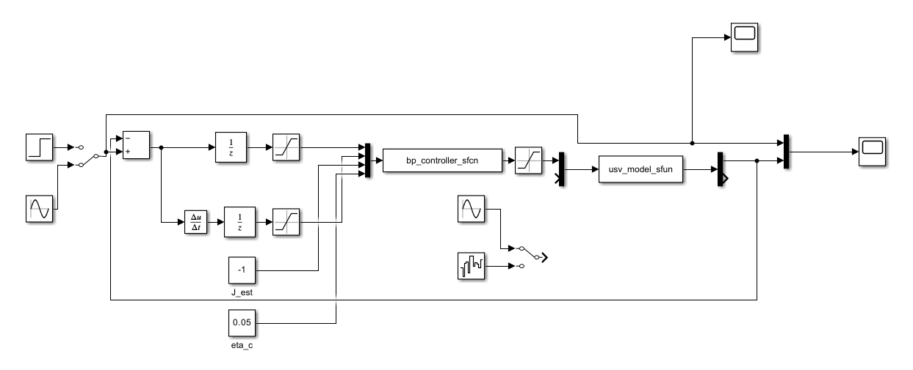

**无扰动情况：**

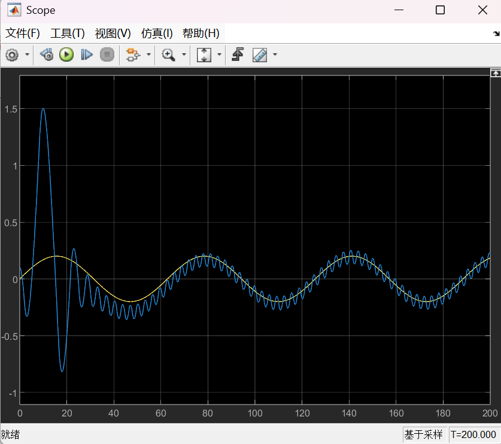

**正弦扰动：d(t) = 0.05sin(0.1t)**

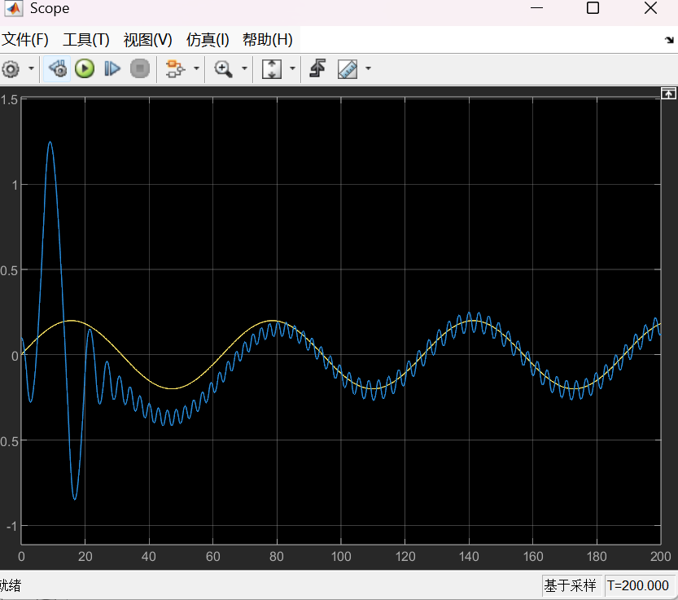

**白噪声扰动：方差0.01**

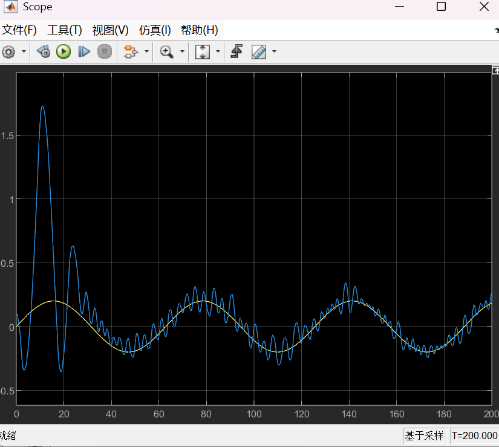

反复调整学习率等参数，该方法依然有较大的波动无法很好的跟踪。

#### 2 神经网络估计法
神经网络估计法Jacobian估计的Simulink模型：（将神经网络估计法等部分全部封装在bp_controller_jacobian_sfcn的S——Function中，代码在后续附录中）

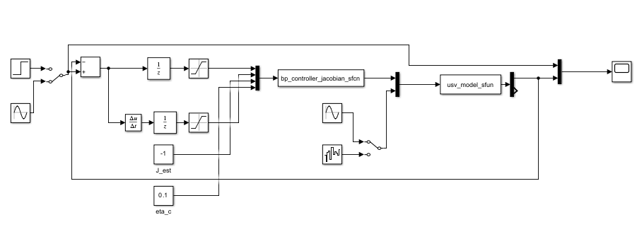

**无扰动情况：**

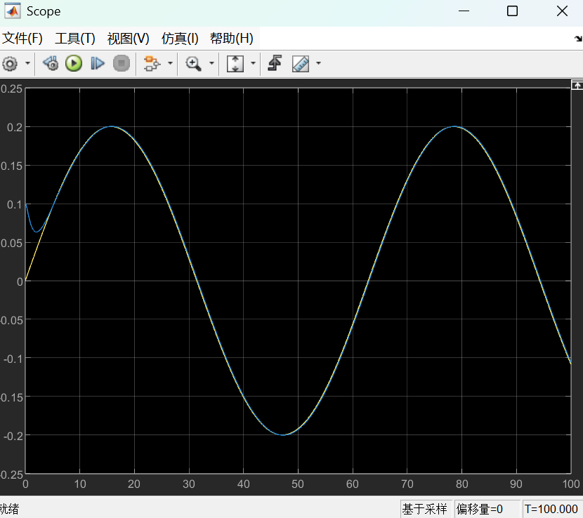

**正弦扰动：d(t) = 0.05sin(0.1t)**

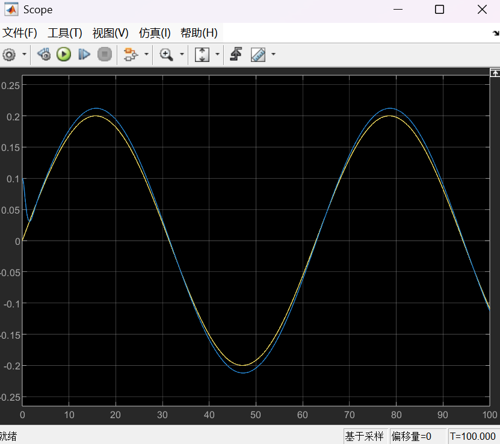

白噪声扰动：方差0.01

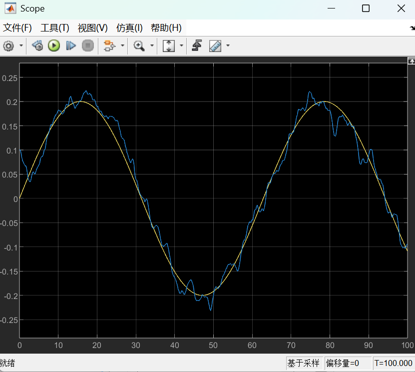

综合上图可知，神经网络估计法在跟踪精度和稳定性方面均优于符号近似法。

### 神经网络PID控制器仿真
神经网络PID控制器的Simulink模型：（将神经网络PID控制器等部分全部封装在nn_pid_ship_sfun的S——Function中，代码在后续附录中）

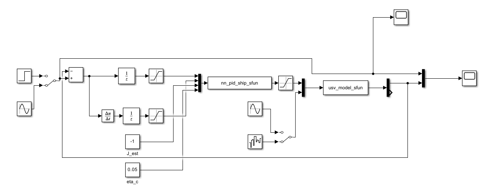

**无扰动情况：**

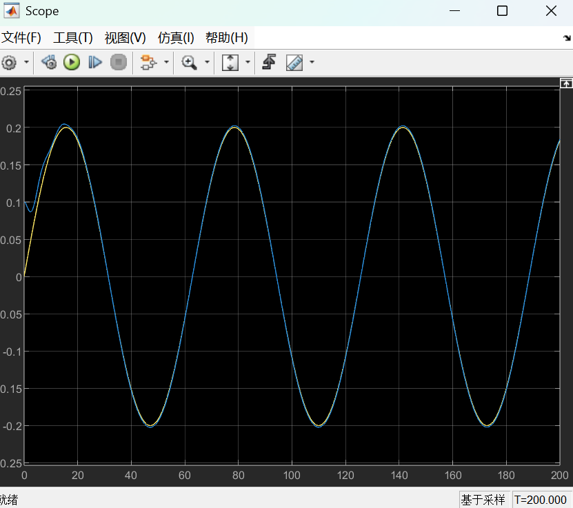

**正弦扰动：d(t) = 0.05sin(0.1t)**

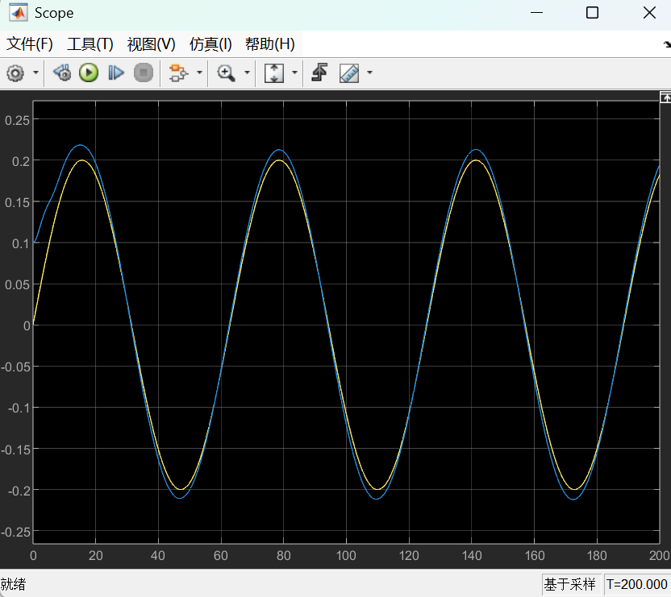

**白噪声扰动：方差0.01**

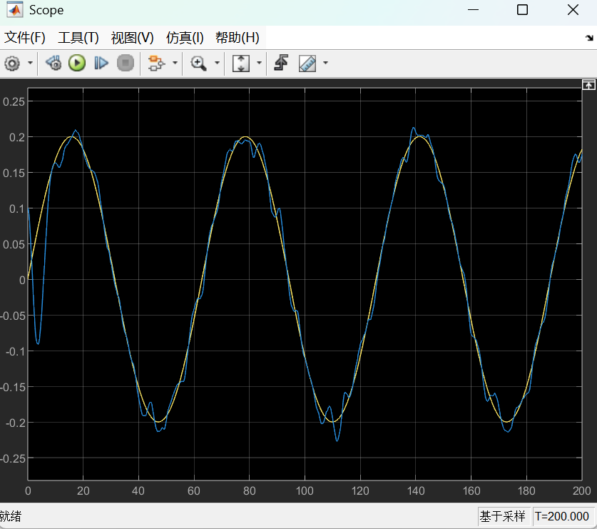

综上图可知，神经网络PID控制器的控制精度比直接控制器的神经网络估计法还要好，符合预期。

### RBF神经网络自适应控制器设计
#### 控制器结构设计：
针对USV仿射非线性模型：

$ T\ddot{\psi} + KH(\dot{\psi}) = K\delta + d(t) $

其中 $ H(\dot{\psi}) = \alpha\dot{\psi} + \beta\dot{\psi}^3 $

设计RBF神经网络自适应控制器的系统结构如下：

```plain
参考输入ψ_ref → 误差计算 → RBF神经网络自适应控制器 → 舵角δ → USV模型 → 输出ψ
              ↓                                    ↑
            Lyapunov稳定性分析 ← 自适应律更新
```

#### 控制律设计：
定义跟踪误差：

$ e = \psi_{ref} - \psi $

定义滑模面：

$ s = \dot{e} + \lambda e, \quad \lambda > 0 $

对滑模面求导：

$ \dot{s} = \ddot{e} + \lambda \dot{e} = \ddot{\psi}_{ref} - \ddot{\psi} + \lambda \dot{e} $

代入USV动力学模型：

$ \dot{s} = \ddot{\psi}_{ref} + \frac{K}{T}H(\dot{\psi}) - \frac{K}{T}\delta - \frac{1}{T}d(t) + \lambda \dot{e} $

将系统不确定性表示为：

$ f(x) = \frac{K}{T}H(\dot{\psi}) + \lambda \dot{e} - \frac{1}{T}d(t) $

则系统可表示为：

$ \dot{s} = \ddot{\psi}_{ref} - \frac{K}{T}\delta + f(x) $

**控制律设计**：

$ \delta = \frac{T}{K} \left[ \ddot{\psi}_{ref} + \eta s + \hat{f}(x) + k \text{sgn}(s) \right] $

其中：

+ $ \eta > 0 $ 为滑模面增益
+ $ k > 0 $ 为鲁棒项增益
+ $ \hat{f}(x) $ 为RBF神经网络对不确定项$ f(x) $的估计
+ $ \text{sgn}(s) $ 为符号函数（实际实现中可用饱和函数代替）

#### RBF神经网络逼近器设计：
采用RBF神经网络逼近未知非线性函数$ f(x) $：

$ \hat{f}(x) = \hat{W}^T \Phi(x) $

其中：

+ $ \hat{W} = [\hat{w}_1, \hat{w}_2, \cdots, \hat{w}_m]^T $ 为可调权值向量
+ $ \Phi(x) = [\phi_1(x), \phi_2(x), \cdots, \phi_m(x)]^T $ 为高斯基函数向量
+ 高斯基函数：$ \phi_i(x) = \exp\left(-\frac{\|x - c_i\|^2}{2\sigma_i^2}\right) $

网络输入向量选取为：

$ x = [e, \dot{e}, \psi, \dot{\psi}]^T $

#### 自适应律设计：
基于Lyapunov稳定性理论设计自适应律。

定义Lyapunov函数：

$ V = \frac{1}{2}s^2 + \frac{1}{2\gamma}\tilde{W}^T\tilde{W} $

其中：

+ $ \tilde{W} = W^* - \hat{W} $ 为权值估计误差
+ $ W^* $ 为理想权值（未知）
+ $ \gamma > 0 $ 为自适应增益

对Lyapunov函数求导：

$ \dot{V} = s\dot{s} - \frac{1}{\gamma}\tilde{W}^T\dot{\hat{W}} $

代入系统方程和控制律，经推导得到自适应律：

$ \dot{\hat{W}} = \gamma s \Phi(x) - \sigma \hat{W} $

其中$ \sigma > 0 $为$ \sigma $-modification项，用于保证权值有界。

最终控制律为：

$ \delta = \frac{T}{K} \left[ \ddot{\psi}_{ref} + \eta s + \hat{W}^T \Phi(x) + k \cdot \text{sat}\left(\frac{s}{\phi}\right) \right] $

其中$ \text{sat}(\cdot) $为饱和函数，$ \phi $为边界层厚度。

## 实验总结
通过本实验，成功设计并实现了针对无人艇非线性航向跟踪问题的四种神经网络控制器。仿真结果表明：

1. **神经网络辨识模型**能有效逼近USV非线性动力学，为控制器设计提供准确的模型信息。
2. **直接神经网络控制器**具有结构简单、无需精确模型的特点，但性能受Jacobian估计精度影响：

神经网络估计法优于符号近似法，需要在线学习，实时性要求高。

3. **神经网络PID控制器**结合了传统PID和神经网络的优点：

保持了PID的直观性和可靠性；通过神经网络在线整定参数，增强了自适应能力；实现相对简单，性能良好。

4. **预期下RBF神经网络自适应控制器**性能最优：

基于Lyapunov稳定性理论设计，保证了闭环稳定性；对系统非线性、参数不确定性和外部扰动具有强鲁棒性；但实现复杂，计算量较大。

综合性能上：RBF自适应控制器 > 神经网络PID控制器 > 直接神经网络控制器（神经网络估计法）> 直接神经网络控制器（符号近似法）。

## 附录
### 附录1：直接控制器-符号估计法模型S-Function （bp_controller_sfcn）
```python
function [sys,x0,str,ts,simStateCompliance] = bp_controller_sfcn(t,x,u,flag)
% BP神经网络直接控制器（符号近似法）- 优化版
% 输入: [e(k), ec(k), J_est, eta_c]
% 状态: [w_ih(10x2); v_ho(1x10)] = 30维
% 输出: delta (弧度制，范围约 -0.6 ~ 0.6，对应舵角 ±35度)

switch flag
  case 0, [sys,x0,str,ts,simStateCompliance] = mdlInitializeSizes;
  case 1, sys = [];
  case 2, sys = mdlUpdate(t,x,u);
  case 3, sys = mdlOutputs(t,x,u);
  case 4, sys = mdlOutputs(t,x,u);
  case 9, sys = [];
  otherwise, DAStudio.error('Simulink:blocks:unhandledFlag', num2str(flag));
end

%% 初始化
function [sys,x0,str,ts,simStateCompliance] = mdlInitializeSizes
    sizes = simsizes;
    sizes.NumContStates  = 0;     
    sizes.NumDiscStates  = 30;    % 10*2 + 1*10 = 30
    sizes.NumOutputs     = 1;     
    sizes.NumInputs      = 4;     
    sizes.DirFeedthrough = 1;     
    sizes.NumSampleTimes = 1;     
    sys = simsizes(sizes);
    x0  = zeros(30, 1); 
    str = []; ts  = [0 0]; 
    simStateCompliance = 'UnknownSimState';

%% 权值更新（梯度下降 + 符号近似）
function sys = mdlUpdate(~,x,u)
hidden_num = 10; input_num = 2; output_num = 1;

if length(x) < 30
    sys = x; return;
end

% 解包权值
w_ih = reshape(x(1:20), 10, 2);
v_ho = reshape(x(21:30), 1, 10);

% 提取输入
e = u(1);
ec = u(2);
J_est = u(3);      % 符号近似值
eta_c = u(4);      % 学习率

% 初始化检测 (打破全零状态)
if norm(x) < 1e-6 
    % 初始化权值范围稍大一些，避免起步太慢
    w_ih = (rand(hidden_num, input_num) - 0.5) * 1.0; 
    v_ho = (rand(output_num, hidden_num) - 0.5) * 1.0;
    sys = [w_ih(:); v_ho(:)];
    return;
end

% --- 优化1: 输入归一化 (防止大误差导致Sigmoid饱和/梯度消失) ---
% 将误差限制在有效范围内，避免控制量突变
e_norm = max(min(e, 2.0), -2.0); 
ec_norm = max(min(ec, 2.0), -2.0);
x_in = [e_norm; ec_norm];

% 前向传播
net_h = w_ih * x_in;
h = 1 ./ (1 + exp(-net_h));

% 反向传播 - 使用符号近似 Jacobian
% dE/d_delta = -e * J_est
dE_d_delta = -e * J_est;

% 更新输出层权值
dv = eta_c * dE_d_delta * h';
v_ho_new = v_ho + dv;

% 更新隐藏层权值
sensitivity = h .* (1 - h);
delta_signal = dE_d_delta * v_ho;
dw = eta_c * (delta_signal' .* sensitivity) * x_in';
w_ih_new = w_ih + dw;

% 权值限幅 (防止过拟合/爆炸)
w_ih_new = max(min(w_ih_new, 10), -10);
v_ho_new = max(min(v_ho_new, 10), -10);

sys = [w_ih_new(:); v_ho_new(:)];

%% 计算输出
function sys = mdlOutputs(~,x,u)
hidden_num = 10; input_num = 2; output_num = 1;

if length(x) < 30
    sys = 0; return;
end

w_ih = reshape(x(1:20), 10, 2);
v_ho = reshape(x(21:30), 1, 10);

% --- 优化2: 输入归一化 (必须与Update一致) ---
e_norm = max(min(u(1), 2.0), -2.0); 
ec_norm = max(min(u(2), 2.0), -2.0);
x_in = [e_norm; ec_norm];

% 前向传播
net_h = w_ih * x_in;
h = 1 ./ (1 + exp(-net_h));
delta_raw = v_ho * h;

% --- 优化3: 输出增益 (关键！) ---
% 神经网络原始输出 delta_raw 范围大约在 [-1, 1]
% 我们需要把它映射到舵角的物理范围。
% 假设最大舵角为 35度 -> 0.61 弧度。
% 如果直接输出角度(35)，在Simulink三角函数计算中会出错，必须用弧度。
% 这里设置增益为 25.0，使得输出范围大致在 [-25, 25] 度左右，即 [-0.43, 0.43] 弧度。
% 如果你的Plant模型需要的是"角度"，请把下面改为 35.0，并把限幅改为 35。

K_scale = 1; % 增益系数 (对应约 ±25度的基础输出)
sys = K_scale * delta_raw;


```

### 附录2：直接控制器-神经网络估计法模型S-Function （bp_controller_jacobian_sfcn）
```python
function [sys,x0,str,ts,simStateCompliance] = bp_controller_jacobian_sfcn(t,x,u,flag)
% BP控制器 + Jacobian估计 (修复矩阵乘法维度错误版)

switch flag
  case 0, [sys,x0,str,ts,simStateCompliance] = mdlInitializeSizes;
  case 1, sys = [];
  case 2, sys = mdlUpdate(t,x,u);
  case 3, sys = mdlOutputs(t,x,u);
  case 4, sys = mdlOutputs(t,x,u);
  case 9, sys = [];
  otherwise, DAStudio.error('Simulink:blocks:unhandledFlag', num2str(flag));
end

end
%% ==============================================================
%% 1. 初始化
%% ==============================================================
function [sys,x0,str,ts,simStateCompliance] = mdlInitializeSizes
    sizes = simsizes;
    sizes.NumContStates  = 0;     
    sizes.NumDiscStates  = 51;    
    sizes.NumOutputs     = 1;     
    sizes.NumInputs      = 4;     
    sizes.DirFeedthrough = 1;     
    sizes.NumSampleTimes = 1;     
    sys = simsizes(sizes);
    
    % 强制生成 51 维向量
    try
        load('jacobian_weights.mat', 'w_j_ih', 'v_j_ho');
        if exist('w_j_ih','var') && exist('v_j_ho','var')
            val_51 = v_j_ho(1); 
            x0_temp = [rand(30,1)-0.5; w_j_ih(:); val_51];
        else
            error('var');
        end
    catch
        x0_temp = rand(51, 1) - 0.5;
    end
    
    if length(x0_temp) > 51
        x0 = x0_temp(1:51);
    elseif length(x0_temp) < 51
        x0 = [x0_temp; zeros(51 - length(x0_temp), 1)];
    else
        x0 = x0_temp;
    end
    
    str = []; ts  = [0 0]; 
    simStateCompliance = 'UnknownSimState';
end

%% ==============================================================
%% 2. 权值更新 (核心修复版)
%% ==============================================================
function sys = mdlUpdate(~,x,u)
    hidden_num = 10; input_num = 2;
    
    if length(x) < 51
        x = [x; zeros(51 - length(x), 1)];
    end

    % 解包权值
    w_ih_c = reshape(x(1:20), hidden_num, input_num); % 10x2
    v_ho_c = reshape(x(21:30), 1, hidden_num);        % 1x10
    w_ih_j = reshape(x(31:50), hidden_num, input_num); % 10x2
    
    % J-Net 输出层处理 (标量扩展为向量)
    v_scalar = x(51); 
    v_ho_j = repmat(v_scalar, 1, hidden_num);         % 1x10
    
    % 提取输入
    e = u(1); ec = u(2); eta_base = u(4);

    % 智能初始化检测
    if norm(x) < 1e-6 
        w_ih_c = (rand(hidden_num, input_num) - 0.5) * 1.0; 
        v_ho_c = (rand(1, hidden_num) - 0.5) * 1.0;
        w_ih_j = (rand(hidden_num, input_num) - 0.5) * 0.5; 
        v_scalar = rand(1) - 0.5;
        v_ho_j = repmat(v_scalar, 1, hidden_num);
        sys = [w_ih_c(:); v_ho_c(:); w_ih_j(:); v_scalar];
        return;
    end

    % 输入归一化
    e_norm = max(min(e, 2.0), -2.0); 
    ec_norm = max(min(ec, 2.0), -2.0);
    x_in = [e_norm; ec_norm]; % 2x1 列向量

    % --- J-Net 前向传播 ---
    net_j = w_ih_j * x_in;       % (10x2) * (2x1) = 10x1
    h_j = tanh(net_j);           % 10x1
    J_hat = v_ho_j * h_j;        % (1x10) * (10x1) = 标量 (注意：这里是内积)
    % 如果 v_ho_j 是 1x10, h_j 是 10x1, 结果是 1x1 -> 标量
    
    % 修正：如果 h_j 是 10x1, v_ho_j 是 1x10, J_hat 是标量。
    % 为了保险，强制 J_hat 为标量
    if ~isscalar(J_hat)
        J_hat = J_hat(1);
    end
    J_hat = max(min(J_hat, 5.0), -5.0);

    % --- C-Net 前向传播 ---
    net_c = w_ih_c * x_in;       % (10x2) * (2x1) = 10x1
    h_c = tanh(net_c);           % 10x1
    % delta_raw = v_ho_c * h_c; % (1x10) * (10x1) = 标量

    % --- 自适应学习率 ---
    abs_e = abs(e);
    if abs_e > 0.5
        eta = eta_base * 0.2;
    elseif abs_e > 0.15
        eta = eta_base * 0.6;
    else
        eta = eta_base * 1.2;
    end
    % eta = min(max(eta, 0.0001), 0.05);

    % --- 反向传播 (关键修复) ---
    % dE/d_delta = -e * J_hat
    dE_d_delta = -e * J_hat; % 标量
    
    % 1. 更新输出层权值 v_ho_c
    % dv = eta * (dE/d_delta) * h_c'
    % 维度: 标量 * 标量 * (10x1)' = 1x10 (正确)
    dv = eta * dE_d_delta * h_c'; 
    v_ho_c_new = v_ho_c + dv;
    
    % 2. 更新隐藏层权值 w_ih_c
    % 灵敏度 sensitivity = h_c .* (1 - h_c)
    sensitivity = h_c .* (1 - h_c); % 10x1 (列向量)
    
    % 误差反向传播至隐层: delta_signal = (dE/d_delta) * v_ho_c'
    % 维度: 标量 * (1x10)' = 10x1 (列向量)
    delta_signal = dE_d_delta * v_ho_c'; 
    
    % 隐层权值梯度 = delta_signal .* sensitivity (点乘) -> 10x1
    % 再乘以输入 x_in' (1x2) -> 外积 -> 10x2
    % 修正公式：必须确保是 (10x1) * (1x2)
    grad_w = (delta_signal .* sensitivity) * x_in'; 
    
    dw = eta * grad_w;
    w_ih_c_new = w_ih_c + dw;

    % 权值限幅
    w_ih_c_new = max(min(w_ih_c_new, 10), -10);
    v_ho_c_new = max(min(v_ho_c_new, 10), -10);
    
    % 更新第51个标量权值 (简单策略：跟随输出层权值的均值)
    v_scalar_new = mean(v_ho_c_new); 
    
    sys = [w_ih_c_new(:); v_ho_c_new(:); w_ih_j(:); v_scalar_new];
end

%% ==============================================================
%% 3. 输出计算
%% ==============================================================
function sys = mdlOutputs(~,x,u)
    hidden_num = 10; input_num = 2;

    if length(x) < 51
        sys = 0; return;
    end

    w_ih_c = reshape(x(1:20), hidden_num, input_num);
    v_ho_c = reshape(x(21:30), 1, hidden_num);

    e = u(1); ec = u(2);

    x_in = [max(min(e,2.0),-2.0); max(min(ec,2.0),-2.0)];
    
    net_c = w_ih_c * x_in;
    h_c = tanh(net_c);
    delta_raw = v_ho_c * h_c;

    K_scale = 25.0; 
    sys = K_scale * delta_raw;

    Max_Rudder = 35 * pi / 180; 
    sys = max(min(sys, Max_Rudder), -Max_Rudder);
end
```

### 附录3：神经网络PID控制器S-Function （nn_pid_ship_sfun）
```python
function [sys,x0,str,ts,simStateCompliance] = nn_pid_ship_sfun(t,x,u,flag)
switch flag
  case 0, [sys,x0,str,ts,simStateCompliance] = mdlInitializeSizes;
  case 1, sys = [];
  case 2, sys = mdlUpdate(t,x,u);
  case 3, sys = mdlOutputs(t,x,u);
  case 4, sys = mdlOutputs(t,x,u);
  case 9, sys = [];
  otherwise, DAStudio.error('Simulink:blocks:unhandledFlag', num2str(flag));
end
end

%% 1. 初始化
function [sys,x0,str,ts,simStateCompliance] = mdlInitializeSizes
    sizes = simsizes;
    sizes.NumContStates  = 0;     
    sizes.NumDiscStates  = 55;    % 增加4个状态用于滤波器
    sizes.NumOutputs     = 1;     
    sizes.NumInputs      = 4;     % [e, ec, eta_base, Ts]
    sizes.DirFeedthrough = 1;     
    sizes.NumSampleTimes = 1;     
    sys = simsizes(sizes);
    
    hidden_num = 5; input_num = 2; output_num = 3;
    len_w = 33;
    
    persistent integral_persistent;
    if isempty(integral_persistent)
        integral_persistent = 0;
    end
    
    x0 = zeros(55, 1); % 扩展状态空间
    
    try
        if exist('nn_pid_weights.mat', 'file')
            load('nn_pid_weights.mat', 'w1', 'b1', 'w2', 'b2');
            if size(w1,1)==5 && size(w2,1)==3
                x0(1:len_w) = [w1(:); b1(:); w2(:); b2(:)];
            else error('DimErr'); end
        else
            w1 = rand(5,2)*0.5 - 0.25; b1 = rand(5,1)*0.5 - 0.25;
            w2 = rand(3,5)*0.1 - 0.05; b2 = zeros(3,1); 
            x0(1:10) = w1(:); x0(11:15) = b1; 
            x0(16:30) = w2(:); x0(31:33) = b2;
        end
    catch
        x0(1:33) = rand(33,1) - 0.5;
    end
    
    str = []; ts = [0 0];
    simStateCompliance = 'UnknownSimState';
end

%% 2. 权值更新 (增强鲁棒性)
function sys = mdlUpdate(t,x,u)
    hidden_num = 5; input_num = 2; output_num = 3;
    len_w1 = 10; len_b1 = 5; len_w2 = 15; len_b2 = 3;
    
    ptr = 1;
    w1 = reshape(x(ptr:ptr+len_w1-1), hidden_num, input_num); ptr = ptr + len_w1;
    b1 = x(ptr:ptr+len_b1-1); ptr = ptr + len_b1;
    w2 = reshape(x(ptr:ptr+len_w2-1), output_num, hidden_num); ptr = ptr + len_w2;
    b2 = x(ptr:ptr+len_b2-1); ptr = ptr + len_b2;
    
    persistent integral_persistent;
    if isempty(integral_persistent)
        integral_persistent = 0;
    end
    
    % 新增滤波器状态
    e_prev_raw = x(ptr); ptr = ptr+1;
    ec_prev_raw = x(ptr); ptr = ptr+1;
    e_filt = x(ptr); ptr = ptr+1;
    ec_filt = x(ptr); ptr = ptr+1;
    
    integral_e = integral_persistent;
    e_prev = x(ptr); ptr = ptr+1;
    
    e = u(1); ec = u(2); 
    eta_base = u(3);
    Ts = u(4); if Ts <= 0, Ts = 0.1; end
    
    % --- 输入低通滤波 (新增) ---
    alpha = 0.3; % 滤波系数
    e_filt_new = alpha*e + (1-alpha)*e_filt;
    ec_filt_new = alpha*ec + (1-alpha)*ec_filt;
    
    % --- 归一化 (使用滤波后值) ---
    e_norm = max(min(e_filt_new / pi, 1), -1); 
    ec_norm = max(min(ec_filt_new / (pi/Ts), 5), -5);
    x_in = [e_norm; ec_norm];
    
    % --- 自适应学习率增强 ---
    abs_e = abs(e_filt_new);
    if abs_e > 0.8, eta = eta_base * 0.1;
    elseif abs_e > 0.3, eta = eta_base * 0.5;
    else, eta = eta_base * 1.0;
    end
    eta = min(max(eta, 0.001), 0.1);
    
    % --- 前向传播 ---
    net1 = w1 * x_in + b1; h = tanh(net1);
    net2 = w2 * h + b2;
    
    Kp = 5 * (1 + tanh(net2(1)));
    Ki = 0.5 * (1 + tanh(net2(2)));
    Kd = 2.5 * (1 + tanh(net2(3)));
    
    % --- 改进反向传播 ---
    dE_dK = [e_filt_new; integral_e; ec_filt_new]; 
    
    sens_out = 1 - tanh(net2).^2;
    scale_vec = [5; 0.5; 2.5];
    delta2 = dE_dK .* sens_out; 
    
    delta1 = (w2' * delta2) .* (1 - h.^2);
    
    % --- 动量项增强 (新增) ---
    persistent dw1_prev db1_prev dw2_prev db2_prev;
    if isempty(dw1_prev), dw1_prev = zeros(size(w1)); end
    if isempty(db1_prev), db1_prev = zeros(size(b1)); end
    if isempty(dw2_prev), dw2_prev = zeros(size(w2)); end
    if isempty(db2_prev), db2_prev = zeros(size(b2)); end
    
    mu = 0.9; % 动量系数
    dw1 = mu*dw1_prev + eta * delta1 * x_in';
    db1 = mu*db1_prev + eta * delta1;
    dw2 = mu*dw2_prev + eta * delta2 * h';
    db2 = mu*db2_prev + eta * delta2;
    
    dw1_prev = dw1; db1_prev = db1;
    dw2_prev = dw2; db2_prev = db2;
    
    w1_new = w1 + dw1; b1_new = b1 + db1;
    w2_new = w2 + dw2; b2_new = b2 + db2;
    
    % --- 改进积分抗饱和 ---
    integral_threshold = 0.5; % 积分分离阈值
    if abs(e_filt_new) > integral_threshold
        integral_new = integral_e * 0.9; % 积分衰减
    else
        integral_new = integral_e + e_filt_new * Ts;
    end
    
    if abs(integral_new) > 8, integral_new = sign(integral_new)*8; end
    
    integral_persistent = integral_new;
    
    % --- 状态更新 ---
    sys = [w1_new(:); b1_new; w2_new(:); b2_new; 
           integral_new; e_filt_new; ec_filt_new; e_prev;
           e_filt_new; ec_filt_new; e_filt; ec_filt]; % 更新滤波器状态
    
    if length(sys) < 55
        sys = [sys; zeros(55 - length(sys), 1)];
    end
end

%% 3. 输出计算
function sys = mdlOutputs(t,x,u)
    hidden_num = 5; input_num = 2; output_num = 3;
    len_w1 = 10; len_b1 = 5; len_w2 = 15; len_b2 = 3;
    
    ptr = 1;
    w1 = reshape(x(ptr:ptr+len_w1-1), hidden_num, input_num); ptr = ptr + len_w1;
    b1 = x(ptr:ptr+len_b1-1); ptr = ptr + len_b1;
    w2 = reshape(x(ptr:ptr+len_w2-1), output_num, hidden_num); ptr = ptr + len_b2;
    b2 = x(ptr:ptr+len_b2-1); ptr = ptr + len_b2;
    
    integral_e = x(ptr); ptr = ptr+4; % 跳过滤波器状态
    
    e = u(1); ec = u(2);
    Ts = u(4); if Ts <= 0, Ts = 0.1; end
    
    % --- 使用滤波值 ---
    e_filt = 0.3*e + 0.7*x(ptr-2); % 保持与Update一致
    ec_filt = 0.3*ec + 0.7*x(ptr-1);
    
    e_norm = max(min(e_filt / pi, 1), -1);
    ec_norm = max(min(ec_filt / (pi/Ts), 5), -5);
    x_in = [e_norm; ec_norm];
    
    % --- 前向传播 ---
    net1 = w1 * x_in + b1; h = tanh(net1);
    net2 = w2 * h + b2;
    
    Kp = 5 * (1 + tanh(net2(1)));
    Ki = 0.5 * (1 + tanh(net2(2)));
    Kd = 2.5 * (1 + tanh(net2(3)));
    
    delta_raw = Kp * e_filt + Ki * integral_e + Kd * ec_filt;
    
    Max_Rudder = 35 * pi / 180; 
    sys = max(min(delta_raw, Max_Rudder), -Max_Rudder);
end
```


