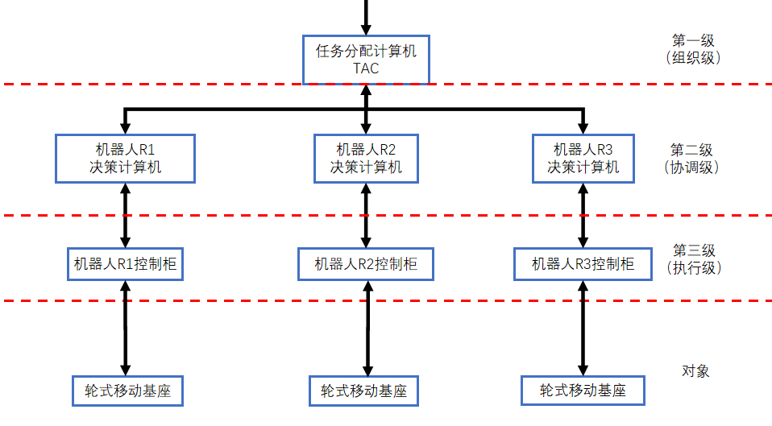

# 多移动机器人编队轨迹跟踪的递阶控制协调设计

考虑 3 台异构差动驱动机器人（R1、R2、R3），需在动态环境中协同完成编队跟踪任务。系统需满足：

⚫ 编队目标：形成并维持等边三角形队形（边长 0.5 米），同时跟踪参考轨迹。

⚫ 动态约束：机器人运动受非完整约束（如差动驱动，速度限制），需避免相互碰撞及环境障碍物。

⚫ 总体目标：最小化编队跟踪误差（位置和队形误差），并保证系统稳定性。请基于三级递阶控制架构设计控制系统，要求：

1、进行系统分解与层级设计

⚫ 明确组织级、协调级、执行级的功能划分，画出该递阶控制系统的分级系统结构图。⚫ 定义各子系统的局部决策变量和目标函数。

2、分别采用以下两种协调方法进行协调策略设计

⚫ 关联预测协调原则（直接干预法）

⚫ 关联平衡协调原则（目标协调法）

### 1. 系统分解与层级设计
#### 分级系统结构图
+ **组织级**（轨迹规划器）：位于顶层，负责生成参考轨迹和编队队形，并与操作者交互。
+ **协调级**（决策控制器）：包括三个机器人的决策控制单元（R1 决策控制器、R2 决策控制器、R3 决策控制器），接收组织级指令，处理传感器信息，并计算控制指令。
+ **执行级**（底层控制器）：包括三个机器人的底层控制单元（R1 底层控制器、R2 底层控制器、R3 底层控制器），直接控制机器人驱动轮速度。

#### **工作流程**：
1. 组织级生成参考轨迹和等边三角形队形参数，并下发给协调级。
2. 协调级各决策控制器接收任务，根据本地传感器信息和协调策略计算控制指令。
3. 执行级底层控制器执行控制指令，驱动机器人移动。
4. 传感器数据（位置、速度、障碍物信息）反馈给协调级，协调级调整控制并向上反馈编队状态给组织级。

#### **信息流动**：
控制信息自上而下流动（组织级 → 协调级 → 执行级），反馈信息自下而上流动（执行级 → 协调级 → 组织级）。同一级各单元受上一级干预，并对下一级决策单元施加影响。在协调级，机器人之间不直接交换信息，而是通过组织级或协调策略间接协调。实现了多机器人编队轨迹跟踪的稳定性和最小化误差目标。

#### 各子系统的局部决策变量和目标函数
每个机器人子系统$ R1, R2, R3 $具有以下局部定义：

**  局部决策变量**：机器人的线速度 $ v_i $和角速度 $ \omega_i $（其中 $ i = 1,2,3 $)。

**  局部目标函数**：最小化跟踪误差和队形误差，同时满足约束。对于机器人 $ i $，目标函数为：  
$ J_i = \int \left( | p_i - p_{i,ref} |^2 + \sum_{j \in \mathcal{N}i} | p_i - p_j - d{ij,ref} |^2 + \rho_i \cdot \text{障碍物惩罚项} \right) dt $  
其中：

$ p_i $ 是机器人的当前位置。

$ p_{i,ref} $是参考轨迹上机器人的目标位置。

$ d_{ij,ref} $是机器人 $ i $ 和 $ j $ 之间的期望相对位置（对于等边三角形队形，边长 0.5 米）。

$ \mathcal{N}_i $是机器人 $ i $ 的邻居集合（例如，对于 R1，邻居为 R2 和 R3）。

$ \rho_i $ 是权重系数，障碍物惩罚项用于避免碰撞和环境障碍物。

### 2. 协调策略设计
#### 2.1 关联预测协调原则（直接干预法）
在关联预测协调中，协调级预测机器人之间的关联变量，并直接干预子系统的决策。协调级使用全局模型计算控制指令，以确保编队队形和避障。协调级具有集中决策能力，直接干预底层控制，响应快速，但计算负担较重。

具体设计：

+ **关联变量**：定义机器人间的相对位姿 $ z_{ij} = p_i - p_j $（其中 $ i,j = 1,2,3, i \neq j $)，作为关键关联变量。
+ **协调过程**：

                 协调级收集所有机器人的状态信息（位置、速度）。

                 基于全局运动模型和预测控制，协调级预测未来一段时间内的关联变量 $ z_{ij} $。

                 协调级求解优化问题，最小化全局目标函数：   
$ J_{global} = \sum_{i=1}3 \left( | p_i - p_{i,ref} |2 + \sum_{j \in \mathcal{N}i} | z{ij} - d_{ij,ref} |^2 \right) + \text{避障项} $  
                 同时满足运动约束和避障约束。协调级直接为每个机器人计算控制指令 $ (v_i, \omega_i) $，并发送给执行级。

#### 2.2 关联平衡协调原则（目标协调法）
在关联平衡协调中，协调级通过调整子系统的目标函数来协调行为，使局部目标与全局目标一致。每个子系统优化自己的局部目标，协调级平衡关联变量的偏差。分布式决策，计算负担较轻，但需要多次迭代，协调速度较慢。

具体设计：

+ **关联变量**：同样定义相对位姿 $ z_{ij} = p_i - p_j $作为关键关联变量。
+ **协调过程**：

                    协调级为每个子系统设置局部目标函数，并引入关联约束： $ z_{ij} = d_{ij,ref} $

                    每个子系统求解局部优化问题，最小化修改后的目标函数：  
$ J_i' = \int \left( | p_i - p_{i,ref} |^2 + \lambda_{ij} \cdot | z_{ij} - d_{ij,ref} |^2 + \rho_i \cdot \text{障碍物惩罚项} \right) dt $  
                    其中 $ \lambda_{ij} $是权重系数，由协调级动态调整。 协调级监控关联变量 $ z_{ij} $，如果偏离期望值，则更新 $ \lambda_{ij} $以惩罚偏差。  
                

