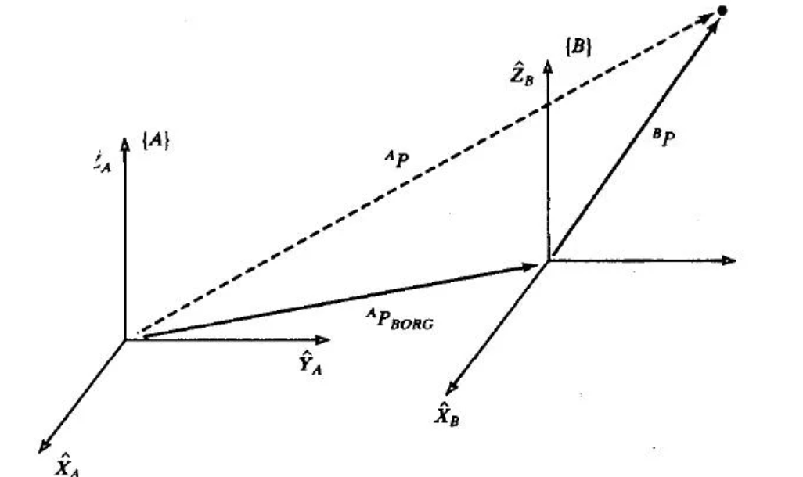
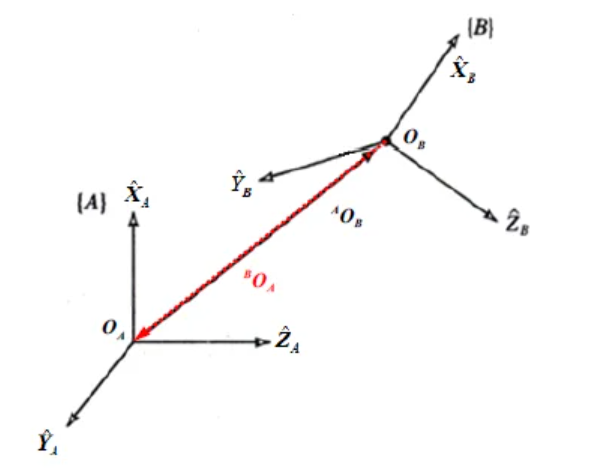

# 01 | 空间描述与变换

这一章主要讲的是几种表示位姿的方法

位置和姿态总是成对出现的，我们将此组合称为坐标系。一个坐标系可以等价的用一个位置向量和一个旋转矩阵来描述。

- **位置**：用向量进行表示，左上标来描述具体的坐标系，例如$^A\!P$ 表明列向量$P$在坐标系$A$下定义的。
- **姿态**：物体上固定坐标系相对于参考坐标系的方位

## 数学基础

=== "向量点乘"
    两个向量 $r_{OP}$ 和 $r_{OQ}$ 的点乘(内积)可按下式计算:

    $$
    r_{OP} \cdot r_{OQ} 
    = ^AP \cdot ^AQ = ^AP^T \cdot ^AQ\\ 
    = (p_x \quad p_y \quad p_z)\begin{pmatrix}q_x\\q_y\\q_z\end{pmatrix} \\ 
    = p_xq_x + p_yq_y + p_zq_z
    $$

=== "向量叉乘"
    两个向量 $\vec{a}$ 和 $\vec{b}$ 的叉乘结果是一个新向量 $\vec{c}$:

    $$
    \vec{c} = \vec{a} \times \vec{b}= |a||b|\sin\theta
    $$

    方向遵循右手定则，垂直于这两个向量所在的平面。

    简单计算方法:

    - 把 $\vec{a}$ 和 $\vec{b}$ 写成下面的矩阵形式

    $$
    \begin{pmatrix}
    a_x & a_y & a_z & a_x & a_y & a_z \\
    b_x & b_y & b_z & b_x & b_y & b_z
    \end{pmatrix}
    $$

    - 去掉第一列和最后一列，剩下的 3 个 2x2 的矩阵（每次滑动 1 格子），计算行列式即可

我们知道空间中的变换可以表示为旋转和平移的组合，那么如何表示旋转和平移呢？

## 向量加法 - 平移变换



$$
^A\!P = ^B\!P + ^A\!P_{BORG}
$$

点本身没有移动，只是随着观察的参考系不同，其坐标表示也不同

## 旋转矩阵 - 旋转变换

旋转矩阵

把新坐标系下的单位向量用旧坐标系下的单位向量表示

> $^A_B\!R$ 表示由 A 坐标系到 B 坐标系的旋转矩阵

$$
^A_BR = \begin{bmatrix} ^A\!X_B & ^A\!Y_B & ^A\!Z_B \end{bmatrix} = \begin{bmatrix} r_{11} & r_{12} & r_{13} \\ r_{21} & r_{22} & r_{23} \\ r_{31} & r_{32} & r_{33} \end{bmatrix}
$$

性质

- 旋转矩阵是正交矩阵，即$^A_B\!R^T = ^A_B\!R^{-1} = ^B_A\!R$<br>
- 旋转矩阵的行列式为 1，即$\det(^A_B\!R) = 1$<br>

!!! note "证明$\det(^A_B\!R) = 1$"
    由正交性即可得出 $R^T \cdot R = I$,所以可以得出行列式是正负一之中

**SO3**：Special Orthogonal Group 三维特殊正交群

$$
SO(3) = \left\{
\begin{pmatrix}
r_{11} & r_{12} & r_{13} \\
r_{21} & r_{22} & r_{23} \\
r_{31} & r_{32} & r_{33}
\end{pmatrix}
\in \mathbb{R}^{3 \times 3} \mid
\begin{pmatrix}
r_{11} \\
r_{21} \\
r_{31}
\end{pmatrix}^T
\begin{pmatrix}
r_{11} \\
r_{21} \\
r_{31}
\end{pmatrix} = 1,
\begin{pmatrix}
r_{12} \\
r_{22} \\
r_{32}
\end{pmatrix}^T
\begin{pmatrix}
r_{12} \\
r_{22} \\
r_{32}
\end{pmatrix} = 1,
\begin{pmatrix}
r_{11} \\
r_{21} \\
r_{31}
\end{pmatrix}^T
\begin{pmatrix}
r_{12} \\
r_{22} \\
r_{32}
\end{pmatrix} = 0,
\begin{pmatrix}
r_{11} \\
r_{21} \\
r_{31}
\end{pmatrix}^T
\begin{pmatrix}
r_{13} \\
r_{23} \\
r_{33}
\end{pmatrix} = 0,
\begin{pmatrix}
r_{12} \\
r_{22} \\
r_{32}
\end{pmatrix}^T
\begin{pmatrix}
r_{13} \\
r_{23} \\
r_{33}
\end{pmatrix} = 0
\right\}
$$


- SO(3) 是全体旋转矩阵的集合，任何一个旋转矩阵（对应于刚体的一个姿态）都属于$SO(3)$
- **旋转前后，2 范数不变**:$\|y\|^2 = y^T y = (Rx)^T Rx = x^T R^T R x = x^T x = \|x\|^2$

!!! tip "空间中确定一个旋转至少需要 3 个参数"
    SO(3)群有6个约束：两个单位向量（范数为1），两个单位向量正交，叉乘得到第三个单位向量

    所以自由度是3

    因为固定角/欧拉角有3个自由度（3个参数），所以又称之为最小表示运动学方程

**表示旋转**：源坐标系下的向量使用基向量以及坐标表示的，如果要转到目标坐标系下，那么就需要把基向量用目标坐标系的基向量表示（旋转矩阵）

$$
\begin{equation}
{}^A\!P = {}^A_B\!R \,{}^B\!P
\end{equation}
$$

> 记忆法则：消消乐，前面的矩阵的下标$A$消去了后面矩阵的上标$A$

>优点：一一对应，求逆容易，方便组合成齐次变换矩阵，链乘法则。

>缺点：9个元素且并非独立。加上6个非线性约束，很难求解。

## 齐次变换矩阵 - 旋转 + 平移变换


将平移变换和旋转变换结合起来，应该怎么表示呢？

先在 B 点建立一个与 A 姿态相同的坐标系，再使用向量加法

$$
^A\!P = {}^A_B\!R \,{}^B\!P + {}^A\!P_{B}
$$

写成矩阵的形式

$$
\begin{bmatrix}
^AP \\
1
\end{bmatrix}=
\begin{bmatrix}
\begin{array}{c|c}
^AR & P_{B} \\ \hline
0 & 1
\end{array}
\end{bmatrix}
\begin{bmatrix}
^BP \\
1
\end{bmatrix}
$$

$$
^A\!P = {}^A_B\!T \,{}^B\!P
$$

其中，齐次变换矩阵

$$
^A_B\!T = \begin{bmatrix} ^A_B\!R & ^A\!P_B \\ 0 & 1 \end{bmatrix} \in \mathbb{R}^{4 \times 4}
$$

SE(3):Special Euclidean Group in 3 dimensions

$$
SE(3) = \left\{
    \begin{bmatrix} ^A_B\!R & ^A\!P_B \\ 0 & 1 \end{bmatrix} \middle| ^A_B\!R \in SO(3), ^A\!P_B \in \mathbb{R}^3
\right\}
$$

**刚体的不同位姿与$SE(3)$中的不同齐次变换矩阵是一一对应的**

经旋转和平移后的**齐次变换矩阵**与一个坐标系相对于参考坐标系经旋转和平移后的齐次变换矩阵是相同的。




$$
\begin{align}
^A_B\!T &=
\begin{bmatrix}
\begin{array}{c|c}
^A_B\!R & ^A\!O_B \\ \hline
0 &  1
\end{array}
\end{bmatrix}
\\
^B_A\!T &=
\begin{bmatrix}
\begin{array}{c|c}
^B_A\!R & ^B\!O_A \\ \hline
0 &  1
\end{array}
\end{bmatrix} =
\begin{bmatrix}
\begin{array}{c|c}
^B_A\!R & -^B_A\!R \cdot ^A\!O_B \\ \hline
0 & 1  
\end{array}
\end{bmatrix}
\end{align}
$$

$$
^A_B\!T \cdot ^B_A\!T = I
$$

## 欧拉角(固定角) - 三个轴次序旋转

通过将三个基本旋转（Roll, Pitch, Yaw）按特定顺序组合来表示任意的旋转。相对于联动坐标系（运动的）的旋转角即为欧拉角表示.相对于参考坐标系（静止的）的旋转角即为固定角表示.

**正方向**：按照右手螺旋确定

=== "共有 12 种欧拉角"
    - 非对称型：3 个轴的排列组合：$^3_3A = 3! = 6$
    - 对称型：zxz, xyz, yxy, yzy, xzx, xyx
=== "优点"
    - 直观易懂，便于人类理解
    - 只需要 3 个参数就能表示旋转
    - 在航空航天等领域应用广泛
=== "缺点"
    - 存在万向节死锁 (Gimbal Lock) 问题
    - 计算复杂度较高
    - 不同旋转顺序会得到不同结果

!!! note "记忆方法"
    首先旋转轴必有一个1<br>
    $\cos$ 一定在主对角线<br>
    $\sin$ 的符号不同y的负号在左下角，xz的负号在右上角


    其中，$\phi$表示滚动角，$\theta$表示俯仰角，$\psi$表示偏摆角。这些矩阵分别表示了绕X轴、Y轴和Z轴的旋转。

z-y-x 欧拉角：

$$
\begin{align}
R_{z,y,x}(\alpha,\beta,\gamma) &= \begin{pmatrix}
\cos\alpha & -\sin\alpha & 0 \\
\sin\alpha & \cos\alpha & 0 \\
0 & 0 & 1
\end{pmatrix}
\begin{pmatrix}
\cos\beta & 0 & \sin\beta \\
0 & 1 & 0 \\
-\sin\beta & 0 & \cos\beta
\end{pmatrix}
\begin{pmatrix}
1 & 0 & 0 \\
0 & \cos\gamma & -\sin\gamma \\
0 & \sin\gamma & \cos\gamma
\end{pmatrix} \\
&= \begin{pmatrix}
\cos\alpha\cos\beta & \cos\alpha\sin\beta\sin\gamma-\sin\alpha\cos\gamma & \cos\alpha\sin\beta\cos\gamma+\sin\alpha\sin\gamma \\
\sin\alpha\cos\beta & \sin\alpha\sin\beta\sin\gamma+\cos\alpha\cos\gamma & \sin\alpha\sin\beta\cos\gamma-\cos\alpha\sin\gamma \\
-\sin\beta & \cos\beta\sin\gamma & \cos\beta\cos\gamma
\end{pmatrix}
\end{align}
$$

$\forall R \in SO(3)$可用$R_{z,y,x}(\alpha, \beta, \gamma)$表示出来

### 万向节死锁（Gimbal Lock）

非对称型欧拉角：

- 中间的旋转角在$\left[ -\frac{\pi}{2}, \frac{\pi}{2}\right]$的时候，可以求出唯一对应
- 如果不在$\left[ -\frac{\pi}{2}, \frac{\pi}{2}\right]$，则有无穷解
  
对称型欧拉角

- 当 $0 < \beta < \pi$ 时，类比可得取唯一一欧拉角或固定角的公式；
- 若 $\beta = 0$ 或 $\beta = \pi$，有无穷组欧拉角解和固定角解，只能确定 $a + \gamma$ 或者 $\alpha - \gamma$ 的值


## 等效轴角 - 绕给定轴旋转一次

### 欧拉旋转定理

若刚体从初姿态作任意定点转动后呈终姿态，则必可找到一个过该点的轴$K$及角度$\theta$，刚体从初姿态绕$K$作定轴转动$\theta$后呈终姿态

### 罗德里格斯公式 - 求解旋转后向量

$$
r_{OQ}' = r_{OQ} \cos \theta + (r_{OQ} \cdot r_{OK}) r_{OK} (1 - \cos \theta) + (r_{OK} \times r_{OQ}) \sin \theta
$$

> 其中$r_{OQ}'$是旋转后的点
> $r_{OQ}$是初始点，$r_{OK}$是旋转轴上的单位向量，$\theta$是旋转角度

旋转矩阵求解

$$
R= \begin{pmatrix}k_x^2 \nu \theta + c \theta & k_x k_y \nu \theta - k_z s \theta & k_x k_z \nu \theta + k_y s \theta \\    k_x k_y \nu \theta + k_z s \theta & k_y^2 \nu \theta + c \theta & k_y k_z \nu \theta - k_x s \theta \\    k_x k_z \nu \theta - k_y s \theta & k_y k_z \nu \theta + k_x s \theta & k_z^2 \nu \theta + c \theta\end{pmatrix}
$$

其中$\nu \theta = 1-\cos \theta$

**矩阵形式**：两种等价表达

$$
\begin{align*}
R &= I + \sin(\theta)N + (1 - \cos(\theta))N^2\\
R &= \cos(\theta)\ast I + (1-\cos(\theta)) \ast n \ast n^T + \sin(\theta) \ast n
\end{align*}
$$

其中，单位轴$n = \begin{pmatrix}n_x \\ n_y \\ n_z\end{pmatrix}$，反对称矩阵（叉积矩阵）$N$为

$$
N = \begin{bmatrix}
0 & -n_z & n_y \\
n_z & 0 & -n_x \\
-n_y & n_x & 0
\end{bmatrix}
$$


#### 性质

- $\theta$被限定在0-$\pi$之间
- 旋转$\theta$角度，等价于旋转$\theta+2k\pi$角度
- $(n^\wedge, \theta) = (-n^\wedge, -\theta)$
- 对于非常小的角度：$R(\omega, \theta) \approx I+\sin(\theta)\ast N \approx I+\theta\ast N = \begin{bmatrix}
1 & -\omega_z & \omega_y \\
\omega_z & 1 & \omega_x \\
-\omega_y & \omega_x & 1
\end{bmatrix}$


#### 代码实现

```m title="罗德里格斯公式"
function R = rotation_vector_to_matrix(k)
    % 这个函数实现了罗德里格斯公式，将旋转向量转换为旋转矩阵
    % 输入k是旋转向量，包含了旋转轴方向和旋转角度(角度在向量的模长中)
    
    % 1. 计算旋转角度theta(弧度)，即旋转向量的模长
    theta = norm(k);
    
    % 2. 如果旋转角度为0，直接返回单位矩阵(不旋转)
    if theta == 0
        R = eye(3);
        return;
    end
    
    % 3. 计算单位旋转轴向量ne
    ne = k/theta;  % 归一化得到单位向量
    
    % 4. 构造ne的叉积矩阵K，用于后续计算
    % K = [ne]_× 是ne的叉积矩阵，满足K*v = ne × v
    K = [0,-ne(3),ne(2);
         ne(3),0,-ne(1);
         -ne(2),ne(1),0];
         
    % 5. 使用罗德里格斯公式计算旋转矩阵
    % R = I + sin(θ)[k]_× + (1-cos(θ))[k]_×^2
    % 其中I是单位矩阵，[k]_×是叉积矩阵，θ是旋转角度
    R = eye(3) + sin(theta)*K + (1-cos(theta))*(K*K);
end
```
>优缺点：4个变量来表示姿态，但是依旧存在缺点。对于不发生旋转的单位矩阵，等效轴角的表示一九存在无穷多组解。

## 四元数

### 欧拉参数

在等效轴 $[k_x \, k_y \, k_z]^T$ 和等效轴角 $\theta \in \mathbb{R}$ 的基础上，定义欧拉参数$[\eta \,\ \varepsilon_1 \ \varepsilon_2 \ \varepsilon_3]^T$,一个标量和一个长度不超过 1 的三维向量

其中

$$
\eta = \cos \frac{\theta}{2}, \quad \varepsilon = \begin{bmatrix} \varepsilon_1 \\ \varepsilon_2 \\ \varepsilon_3 \end{bmatrix} = \begin{bmatrix} k_x \sin \frac{\theta}{2} \\ k_y \sin \frac{\theta}{2} \\ k_z \sin \frac{\theta}{2} \end{bmatrix}
$$

满足约束 $\eta^2 + \varepsilon_1^2 + \varepsilon_2^2 + \varepsilon_3^2 = 1$

记 $\mathbb{U}$ 为由全体欧拉参数构成的集合，显然$\mathbb{U}$ 是 $\mathbb{R}^4$ 中的单位超球面

将之前的等效轴角表示写成欧拉参数的形式

$$
R = \begin{bmatrix}
k_x^2 \nu \theta + c \theta & k_x k_y \nu \theta - k_z s \theta & k_x k_z \nu \theta + k_y s \theta \\
k_x k_y \nu \theta + k_z s \theta & k_y^2 \nu \theta + c \theta & k_y k_z \nu \theta - k_x s \theta \\
k_x k_z \nu \theta - k_y s \theta & k_y k_z \nu \theta + k_x s \theta & k_z^2 \nu \theta + c \theta
\end{bmatrix}\\
= \begin{bmatrix}
2(\eta^2 + \varepsilon_1^2) - 1 & 2(\varepsilon_1 \varepsilon_2 - \eta \varepsilon_3) & 2(\varepsilon_1 \varepsilon_3 + \eta \varepsilon_2) \\
2(\varepsilon_1 \varepsilon_2 + \eta \varepsilon_3) & 2(\eta^2 + \varepsilon_2^2) - 1 & 2(\varepsilon_2 \varepsilon_3 - \eta \varepsilon_1) \\
2(\varepsilon_1 \varepsilon_3 - \eta \varepsilon_2) & 2(\varepsilon_2 \varepsilon_3 + \eta \varepsilon_1) & 2(\eta^2 + \varepsilon_3^2) - 1
\end{bmatrix} = R_\varepsilon(\eta)
$$

其中，$\nu \theta = 1 - c \theta$，$c = \cos \theta$，$s = \sin \theta$。

任给一组欧拉参数，必有一个姿态（或旋转）与之对应。

### 四元数基础

!!! info "哈密顿与四元数"
    哈密顿在1843年提出四元数，并将其用于描述三维空间中的旋转。

四元数是一种扩展了复数的数学对象，由一个实部和三个虚部组成

引入三个虚数单位 $i, j, k$，并规定 $i^2 = j^2 = k^2 = ijk = -1$。

由此规定，可推导得：

$$
ij = k, ji = -k, jk = i, kj = -i, ki = j, ik = -j
$$

对任意 $[\eta \,\ \varepsilon_1 \,\ \varepsilon_2 \,\ \varepsilon_3]^T \in \mathbb{R}^4$，其对应的四元数 $q$ 为：

$$
q = \eta + i\varepsilon_1 + j\varepsilon_2 + k\varepsilon_3
$$

记 $\mathbb{H}$ 为由全体四元数构成的集合。

- 四元数乘法不满足交换律
- $S^3$是全体单位四元数的集合，相当于$\mathbb{H}$中的单位球面
- 实部为 0 的四元数是纯虚四元数，集合为$\mathbb{P}$，相当于$\mathbb{H}$中的超平面
- $\mathbb{P}$是封闭的

=== "加法"
    与复数加法一致

    $$
    (\eta + i\varepsilon_1 + j\varepsilon_2 + k\varepsilon_3) + (\xi + i\delta_1 + j\delta_2 + k\delta_3) = (\eta + \xi) + i(\varepsilon_1 + \delta_1) + j(\varepsilon_2 + \delta_2) + k(\varepsilon_3 + \delta_3)
    $$

=== "乘法"

    $$
    (\eta + i\varepsilon_1 + j\varepsilon_2 + k\varepsilon_3)(\xi + i\delta_1 + j\delta_2 + k\delta_3) = (\eta\xi - \varepsilon_1\delta_1 - \varepsilon_2\delta_2 - \varepsilon_3\delta_3) + i(\eta\delta_1 + \varepsilon_1\xi + \varepsilon_2\delta_3 - \varepsilon_3\delta_2) + j(\eta\delta_2 - \varepsilon_1\delta_3 + \varepsilon_2\xi + \varepsilon_3\delta_1) + k(\eta\delta_3 + \varepsilon_1\delta_2 - \varepsilon_2\delta_1 + \varepsilon_3\xi)
    $$

    $\mathbb{H}$ 中的乘法相当于 $\mathbb{R}^4$ 中的 Grassmann 积。

=== "共轭"

    $\eta + i\varepsilon_1 + j\varepsilon_2 + k\varepsilon_3$的共轭$(\eta + i\varepsilon_1 + j\varepsilon_2 + k\varepsilon_3)^* = \eta - i\varepsilon_1 - j\varepsilon_2 - k\varepsilon_3$

=== "模长"

    $\eta + i\varepsilon_1 + j\varepsilon_2 + k\varepsilon_3$的模长$|\eta + i\varepsilon_1 + j\varepsilon_2 + k\varepsilon_3| = \sqrt{\eta^2 + \varepsilon_1^2 + \varepsilon_2^2 + \varepsilon_3^2}$

### Grassmann 积

在欧拉参数中定义 $\eta$ 和 $\varepsilon$ 的 Grassmann 积如下：

$$
\begin{bmatrix}
\eta \\
\varepsilon
\end{bmatrix} \oplus \begin{bmatrix}
\xi \\
\delta
\end{bmatrix} = \begin{bmatrix}
\eta\xi - \varepsilon^T\delta \\
\eta\delta +\xi\varepsilon +  \varepsilon \times \delta
\end{bmatrix} = \begin{bmatrix}
\eta & -\varepsilon_1 & -\varepsilon_2 & -\varepsilon_3 \\
\varepsilon_1 & \eta & -\varepsilon_3 & \varepsilon_2 \\
\varepsilon_2 & \varepsilon_3 & \eta & -\varepsilon_1 \\
\varepsilon_3 & -\varepsilon_2 & \varepsilon_1 & \eta
\end{bmatrix} \begin{bmatrix}
\xi \\
\delta_1 \\
\delta_2 \\
\delta_3
\end{bmatrix} = A\begin{bmatrix}
\xi \\
\delta
\end{bmatrix}
$$

- 基于 Grassmann 积，欧拉参数可在 $\mathbb{U}$ 中直接描述 3 维姿态和 3 维坐标系旋转。
- 两个欧拉参数做 grassman 积等效于两个旋转矩阵相乘，$\mathbb{U}$ 中的 Grassmann 积相当于 $SO(3)$ 中的乘法。（与之前表示方法兼容）


### 单位四元数

- **定义**：单位四元数是模长等于 1 的四元数。
- **关系**：单位四元数与欧拉参数一一对应。

- **单位四元数的乘积仍然是单位四元数**
- 单位四元数表示采用带一个约束的 4 个实变量描述姿态，对任何姿态不会出现无穷多组解，有效克服了欧拉角、固定角和等效轴角的缺点。

!!! note "证明"
    === "方法1"
        使用Grassmann积，$\mathbb{U}$中任意两个向量的Grassmann积仍是$\mathbb{U}$中的向量

    === "方法2"
        设 $p$、$q$ 为两个单位四元数，我们有：

        $$
        |pq| = \sqrt{(pq)(pq)^*}
        $$


        由于 $p$ 和 $q$ 都是单位四元数，所以有：$|p| = 1 \quad \text{且} \quad |q| = 1$


        根据四元数的共轭性质，我们有：

        $$
        (pq)^* = q^* p^*
        $$


        $$
        |pq| = \sqrt{(pq)(q^* p^*)} = \sqrt{pqq^* p^*} =  \sqrt{pp^*} =1
        $$

        所以，两个单位四元数的乘积 $pq$ 的模等于 1，即 $pq$ 也是一个单位四元数。

- **单位四元数的逆是其共轭**，即$(\eta + i\varepsilon_1 + j\varepsilon_2 + k\varepsilon_3)(\eta + i\varepsilon_1 + j\varepsilon_2 + k\varepsilon_3)^* = (\eta + i\varepsilon_1 + j\varepsilon_2 + k\varepsilon_3)^*(\eta + i\varepsilon_1 + j\varepsilon_2 + k\varepsilon_3) = 1$

> 证明思路：按照乘法的公式进行分解，就可以发现 i,j,k 的系数都消掉了，而常数项因为共轭，所以和为 1

!!! note "兼容性"
    旋转矩阵基于欧拉参数表示为：

    $$
    A_B^B R = R_\varepsilon(\eta) = \begin{bmatrix}
    2(\eta^2 + \varepsilon_1^2) - 1 & 2(\varepsilon_1 \varepsilon_2 - \eta \varepsilon_3) & 2(\varepsilon_1 \varepsilon_3 + \eta \varepsilon_2) \\
    2(\varepsilon_1 \varepsilon_2 + \eta \varepsilon_3) & 2(\eta^2 + \varepsilon_2^2) - 1 & 2(\varepsilon_2 \varepsilon_3 - \eta \varepsilon_1) \\
    2(\varepsilon_1 \varepsilon_3 - \eta \varepsilon_2) & 2(\varepsilon_2 \varepsilon_3 + \eta \varepsilon_1) & 2(\eta^2 + \varepsilon_3^2) - 1
    \end{bmatrix}
    $$

    上述三维向量的转换公式可基于单位四元数表示为：

    $$
    ix_2 + jy_2 + kz_2 = (\eta + i\varepsilon_1 + j\varepsilon_2 + k\varepsilon_3)(ix_1 + jy_1 + kz_1)(\eta + i\varepsilon_1 + j\varepsilon_2 + k\varepsilon_3)^*
    $$


## Left or Right —— 右乘连体左乘基

1. $M_1$、$M_2$都是自然基坐标系下：对于两个变换的叠加为$M_2M_1$表示先进行$M_1$变换，再进行$M_2$变换
2. 如果$M_2$变换是在$M_1$坐标系基础上进行的，那么根据相似矩阵把$M_2$转换成自然基坐标系下：$M_1M_2M_1^{-1}$，那么两个变换叠加就是：$(M_1M_2M_1^{-1})M_1 = M_1M_2$
- 所有变换都在自然基下：$M_4M_3M_2M_1$
- 每个变换在前一个变换后的坐标系下：$M_1M_2M_3M_4$

## 题型总结

[三维旋转：欧拉角、四元数、旋转矩阵、轴角之间的转换 - 知乎](https://zhuanlan.zhihu.com/p/45404840)

!!! tip "总结各种变换中的符号与字母"
    - $^A_B\!R$ 表示从 A 坐标系到 B 坐标系的旋转矩阵
    - $^A_B\!T$ 表示从 A 坐标系到 B 坐标系的齐次变换矩阵
    - SO(3)：全体旋转矩阵的集合
    - SE(3)：全体齐次变换矩阵的集合
    - $\mathbb{U}$ 为由全体欧拉参数构成的集合
    - $\mathbb{H}$ 为由全体四元数构成的集合
    - $\mathbb{P}$ 为全体纯虚四元数构成的集合
    - $S^3$ 为全体单位四元数构成的集合

### 各种表示方法的对比

- 最小参数表示：欧拉角（3 个）、等效轴角（不一定算是）

| 表示方法 | 核心思想 | 公式 | 缺点 |
| --- | --- | --- | --- |
| **旋转矩阵** | 使用 3x3 矩阵表示三维旋转 | $\mathbf{R} = \begin{pmatrix} r_{11} & r_{12} & r_{13} \\ r_{21} & r_{22} & r_{23} \\ r_{31} & r_{32} & r_{33} \end{pmatrix}$ | 1. 参数多（9 个），冗余<br> 2. 难以直观理解旋转过程<br> 3. 插值复杂 |
| **欧拉角** | 将旋转分解为绕三个正交轴的旋转 | $(\alpha, \beta, \gamma)$，常用 ZYX 顺序：$\mathbf{R} = R_z(\alpha) R_y(\beta) R_x(\gamma)$ | 易于理解和可视化<br> 但是<br> 1. 万向锁问题（奇异性）<br> 2. 不同顺序定义不唯一<br> 3. 插值不平滑 |
| **等效轴角** | 用一个单位轴和一个旋转角表示旋转 | $(\mathbf{k}, \theta)$，其中$\mathbf{k} = (k_x, k_y, k_z)$为单位向量，$\theta$为旋转角。旋转矩阵为：<br>$\mathbf{R} = \mathbf{I} + \sin\theta \mathbf{K} + (1 - \cos\theta) \mathbf{K}^2$，<br>其中$\mathbf{K} = \begin{pmatrix} 0 & -k_z & k_y \\ k_z & 0 & -k_x \\ -k_y & k_x & 0 \end{pmatrix}$ | 1. 无法直接表示 0°旋转（需特殊处理）<br>2. 插值时需注意旋转角的周期性，等效轴角在描述大范围旋转刚体的姿态时，会出现参数跳变 |
| **四元数** | 使用四维超复数表示旋转 | $q = \eta + i\varepsilon_1 + j\varepsilon_2 + k\varepsilon_3$，其中$\eta^2 + \varepsilon_1^2 + \varepsilon_2^2 + \varepsilon_3^2 = 1$。 | 参数最少（4 个）避免了奇异性问题<br>1. 较难直观理解<br>2. 计算稍复杂（但比旋转矩阵简单）单位四元数与姿态是二对一关系，可以表示多圈旋转刚体 |

- 一般说来，欧拉角表示、固定角表示和等效轴角表示等姿态表示方式，适合于静止刚体或小范围旋转运动刚体。
- 大范围旋转刚体的姿态更适合采用旋转矩阵表示或单位四元数表示。
- 对于任何运动刚体，若采用旋转矩阵表示，刚体姿态是 SO(3) 中的一条连续轨迹；若采用单位四元数表示，刚体姿态是$S^3$中的一条连续轨迹。

### 坐标系的变换

平移/旋转：应用不同方法

要特别注意**上下标的顺序**，不要看反了

- $^A_B\!R$ 表示从 A 坐标系到 B 坐标系的旋转矩阵
- $^A_B\!T$ 表示从 A 坐标系到 B 坐标系的齐次变换矩阵

**不同欧拉角的考察**（z-y-x 欧拉角）

$$
\begin{align}
R_{z,y,x}(\alpha,\beta,\gamma) &= \begin{pmatrix}
\cos\alpha & -\sin\alpha & 0 \\
\sin\alpha & \cos\alpha & 0 \\
0 & 0 & 1
\end{pmatrix}
\begin{pmatrix}
\cos\beta & 0 & \sin\beta \\
0 & 1 & 0 \\
-\sin\beta & 0 & \cos\beta
\end{pmatrix}
\begin{pmatrix}
1 & 0 & 0 \\
0 & \cos\gamma & -\sin\gamma \\
0 & \sin\gamma & \cos\gamma
\end{pmatrix} \\
&= \begin{pmatrix}
\cos\alpha\cos\beta & \cos\alpha\sin\beta\sin\gamma-\sin\alpha\cos\gamma & \cos\alpha\sin\beta\cos\gamma+\sin\alpha\sin\gamma \\
\sin\alpha\cos\beta & \sin\alpha\sin\beta\sin\gamma+\cos\alpha\cos\gamma & \sin\alpha\sin\beta\cos\gamma-\cos\alpha\sin\gamma \\
-\sin\beta & \cos\beta\sin\gamma & \cos\beta\cos\gamma
\end{pmatrix}
\end{align}
$$

齐次变换矩阵的考察

$$
\begin{align}
^A_B\!T &=
\begin{bmatrix}
\begin{array}{c|c}
^A_B\!R & ^A\!O_B \\ \hline
0 &  1
\end{array}
\end{bmatrix}
\\
^B_A\!T &=
\begin{bmatrix}
\begin{array}{c|c}
^B_A\!R & ^B\!O_A \\ \hline
0 &  1
\end{array}
\end{bmatrix} =
\begin{bmatrix}
\begin{array}{c|c}
^B_A\!R & -^B_A\!R \cdot ^A\!O_B \\ \hline
0 & 1  
\end{array}
\end{bmatrix}
\end{align}
$$

!!! example "例子"

    $$
    ^{A}_{B}T = \begin{bmatrix} 0.25 & 0.43 & 0.86 & 5.0 \\ 0.87 & -0.50 & 0.00 & -4.0 \\ 0.43 & 0.75 & -0.50 & 3.0 \\ 0 & 0 & 0 & 1 \end{bmatrix}
    $$

    求：$^{B}O_A$

    解：

    $$
    ^{B}O_A  = - \begin{bmatrix} 0.25 & 0.43 & 0.86 \\ 0.87 & -0.50 & 0.00 \\ 0.43 & 0.75 & -0.50 \end{bmatrix}^T \begin{bmatrix} 5.0 \\ -4.0 \\ 3.0 \end{bmatrix} = \begin{bmatrix} -0.25 & -0.87 & -0.43 \\ -0.43 & 0.50 & -0.75 \\ -0.86 & 0.00 & 0.50 \end{bmatrix} \begin{bmatrix} 5.0 \\ -4.0 \\ 3.0 \end{bmatrix} = \begin{bmatrix} 0.94 \\ -6.4 \\ -2.8 \end{bmatrix}
    $$

### 左乘还是右乘

要搞清楚顺序

=== "例 1"
    参考系 {A} 固定不动，坐标系 {B} 作了以下几次的变动：

    - (1) 姿态不变，原点移动到 {B} 中的点 $^{B}\boldsymbol{P}$；
    - (2) 绕 {A} 中的单位向量 $^{A}\boldsymbol{K}$ 旋转 $\theta_{1}$ 角度；
    - (3) 姿态不变，原点移动，从旧原点到新原点的向量为 $^{A}\boldsymbol{Q}$；
    - (4) 绕 {B} 中的单位向量 $^{B}\boldsymbol{L}$ 旋转 $\theta_{2}$ 角度。

    上述变动前后 {B} 相对于 {A} 的位姿分别为 $^{A}_{B}\boldsymbol{T}$ 和 $\boldsymbol{T}_{1}^{A} \boldsymbol{T} \boldsymbol{T}_{2}$，已知

    $$
    \boldsymbol{T}_{1}=\left[\begin{array}{cccc}
    0.866 & -0.5 & 0 & -3 \\
    0.433 & 0.75 & -0.5 & -3 \\
    0.25 & 0.433 & 0.866 & 3 \\
    0 & 0 & 0 & 1
    \end{array}\right], \boldsymbol{T}_{2}=\left[\begin{array}{cccc}
    0.911 & -0.244 & 0.333 & 2 \\
    0.333 & 0.911 & -0.244 & -2 \\
    -0.244 & 0.333 & 0.911 & 1 \\
    0 & 0 & 0 & 1
    \end{array}\right]
    $$

    试求 $^{B}\boldsymbol{P}$, $^{A}\boldsymbol{K}$, $^{A}\boldsymbol{Q}$, $^{B}\boldsymbol{L}$, $\theta_{1}$, $\theta_{2}$ （旋转角的范围为 [0, π]）。

    解

    $$
    \begin{aligned}
    {}^B\boldsymbol{P}&=\begin{bmatrix}2\\-2\\1\end{bmatrix}\quad {}^A\boldsymbol{Q}=\begin{bmatrix}-3\\-3\\3\end{bmatrix}\\
    \theta_{1}&=\mathrm{Acos}\left(\frac{r_{11}+r_{22}+r_{33}-1}{2}\right)=\mathrm{Acos}\left(\frac{0.866+0.75+0.866-1}{2}\right)=42.18^{\circ}\\
    ^A\boldsymbol{K}&=\frac{1}{2\sin\theta_{1}}\begin{bmatrix}r_{32}-r_{23}\\r_{13}-r_{31}\\r_{21}-r_{12}\end{bmatrix}=\frac{1}{2\times0.6715}\begin{bmatrix}0.433+0.5\\0-0.25\\0.433+0.5\end{bmatrix}=\begin{bmatrix}0.6947\\-0.1862\\0.6947\end{bmatrix}\\
    \theta_{2}&=\mathrm{Acos}\left(\frac{r_{11}+r_{22}+r_{33}-1}{2}\right)=\mathrm{Acos}\left(\frac{0.911+0.911+0.911-1}{2}\right)=30^{\circ}\\
    ^{B}\boldsymbol{L}&=\frac{1}{2\sin\theta_{2}}{\begin{bmatrix}r_{32}-r_{23}\\r_{13}-r_{31}\\r_{21}-r_{12}\end{bmatrix}}=\frac{1}{2\times0.5}\begin{bmatrix}0.333+0.244\\0.333+0.244\\0.333+0.244\end{bmatrix}=\begin{bmatrix}0.577\\0.577\\0.577\end{bmatrix}
    \end{aligned}
    $$

=== "例 3"
    

=== "例 4"
    

=== "例 5"

    在下图中，没有确知工具的位置$_T^W\boldsymbol{T}$。机 器 人 利 用 力 控 制 对 工 具 末 端 进 行 检 测 直 到 把 工 件 插入位于$^s_G\boldsymbol{T}$的孔中 (即目标)。在这个“标定”过程中 (坐标系{G}})和坐标系{T}是重合的), 通过读取关节角度传感器，进行运动学计算得到机器人的位置$_w^B\boldsymbol{T}\text{ 。假定已知}_S^B\boldsymbol{T}\text{ 和}_G^S\boldsymbol{T}$,求计算末知工具坐标系$_T^W\boldsymbol{T}$ 的变换方程。

    

    $$
    \begin{aligned}&\text{解:因}_I^G\boldsymbol{T}=\boldsymbol{I}\\&&_T^B\boldsymbol{T}=_S^B\boldsymbol{T}_G^S\boldsymbol{T}_T^G\boldsymbol{T}=_S^B\boldsymbol{T}_G^S\boldsymbol{T}\\&&_T^W\boldsymbol{T}=_B^W\boldsymbol{T}_T^B\boldsymbol{T}=_W^B\boldsymbol{T}^{-1B}\boldsymbol{T}_G^S\boldsymbol{T}\end{aligned}
    $$

### 旋转矩阵与欧拉角

**欧拉角 to 旋转矩阵**:直接使用矩阵乘法即可

**旋转矩阵 to 欧拉角**：使用反三角函数推导

从旋转矩阵提取欧拉角的公式跟欧拉角顺规的选取有关，因为旋转矩阵的元素会略有不同，但是思路都是一样的，就是根据旋转矩阵的解析表达式 + 反三角函数凑出来

这里需要特别注意，gimbal lock 所带来的特殊情况的讨论

!!! note "已知 $R \in \text{SO}(3)$，求$(\alpha, \beta, \gamma) \in (-\pi, \pi] \times [-\pi/2, \pi/2] \times (-\pi, \pi]$使得$R = R_{z'y'x'}(\alpha, \beta, \gamma)$"
    虽然 zyx 欧拉角可以表示任意旋转，但是这个命题限制了$\beta$的取值范围

    $$
    R_{z'y'x'}(\alpha, \beta, \gamma) = \begin{pmatrix}
    \cos\alpha \cos\beta & \cos\alpha \sin\beta \sin\gamma - \sin\alpha \cos\gamma & \cos\alpha \sin\beta \cos\gamma + \sin\alpha \sin\gamma \\
    \sin\alpha \cos\beta & \sin\alpha \sin\beta \sin\gamma + \cos\alpha \cos\gamma & \sin\alpha \sin\beta \cos\gamma - \cos\alpha \sin\gamma \\
    -\sin\beta & \cos\beta \sin\gamma & \cos\beta \cos\gamma
    \end{pmatrix}
    $$


    首先，因为$\beta$的定义域是$\left[ -\frac{\pi}{2}, \frac{\pi}{2} \right]$，所以$\cos\beta \ge 0$


    **情况 1** $\cos\beta > 0$

    - $\cos\beta = \sqrt{r_{32}^2 + r_{33}^2}$
    - $\beta = \arctan2\left(-r_{31}, \sqrt{r_{32}^2 + r_{33}^2}\right)$
    - $\alpha = \arctan2(r_{21}, r_{11})$
    - $\gamma = \arctan2(r_{32}, r_{33})$

    **情况 2** $\beta = \frac{\pi}{2}$

    $$
    R_{z'y'x'}(\alpha, \frac{\pi}{2}, \gamma) = \begin{pmatrix}
    0 & \cos\alpha \cos\gamma - \sin\alpha \sin\gamma & \cos\alpha \sin\gamma + \sin\alpha \cos\gamma \\
    0 & \sin\alpha \cos\gamma + \cos\alpha \sin\gamma & \sin\alpha \sin\gamma - \cos\alpha \cos\gamma \\
    -1 & 0 & 0
    \end{pmatrix}=\begin{pmatrix}
    0 & -\sin(\alpha - \gamma) & \cos(\alpha - \gamma) \\
    0 & \cos(\alpha - \gamma) & \sin(\alpha - \gamma) \\
    -1 & 0 & 0
    \end{pmatrix}
    $$

    - 只能得到一个关于 $\alpha$ 与 $\gamma$ 之差的结果：$\alpha - \gamma = \arctan2(r_{23}, r_{22})$
    - 对应这种姿态的 $z'y'x'$ 欧拉角或 $xyz$ 固定角不唯一。

    **情况 3** $\beta = -\frac{\pi}{2}$

    当 $\beta = -\frac{\pi}{2}$ 时，旋转矩阵 $R_{z'y'x'}(\alpha, \beta, \gamma)$ 可以简化为：

    $$
    R_{z'y'x'}(\alpha, -\frac{\pi}{2}, \gamma) = \begin{pmatrix}
    0 & \cos\alpha \cos\gamma + \sin\alpha \sin\gamma & -\cos\alpha \sin\gamma + \sin\alpha \cos\gamma \\
    0 & \sin\alpha \cos\gamma - \cos\alpha \sin\gamma & \sin\alpha \sin\gamma + \cos\alpha \cos\gamma \\
    1 & 0 & 0
    \end{pmatrix}=\begin{pmatrix}
    0 & \sin(\alpha + \gamma) & \cos(\alpha + \gamma) \\
    0 & \cos(\alpha + \gamma) & -\sin(\alpha + \gamma) \\
    1 & 0 & 0
    \end{pmatrix}
    $$

    - $\alpha + \gamma = \arctan2(-r_{23}, r_{22})$

### 旋转矩阵与四元数

- 对任何的单位四元数$\eta+$i$\varepsilon_1+$j$\varepsilon_2+$ $k\varepsilon_3,\boldsymbol{R}_\varepsilon(\eta)$都是旋转矩阵；
- 对任何的旋转矩阵 $R$,都存在两个互为相反数的单位四元数$\pm ( \eta +$i$\varepsilon _1+$j$\varepsilon _2+$k$\varepsilon _3)$使得$R=\boldsymbol{R}_\varepsilon(\eta)$。

四元数 to 旋转矩阵

可以直接带入公式，对于四元数$p = \eta + \varepsilon_1 i + \varepsilon_2 j + \varepsilon_3 k$,其旋转矩阵为

$$
A_B^B R = R_\varepsilon(\eta) = \begin{bmatrix}
2(\eta^2 + \varepsilon_1^2) - 1 & 2(\varepsilon_1 \varepsilon_2 - \eta \varepsilon_3) & 2(\varepsilon_1 \varepsilon_3 + \eta \varepsilon_2) \\
2(\varepsilon_1 \varepsilon_2 + \eta \varepsilon_3) & 2(\eta^2 + \varepsilon_2^2) - 1 & 2(\varepsilon_2 \varepsilon_3 - \eta \varepsilon_1) \\
2(\varepsilon_1 \varepsilon_3 - \eta \varepsilon_2) & 2(\varepsilon_2 \varepsilon_3 + \eta \varepsilon_1) & 2(\eta^2 + \varepsilon_3^2) - 1
\end{bmatrix}
$$

> 姿态的单位四元数表示

假设被旋转的变量为$V$,那么

$$
V' = p V p^{-1}
$$

旋转矩阵 to 四元数

- 首先判断旋转矩阵的合法性，判断其是否正交，即$R \cdot R^T = I$
- 然后可以从对应的旋转矩阵的表达式中，使用拼凑法，凑出所需要的四个参数的值。这里需要注意的是，每一个旋转矩阵会对应两个反号的四元数

!!! note "欧拉参数解算"

    已知 $R \in SO(3)$，求欧拉参数使得

    $$
    R = \begin{bmatrix}
    r_{11} & r_{12} & r_{13} \\
    r_{21} & r_{22} & r_{23} \\
    r_{31} & r_{32} & r_{33}
    \end{bmatrix} = \begin{bmatrix}
    2(\eta^2 + \varepsilon_1^2) - 1 & 2(\varepsilon_1 \varepsilon_2 - \eta \varepsilon_3) & 2(\varepsilon_1 \varepsilon_3 + \eta \varepsilon_2) \\
    2(\varepsilon_1 \varepsilon_2 + \eta \varepsilon_3) & 2(\eta^2 + \varepsilon_2^2) - 1 & 2(\varepsilon_2 \varepsilon_3 - \eta \varepsilon_1) \\
    2(\varepsilon_1 \varepsilon_3 - \eta \varepsilon_2) & 2(\varepsilon_2 \varepsilon_3 + \eta \varepsilon_1) & 2(\eta^2 + \varepsilon_3^2) - 1
    \end{bmatrix}
    $$

    === "若 $r_{11} + r_{22} + r_{33} > -1$，两组反号的欧拉参数"
        说明 $\eta > 0$

        $$
        \sqrt{r_{11} + r_{22} + r_{33} + 1} = 2|\eta|
        \sqrt{r_{11} - r_{22} - r_{33} + 1} = 2|\varepsilon_1|, \text{sgn}(r_{32} - r_{23}) = \text{sgn}(2\eta\varepsilon_1)
        $$

        这个时候因为$\eta > 0$,就可以由$\eta\varepsilon_1$的符号推断$\varepsilon_1$的符号了


        $$
        \begin{bmatrix}
        \eta \\
        \varepsilon
        \end{bmatrix} = \frac{1}{2} \begin{bmatrix}
        \sqrt{r_{11} + r_{22} + r_{33} + 1} \\
        \text{sgn}(r_{32} - r_{23}) \sqrt{r_{11} - r_{22} - r_{33} + 1} \\
        \text{sgn}(r_{13} - r_{31}) \sqrt{r_{22} - r_{33} - r_{11} + 1} \\
        \text{sgn}(r_{21} - r_{12}) \sqrt{r_{33} - r_{11} - r_{22} + 1}
        \end{bmatrix}
        $$

        或

        $$
        \begin{bmatrix}
        \eta \\
        \varepsilon
        \end{bmatrix} = -\frac{1}{2} \begin{bmatrix}
        \sqrt{r_{11} + r_{22} + r_{33} + 1} \\
        \text{sgn}(r_{32} - r_{23}) \sqrt{r_{11} - r_{22} - r_{33} + 1} \\
        \text{sgn}(r_{13} - r_{31}) \sqrt{r_{22} - r_{33} - r_{11} + 1} \\
        \text{sgn}(r_{21} - r_{12}) \sqrt{r_{33} - r_{11} - r_{22} + 1}
        \end{bmatrix}
        $$
        
        
    === "若 $r_{11} + r_{22} + r_{33} = -1$"

        这个时候 $\eta$是等于0 的
    
        又可知 $r_{11}$、$r_{22}$ 和 $r_{33}$ 不会同时等于 $-1$（同时等于零意味着$\varepsilon$就是0，显然不符合意思）

        以 $r_{11} \neq -1$ ($\varepsilon_1 \neq 0$)为例，可得两组反号的欧拉参数：

        $$
        \begin{bmatrix}
        \eta \\
        \varepsilon
        \end{bmatrix} = \frac{1}{2} \begin{bmatrix}
        0 \\
        \sqrt{r_{11} - r_{22} - r_{33} + 1} \\
        \text{sgn}(r_{12}) \sqrt{r_{22} - r_{33} - r_{11} + 1} \\
        \text{sgn}(r_{13}) \sqrt{r_{33} - r_{11} - r_{22} + 1}
        \end{bmatrix}
        $$

        或

        $$
        \begin{bmatrix}
        \eta \\
        \varepsilon
        \end{bmatrix} = -\frac{1}{2} \begin{bmatrix}
        0 \\
        \sqrt{r_{11} - r_{22} - r_{33} + 1} \\
        \text{sgn}(r_{12}) \sqrt{r_{22} - r_{33} - r_{11} + 1} \\
        \text{sgn}(r_{13}) \sqrt{r_{33} - r_{11} - r_{22} + 1}
        \end{bmatrix}
        $$

        这里要注意一下，求出来$\varepsilon_1<0$的时候，在求$\varepsilon_2$的时候，使用到了$sgn(r_{12})$，其实最后$\varepsilon_2$的符号应该是和$\sgn(r_{12})$是反号的，所以加了负号


    === "$\theta = 2k\pi$ 时"
    
        $$
        \begin{bmatrix}
        \eta \\
        \varepsilon
        \end{bmatrix} = \begin{bmatrix}
        \pm 1 \\
        0 \\
        0 \\
        0
        \end{bmatrix}
        $$

        当 $\theta = 2k\pi$ 时，利用 $\sin \frac{\theta}{2} = 0$ 使得 $\varepsilon$ 为零向量。

        这意味着当旋转角 $\theta$ 为 $2k\pi$（其中 $k$ 为整数）时，欧拉参数中的 $\varepsilon$ 向量为零向量，而 $\eta$ 的值为 $\pm 1$。这对应于旋转矩阵 $R$ 为单位矩阵的情况，即没有发生旋转。

        这里就可以说明欧拉参数以及四元数解决了等效轴角的问题

### 欧拉角与四元数

欧拉角 to 四元数

- 首先欧拉角可以视为绕着给定轴旋转一个角度
- 我们又知道四元数是可以相乘的
- 所以把欧拉角的旋转描述成四元数，再进行相乘即可

**四元数 to 欧拉角** 比较复杂，建议使用四元数转换为旋转矩阵，再转换为欧拉角

### 等效轴角

等效轴角 to 四元数

等效轴角就是绕着某条单位轴旋转一定角度，这个角度和四元数非常类似，所以这两个转换比较容易

四元数可以表示为

$$
p = \eta + \varepsilon_1 i + \varepsilon_2 j + \varepsilon_3 k
$$

$$
\eta = \cos \frac{\theta}{2}, \quad \varepsilon = \begin{bmatrix} \varepsilon_1 \\ \varepsilon_2 \\ \varepsilon_3 \end{bmatrix} = \begin{bmatrix} k_x \sin \frac{\theta}{2} \\ k_y \sin \frac{\theta}{2} \\ k_z \sin \frac{\theta}{2} \end{bmatrix}
$$

**等效轴角 to 旋转矩阵** ：罗德里格斯旋转公式|Rodrigues' rotation formula

**矩阵形式**：两种等价表达

$$
\begin{align*}
R &= I + \sin(\theta)N + (1 - \cos(\theta))N^2\\
R &= \cos(\theta)\ast I + (1-\cos(\theta)) \ast n \ast n^T + \sin(\theta) \ast n
\end{align*}
$$

其中，单位轴$n = \begin{pmatrix}n_x \\ n_y \\ n_z\end{pmatrix}$，反对称矩阵（叉积矩阵）$N$为

$$
N = \begin{bmatrix}
0 & -n_z & n_y \\
n_z & 0 & -n_x \\
-n_y & n_x & 0
\end{bmatrix}
$$

也可以记忆公式

$$
R= \begin{pmatrix}k_x^2 \nu \theta + c \theta & k_x k_y \nu \theta - k_z s \theta & k_x k_z \nu \theta + k_y s \theta \\    k_x k_y \nu \theta + k_z s \theta & k_y^2 \nu \theta + c \theta & k_y k_z \nu \theta - k_x s \theta \\    k_x k_z \nu \theta - k_y s \theta & k_y k_z \nu \theta + k_x s \theta & k_z^2 \nu \theta + c \theta\end{pmatrix}
$$

旋转矩阵 to 等效轴角

正方向旋转，等效于负方向逆时针旋转

!!! note "求解"

    已知 $R \in \mathrm{SO}(3)$，求单位向量 $(k_x, k_y, k_z)^\mathrm{T}$ 和旋转角 $\theta \in (-\pi, \pi]$ 使得 $R = R_K(\theta)$

    $$
    R = \begin{pmatrix}
    r_{11} & r_{12} & r_{13} \\
    r_{21} & r_{22} & r_{23} \\
    r_{31} & r_{32} & r_{33}
    \end{pmatrix} = \begin{pmatrix}
    k_x^2 \nu \theta + c \theta & k_x k_y \nu \theta - k_z s \theta & k_x k_z \nu \theta + k_y s \theta \\
    k_x k_y \nu \theta + k_z s \theta & k_y^2 \nu \theta + c \theta & k_y k_z \nu \theta - k_x s \theta \\
    k_x k_z \nu \theta - k_y s \theta & k_y k_z \nu \theta + k_x s \theta & k_z^2 \nu \theta + c \theta
    \end{pmatrix} \quad \nu \theta = 1 - c \theta
    $$

    不难理解 $R_K(\theta) = R_{-K}(-\theta)$ （绕正方向旋转一个角度，等同于绕反方向旋转同样的负的角度）

    因此规定 $\theta \in [0, \pi]$

    $$
    \theta = \arccos\left(\frac{r_{11} + r_{22} + r_{33} - 1}{2}\right)
    $$

    === "若 $\theta \in (0, \pi)$,唯一解"

        $$
        \begin{pmatrix}
        k_x \\
        k_y \\
        k_z
        \end{pmatrix} = \frac{1}{2 \sin \theta} \begin{pmatrix}
        r_{32} - r_{23} \\
        r_{13} - r_{31} \\
        r_{21} - r_{12}
        \end{pmatrix} \quad \text{唯一解}
        $$

    === "若 $\theta = \pi$,两组解"

        $$
        \begin{pmatrix}
        r_{11} & r_{12} & r_{13} \\
        r_{21} & r_{22} & r_{23} \\
        r_{31} & r_{32} & r_{33}
        \end{pmatrix} = \begin{pmatrix}
        2k_x^2 - 1 & 2k_x k_y & 2k_x k_z \\
        2k_x k_y & 2k_y^2 - 1 & 2k_y k_z \\
        2k_x k_z & 2k_y k_z & 2k_z^2 - 1
        \end{pmatrix}
        $$

        由 $r_{11} + r_{22} + r_{33} = (2k_x^2 - 1) + (2k_y^2 - 1) + (2k_z^2 - 1) = -1$，知 $r_{11}, r_{22}, r_{33}$ 不会同时等于 $-1$

        以 $r_{11} \neq -1$ 为例，$k_x = \pm \sqrt{(r_{11} + 1)/2}$

        $$
        \begin{pmatrix}
        k_x \\
        k_y \\
        k_z
        \end{pmatrix} = \pm \begin{pmatrix}
        \sqrt{(r_{11} + 1)/2} \\
        r_{12} / \sqrt{2(r_{11} + 1)} \\
        r_{13} / \sqrt{2(r_{11} + 1)}
        \end{pmatrix} \quad \text{两组解}
        $$

    === "若 $\theta = 0$,无穷解"

        $$
        \begin{pmatrix}
        r_{11} & r_{12} & r_{13} \\
        r_{21} & r_{22} & r_{23} \\
        r_{31} & r_{32} & r_{33}
        \end{pmatrix} = \begin{pmatrix}
        1 & 0 & 0 \\
        0 & 1 & 0 \\
        0 & 0 & 1
        \end{pmatrix}
        $$


        任何单位向量$\begin{pmatrix}k_x \\k_y \\k_z\end{pmatrix}$ 均可，无穷组解
