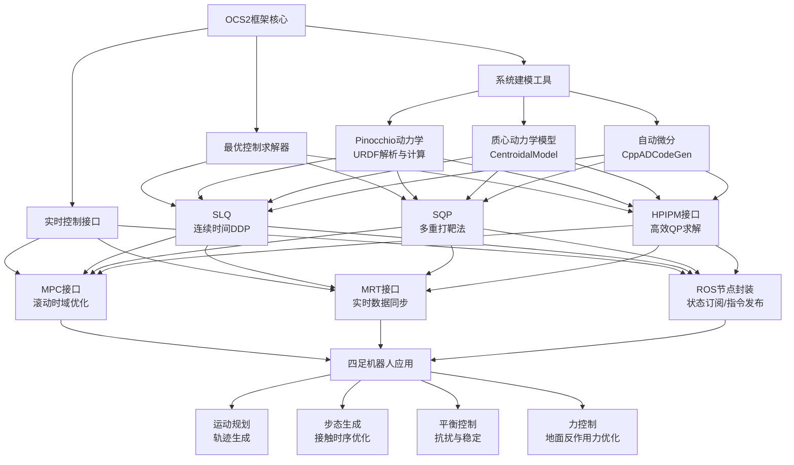

OCS2（Optimal Control for Switched Systems）是一个由苏黎世联邦理工学院（ETH Zürich）机器人系统实验室（RSL）开发的开源C++工具箱，专门用于解决具有混合动力学的复杂系统的最优控制问题。它在四足机器人控制领域表现尤为出色，已成功应用于ANYmal、Unitree系列等多种机器人平台。下面我将从框架概览、MPC核心原理、以及在四足机器人上的具体应用三个方面为你详细介绍。

## OCS2算法框架概览
OCS2的核心设计理念是高效处理**切换系统（Switched Systems）**的最优控制——这类系统由多个动态子系统组成，并通过离散事件进行切换。对于四足机器人，不同的支撑相位（如单腿支撑、双腿支撑、腾空等）正是典型的离散模式。

**OCS2框架的核心优势：**

+ **混合动力学处理**：无缝处理不同接触状态下的模式切换
+ **高效数值求解**：内置多种优化算法，适用于实时控制
+ **模块化设计**：可灵活组合动力学、成本函数和约束
+ **自动微分**：通过CppADCodeGen实现高效稳定的导数计算
+ **ROS集成**：提供完整的ROS接口，便于机器人部署

下图展示了OCS2框架的整体架构与核心模块关系：



## OCS2的MPC核心模块详解
OCS2中的MPC模块是其最强大的功能之一。在OCS2中，最优控制问题通过`OptimalControlProblem`结构体来定义，它包含了四个核心组成部分：

### 问题定义
$ \text{Minimize } J = \sum_{k=0}^{N-1} \left[ l_k(x_k, u_k) + l_{\text{switch}}(x_k) \right] + l_N(x_N) $

$ \text{Subject to: } x_{k+1} = f_{\sigma(k)}(x_k, u_k) \quad \text{(模式相关动力学)} $

$ h_k(x_k, u_k) \leq 0 \quad \text{(路径约束)} $

$ x_k \in \mathcal{X}, \quad u_k \in \mathcal{U} \quad \text{(状态/输入边界)} $

其中 $ \sigma(k) $ 表示时刻 $ k $ 的系统模式（如支撑腿的组合）。

**成本函数（Cost Function）**：

+ 定义需要最小化的目标，如跟踪误差、能量消耗等
+ 在OCS2中，成本函数可以在三个时间点定义：中间时刻、切换时刻（预跳跃）、终端时刻

**动力学约束（Dynamics Constraints）**：

+ 系统的运动方程，通过Pinocchio库从URDF模型自动生成
+ 支持多种模型类型：运动学模型、完整动力学模型、质心动力学模型

**路径约束（Path Constraints）**：

+ 不等式约束：如关节角度/力矩限制、摩擦锥约束、避障等
+ 等式约束：如支撑腿足端必须保持静止（零速度）

**预计算（Pre-computation）**：

+ 缓存友好的设计，允许各模块共享中间计算结果，提升计算效率

### 高效求解器
OCS2提供了多种求解器以适应不同问题特性：

| 求解器 | 方法类型 | 适用场景 |
| --- | --- | --- |
| **SLQ** | 连续时间DDP | 平滑动力学系统，计算效率高 |
| **SQP** | 多重打靶+HPIPM | 强非线性约束问题 |
| **SLP** | 序列线性规划 | 大规模问题快速近似 |
| **IPM** | 内点法 | 高精度需求问题 |


在四足机器人控制中，最常用的是**SQP**和**SLQ**，它们通过多重打靶法将最优控制问题转化为非线性规划（NLP），再通过序列二次规划高效求解。

### 实时优化关键技术
**实时迭代策略（Real-time Iteration）**：  
在每个MPC周期（如10ms）内，求解器只执行一次迭代而非完全收敛，配合滚动时域实现近似最优控制。

**自动微分（Automatic Differentiation）**：  
通过CppADCodeGen在首次运行时编译生成共享库，缓存导数信息，大幅提升后续计算速度。

**质心动力学简化**：  
对于四足机器人，OCS2常用质心动力学模型作为简化模板，将状态空间简化为：质心动量、基座位姿、关节位置，输入空间为：接触力矩+关节速度。

## 四足机器人相关应用
### 系统建模
**（1）从URDF到OCP**：  
通过Pinocchio库加载URDF模型，自动构建机器人的运动学和动力学信息。

**（2）足端运动学**：  
OCS2提供`PinocchioEndEffectorKinematics`接口，为足端等坐标系提供位置、速度和雅可比矩阵计算。

**（3）自碰撞避免**：  
结合HPP-FCL库，可以定义自碰撞约束，避免机器人肢体之间的碰撞。

### 控制架构
在四足机器人控制中，OCS2常与`legged_control`框架结合，形成"MPC + WBC"的两级控制架构：

**层级一：MPC（模型预测控制）**

+ **频率**：50-100 Hz（10-20ms周期）
+ **任务**：基于质心动力学，优化未来轨迹和足端受力
+ **输入**：当前状态+期望速度
+ **输出**：最优躯干轨迹+足端接触力

**层级二：WBC（全身控制）**

+ **频率**：400-1000 Hz
+ **任务**：将MPC的优化结果映射到关节力矩
+ **方法**：求解二次规划（QP），在满足高优先级任务（如接触约束）的前提下实现多个任务（如躯干跟踪、足端摆动）的严格层次控制

### 关键实现要点
**（1）步态定义与切换**：  
通过任务文件（YAML）定义步态参数，如支撑相/摆动相持续时间、接触时序等：

```yaml
gait: "trot"           # 小跑步态
swingPeriod: 0.2       # 摆动相持续时间（秒）
stancePeriod: 0.3      # 支撑相持续时间（秒）
```

**（2）MPC参数配置**：

```yaml
mpc:
  timeStep: 0.01       # 离散时间步长（10ms）
  horizonLength: 1.0   # 预测时域长度（秒）
  solverIterations: 1  # 每个周期求解器迭代次数（实时性关键）
```

**（3）成本函数权重设计**：

```yaml
cost:
  tracking:
    basePosition: [10.0, 10.0, 50.0]     # 躯干位置跟踪权重
    baseOrientation: [100.0, 0.0, 0.0]    # 躯干姿态（横滚、俯仰、偏航）权重
    footPosition: [500.0, 500.0, 500.0]   # 足端位置跟踪权重
  input: [0.1, ...]                       # 12个关节的力矩惩罚权重
```

### 工程实践
**（1）支持的机器人平台**：

+ Unitree系列：Go1、Go2、A1、Aliengo、B2
+ DeepRobotics：Lite3、X30
+ ANYbotics：Anymal C
+ 小米：CyberDog

**（2）仿真与真机部署**：

+ **仿真环境**：Gazebo、Mujoco、RaiSim
+ **真机接口**：通过ros2-control硬件接口，读取关节状态/IMU/足端力，下发力矩指令

**（3）共享库编译**：  
首次运行时，OCS2会根据机器人模型自动编译CppAD代码生成共享库，这个过程可能需要几分钟，编译完成后控制器即可实时运行。

### 扩展：MPC-Net
OCS2还提供了MPC-Net功能，通过模仿学习将MPC策略克隆为神经网络，实现比传统MPC更快的评估速度——适合计算资源受限的场合。

## 总结
OCS2是一个专为切换系统设计的强大最优控制工具箱，其MPC模块通过高效的求解器、自动微分技术和模块化设计，能够实时求解复杂的四足机器人控制问题。在实际应用中，OCS2常结合Pinocchio动力学库和ros2-control框架，构建"MPC+WBC"的两级控制架构，实现四足机器人在复杂地形上的稳定运动。无论是学术研究还是工程开发，OCS2都提供了从仿真到真机部署的完整解决方案。

