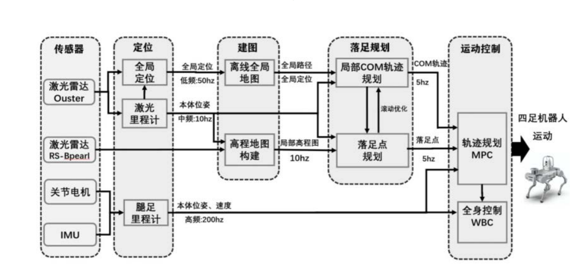

这是一张非常典型的**四足机器人感知-规划-控制**系统架构图。它清晰地展示了一个分层控制系统，从传感器数据输入开始，经过多级处理，最终转化为机器人的关节运动。下面我将为您详细拆解这张图的逻辑、原理和实现方式。

---

### **总体逻辑与核心思想**
这张图的核心思想是 **“分层控制”** 和 **“不同频率更新”**。

+ **分层控制**：将复杂的机器人运动问题分解成多个层次的任务，高层为底层提供目标，底层负责精准执行。这样简化了设计，并允许每个层次使用最适合的算法。
+ **多频率更新**：不同模块的处理频率不同。感知和高层规划可以慢一些（5-50Hz），以保证足够的计算时间进行复杂运算；底层控制必须非常快（200Hz），以实现稳定、敏捷的响应。

整个系统的数据流是自上而下和自下而上的闭环：  
**环境感知 → 全局定位与地图构建 → 局部运动规划 → 全身协调控制 → 关节执行 → 状态反馈 → 感知...**

---

### **模块详解：原理与实现**
我们将系统分为四大板块：**感知层**、**规划层**、**控制层**和**执行与反馈层**。

#### **1. 感知层**
**目标**：回答“我在哪？”和“我周围的环境是什么样的？”这两个问题。

+ **传感器**：
    - **激光雷达**：
        * **Ouster**：通常是一种高性能激光雷达，用于**全局定位**和**离线全局地图构建**。它的探测距离远、精度高，但数据量大，处理频率较低（50Hz）。
        * **RS-Bpearl**：这是一种专门为地面机器人设计的激光雷达，视场角特别广（尤其在垂直方向），非常适合**近距离避障**和**局部高程地图构建**。它处理频率为10Hz。
+ **定位**：
    - **原理**：通过将当前激光雷达扫描点云与预先绘制好的**离线全局地图**进行匹配（点云配准算法，如ICP），来精确计算机器人在全局坐标系中的位置和姿态。这是一个“重定位”过程。
    - **实现**：使用SLAM技术或其变体。频率较低（50Hz），因为匹配计算量较大。
+ **建模**：
    - **离线全局地图**：在任务开始前，使用Ouster等激光雷达预先扫描环境，生成一个静态的、高精度的3D点云地图。
    - **局部高程地图**：
        * **原理**：使用RS-Bpearl等近距离激光雷达实时扫描机器人周围的局部区域。将3D点云投影到2D网格中，每个网格存储其对应区域的高度（Z坐标）信息，形成一个2.5D的地图。这非常适合检测脚下的台阶、坑洼等障碍物。
        * **实现**：频率为10Hz，为落足点规划提供实时地形信息。

#### **2. 规划层**
**目标**：回答“我应该把脚踩在哪里？”和“我的身体应该如何移动？”。

+ **落足规划**：
    - **落地点规划**：
        * **原理**：基于**局部高程图**，评估每个可能的落脚区域。算法会考虑地形的平坦度、坡度、粗糙度，以及该点与机器人当前姿态的可达性。目标是找到一个稳定、安全的落脚点。
        * **实现**：使用基于规则的成本函数或简单的机器学习模型进行地形评估。频率为5Hz。
    - **局部COM轨迹规划**：
        * **原理**：COM是质心。在确定了未来几步的落脚点后，需要规划出一条机器**身体质心**的平滑运动轨迹。这条轨迹必须保证机器人在迈步时动态稳定（不会摔倒），并且尽可能减少身体的晃动。
        * **实现**：通常使用简化模型，如**线性倒立摆模型**。该模型将机器人的复杂动力学简化为一个在点上移动的质量，便于快速生成轨迹。频率为5Hz。
+ **运动控制**：
    - **轨迹规划 MPC**：
        * **原理**：MPC是核心控制器。它接收来自上层的**期望COM轨迹**和**落脚点**，同时结合机器人**当前的状态反馈**。MPC通过一个预测模型，在未来一个短时域内，优化计算出一系列最优的控制指令（如身体的作用力、力矩），并只执行第一步，然后在下一个周期重复优化。这种“滚动优化”的方式使其能很好地处理延迟和模型误差。
        * **实现**：将机器人的动力学方程作为预测模型，构建一个包含跟踪误差、控制量、稳定性约束的优化问题，并使用数值优化器（如QP求解器）在线求解。频率为5Hz。**MPC在这里输出的通常是高阶的躯干运动指令（如加速度、力）。**

#### **3. 控制层**
**目标**：将MPC输出的躯干级指令，分解为具体的每个关节的力矩命令。

+ **全身控制**：
    - **原理**：WBC是一种优化控制器。它同时考虑多个任务，并为其分配优先级。
        * **高阶任务**：例如，保持身体平衡、跟踪MPC给出的躯干运动指令。
        * **低阶任务**：例如，满足关节角度和力矩的物理限制、在空闲时让关节保持一个舒适的姿势。
    - **实现**：WBC将MPC的输出（如躯干所需的合外力/力矩）作为一个**硬约束**或**高优先级任务**，通过逆动力学计算，求解出每个关节需要输出的精确力矩，以满足这个总需求。它运行在非常高的频率（200Hz），以确保控制的流畅性和快速响应。

#### **4. 执行与反馈层**
**目标**：执行控制命令，并感知机器人自身的状态，形成闭环。

+ **关节电机**：接收来自WBC的关节力矩指令，通过电机驱动器输出扭矩，驱动机器人运动。
+ **IMU**：测量机器人的本体加速度和角速度，是估计本体姿态和速度的关键传感器。
+ **腿足里程计**：
    - **原理**：通过结合关节编码器读数和腿部运动学模型，计算机器人足端相对于身体的位置。当足端与地面保持固定接触时，可以反向推算出身体本体的位移和速度。这是一种**相对定位**，在短时间内精度很高，但会累积漂移。
    - **实现**：与IMU数据进行融合（通常使用卡尔曼滤波器），以提供高频（200Hz）、无漂移的**本体位姿和速度**估计。这个反馈对于MPC和WBC的稳定运行至关重要。

---

### **总结：系统如何协同工作**
让我们以一个“在杂乱环境中行走”的场景来串联整个流程：

1. **初始化**：Ouster激光雷达与全局地图匹配，确定机器人的**全局定位**。
2. **实时感知**：RS-Bpearl激光雷达以10Hz频率扫描脚下，构建**局部高程图**。
3. **决策与规划**：
    - **落足规划器**（5Hz）查看高程图，找到前方几个安全、平坦的**落地点**。
    - 根据这些落地点，**COM轨迹规划器**（5Hz）计算出一条身体质心应该遵循的平滑路径。
4. **模型预测控制**：
    - **MPC控制器**（5Hz）接收期望的COM轨迹和落地点。
    - 同时，它从**腿足里程计和IMU**获得高频（200Hz）的**本体实时状态**（位置、速度）。
    - MPC进行优化计算，得出为了跟踪轨迹，身体所需施加的**总力和力矩**。
5. **全身力矩分配**：
    - **WBC**（200Hz）接收MPC的指令，并结合所有关节的实时状态。
    - 它通过优化计算，将总力和力矩精确地分配给**12条腿的每个关节**，输出**关节力矩命令**。
6. **执行与反馈**：
    - **关节电机**执行力矩命令，机器人开始运动。
    - **IMU和关节编码器**立即感知到运动带来的变化，并通过**腿足里程计**计算出新的本体状态。
    - 这个新的状态反馈给MPC和WBC，形成一个闭环。MPC在下一个控制周期（0.2秒后）会根据新的状态重新优化，从而适应实际地形和机器人的动态变化。

通过这种分层、多频率的架构，四足机器人能够实现复杂环境下的稳定、敏捷和自适应运动。**MPC负责前瞻性的“策略”制定，而WBC负责底层的“战术”执行**，两者结合，构成了现代高性能足式机器人的核心控制范式。

